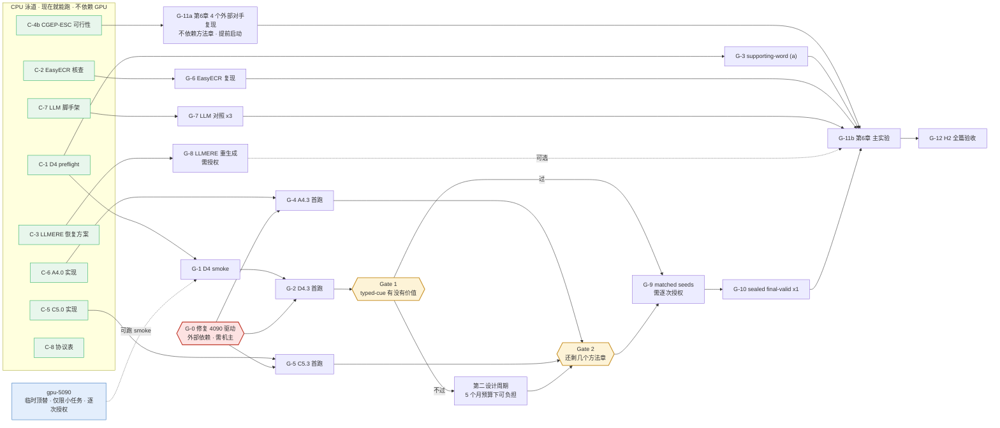

# 完整实验规划（防漂移主表）

> 冻结于 **2026-09-11**。服务 `SPEC.md` v1.1.0。
> **这份文件取代「每周想一遍下周做什么」。** 每周不再重新排任务，只从 §3 的主表里取下一个
> 未完成项；**时间线与估算基准率见 §3**，预期结果表见 §7。要偏离顺序，**先改本文件再执行**；口头改计划一律无效。
> 数字仍只写进 `results/PHASE_*.md`，本文件不复制任何实验数字。

## 0. 防漂移的四条规则

1. **单一主表**：可执行实验只认 §4。`HANDOFF.md` 的 E 队列只是主表的**当周切片**，不得包含
   主表以外的新任务。
2. **两条泳道并行**：§4 分 **CPU 泳道**与 **GPU 泳道**。GPU 不可用时，CPU 泳道照常推进，
   **不得**把「等 GPU」写成停工理由，也**不得**为了填时间发明主表外的任务。
3. **决策点是排期的一部分**：§5 的三个 Gate 是预先安排的重规划时刻。**只在 Gate 上改计划**；
   Gate 之间出现的新想法记进 §8 候补区，不插队。
4. **完成判据写在表里**：每一项的「完成 =」列就是验收标准。没达到就标 `wip` 并写清卡在哪条证据，
   不得口头声称完成。

## 1. 论文目标结构（作者 2026-09-11 选定「乙」形态）

```
第1章 绪论
第2章 相关工作与统一评测协议
第3章 事件事实性检测            ← D4    方法 + 3.4 实验（对比/消融/负控/案例）
第4章 事件关系抽取              ← A4    方法 + 4.4 实验
第5章 事件身份消解              ← C5    方法 + 5.4 实验
第6章 事件图谱构建与下游事件预测应用 ← E3  带公开对手的应用章
第7章 总结与展望
```

章序按**把握度**排，不按依赖：D4 赛道无竞争、power 六倍余量、实现已完成，放第 3 章先做；
C5 最没把握，放第 5 章。Ch6 不要求胜过任何方法章。

🔴 **2026-09-18 裁决 ①（作者点头）**：Gate 2 实测 0 章过门后，结构按 §7.5「下行」分支改为——
**Ch6 提为承重章**（应用 + 两条协议发现）；**C5 获批第二设计周期**（H1，角色相容性改接**抑制侧**，
同一机制家族，**不是新家族**）；**D4 与 A4 合并为一章「负结果与归因」**（三者的归因结论各自有信息量：
D4 主干先输、A4 无差别坍塌且集中在 PRECONDITION、C5 缺口 100% 在 precision）。
**若 C5 第二周期仍不过门 ⇒ 落「Ch6 承重 + 一章负结果归因」的最终形态。**
⛔ 本裁决**不授权**：新机制家族、多种子（G-9 仍须逐次授权）、调门槛护栏、换 split、加大 backbone。

🔴 **同日续**：裁决 ① 批准的是 **H1 这一条接法**，它当天被 **C-11 + C-12 证伪**——抑制侧有 4.74 分
空间，但现有角色信号在目标桶上只有基率水平的判别力（详见 §4.1 两行与 `results/PHASE_C.md`）。
**换信号源＝新机制家族，须回 R1 立项，不在本裁决授权内** ⇒ **Ch5 存废回到一个新裁决**，
兜底形态仍是本条写好的「Ch6 承重 + 一章负结果归因」。

🔴 **2026-09-18 晚 · 裁决 ④（作者）**：上面那个新裁决已定——**C5 第二设计周期取 (甲)，就此收**，
Ch5 并入「负结果与归因」章 ⇒ **最终形态定稿为「Ch6 承重 + 一章负结果归因」**（§7.5 下行）。
同时作者给了两条方向性指示，**优先级高于本表当前的队列顺序**：

1. ⛔ **G-9 多种子不授权**，理由是「现在不用做多种子，还没到最终结果」；
2. ⛔ **停止继续在应用章上加动作**——原文：「你不要一直在应用章上动作，应用章的分数也一般。
   前三个方法章要整体提高，整体方案的科研价值更高、科研成果更好。」

⇒ **重心回到三个方法章的整体提高**。这不是把已封存的机制家族重开，而是要先回答
「三个章一起低于自己的主锚，是七个机制各自的问题，还是一个共因」——立项分析见 **§10**。
⛔ 本裁决仍**不授权**：自行开新机制家族、加大 backbone、换 split、调门槛护栏、跑未授权 seed。

🔴 **2026-09-20 · 裁决 ⑤（作者）**：作者明确否决「结果未达到就收口」，并要求
「找到更好、更有效、更有科研价值的论文后继推进」。因此上述「不授权新家族」的历史边界
被**定向放开为新一轮 R1 准入研究**，不是直接放开训练：先执行主表 C-13–C-16，完成文献、数据、
协议、代码和 power 五道审计；只有通过者才能生成新 phase contract 和单 seed GPU 任务。旧 typed-cue、
pair-evidence、role-compatibility 家族仍封存，不得换名、扫参或换大 backbone 复活。详见 **§11**。

**每个方法章的实验节固定四件**（照钱子杰/宁婉廷/李璐的一致体例）：

```
X.4.1 数据集、评价指标与实验设置
X.4.2 对比模型          ← 逐个介绍每个 baseline
X.4.3 总体实验结果及分析  ← 主表：公开方法[ref] ×≥3 + LLM 对照 + 本文前期方法 + 本文最终方案（末行）
X.4.4 消融实验 + 负控
(X.4.5 参数/案例/错误分析)
```

主表形态与 FR-016 保真度规则见 [`BASELINE_ROSTER.md`](BASELINE_ROSTER.md)。

## 2. 当前状态基线

| | 状态 |
|---|---|
| v6.1 三份方法设计 | **一个都没跑过**。C5/A4 未实现，D4 只完成 D4.0 实现与本地 gate |
| 各章主锚 | Ch1 MUC `.809847`；Ch2 causal F1 `33.17`；Ch3 pooled 5 类 macro-F1 `.553995` |
| Ch6 已有资产 | 图依赖正控**已通过**（gold .1802 / rewired .1185 / no_graph .0811）；构建损失 −.0218＝整图价值 22.0%；受控扰动曲线已测 |
| gpu-4090 | **CUDA 完全不可用**（驱动内核模块与用户态库版本不符，需 root 修复，机器共用） |
| gpu-5090 | **已授权作 4090 不可达期间的临时顶替**（作者 2026-09-11）：只跑 smoke 与小任务，主体实验回 4090。host key 待确认、余量约 15GB、须逐次授权。边界见 §3.5 |

## 3. 时间线

> **2026-09-11 重估。** 初版排期（全部实验 3 周收口）是错的：当时把 **GPU 计算耗时**当成了
> **项目日历时间**，既没算调试与抢修，也没留失败重试预算。本节改用**项目自身的历史基准率**估算。

### 3.1 估算基准率（来自本仓库 git 历史，不是拍脑袋）

| 参照事件 | 起止 | 日历天 | 结果 | 说明 |
|---|---|---:|---|---|
| **E8 LLMERE**：跑别人的 converter + LoRA SFT + 全量生成 | 09-07 → 09-10 | **4** | **失败** | 约 10 个抢修 commit：TLS、磁盘、未设门镜像、依赖 extras、断点续跑。计算本身约 2 天，其余全是环境 |
| **A3 关系方法族**：四臂，我们自己的机制 | 08-28 → 09-05 | **9** | **失败** | 20 个 commit |
| Ch3 五折 OOF baseline：2 baseline × 5 折 = 10 个训练任务 | 09-04 → 09-05 | **2** | 成功 | 最顺的一次：无新机制、GPU 正常 |
| D4.0 实现 + 本地 gate | 09-09 | **~2** | 成功 | 建立在既有 factuality 代码上 |

由此得到四条**换算规则**，本节所有估算都按它推：

1. **复现一个外部方法 ≈ 4–9 个日历天，且首次失败概率高**（LLMERE 4 天失败、taco 反复多轮）；
2. **跑一个我们自己的多臂方法 pilot ≈ 6–12 个日历天**（A3 九天）；
3. **纯 baseline 扫（无新机制 + 基础设施正常）≈ 2 天**；
4. **实现 + 本地 gate ≈ 2–7 天**，取决于要不要新建机制组件。

另加三项初版完全没算的开销：**失败重试预算**（我们方法机制首次成功率 0/6）、
**第二设计周期**（`RESEARCH_PLAN` 明确允许每个家族两轮）、**基础设施再故障**
（4090 于 2026-09-11 自发损坏；ssh 隧道约 40% 掉线）。

### 3.2 依赖图



### 3.3 排期 2026-09 → 2027-02


### 3.4 三条关键推论

1. **顺利情形下 2027-01 底收口，2026-02 整月是缓冲。** 但若**两个以上**方法章各需第二设计周期，
   缓冲清零。5 个月不宽裕，是**刚好够**。
2. **第 6 章必须提前启动，不能排在最后。** 那 4 个外部对手（CSProm-KG / SimKGC / BART contrastive /
   MCPredictor）与方法章**没有依赖关系**——它们只需要冻结的 evaluation unit。初版把 G-11 估成 1–2 天
   是本次最大的低估：按基准率 1，4 个外部复现单独就要 **3–4 周**。故从 2026-11 起就在卡 B 上滚。
3. **G-0 每拖一周，缓冲就少一周。** 这是当前唯一该催的外部事项。

### 3.5 GPU 使用：5090 的临时授权与边界

作者 2026-09-11 **第二次裁决（取代下面的旧边界）**：**4090 不管了，工作机改为 gpu-5090**；
在 5090 上验证我们的假设与方法可行性，**可重新拉取模型**，**单次不超过一天的任务都可以直接执行**。
拉模型前须先与作者确认服务器位置（已确认：`/mnt/aidata/tongjiakai/models/local/roberta-base/`）。
下面这张表是旧边界，保留作记录：

~~作者 2026-09-11 授权：**4090 不可达期间，gpu-5090 可用于临时性 GPU 任务；主体实验仍回 4090。**~~

| 能在 5090 上跑 | 不能 |
|---|---|
| D4 / C5 / A4 的 **CPU/CUDA smoke**（RoBERTa-base 量级，显存需求小） | **EasyECR**：其栈是 `torch==2.0.1`，5090 是 Blackwell sm_120，**torch 2.0 不支持该架构**，只能等 4090 |
| 小规模 preflight 里需要 CUDA 的片段 | ~~**Qwen3-8B LoRA 的 LLM 对照**：卡上已有约 17 GB 的既有服务，余量约 15 GB，8B bf16 需约 16 GB，**装不下**~~ —— **2026-09-13 实测作废**，见下面的 ⚠️ |
| 短时诊断、显存探测 | **任何长任务 pilot**（D4.3 / A4.3 / C5.3）：主体实验按作者要求留在 4090 |

⚠️ **上表「装不下」那格已被实测推翻（2026-09-13）**：5090 显存 **209 MiB / 32,607 MiB，无任何计算进程**
（那个约 17 GB 的 Qwen 服务早已不在，§3.5 的 ③ 在 09-11 就记了同样的读数，只是表没跟着改）。
24 核 load 0.05，磁盘余 1,015 GB。**G-7 的「余量不够」这条阻塞理由不再成立**；真正的前置改成
**5090 上只有 Qwen3-1.7B / 4B，没有 8B——拉模型仍须先问作者**。
**结论：过期的能力记录会把可行的任务判成不可行。写进本表的资源读数必须带日期，用前重测。**

**使用前置（按 2026-09-11 第二次裁决更新）**：① host key 已在 `known_hosts` 且**作者确认是本人所加**，
指纹 ED25519 `SHA256:Jkfb9Tb14Z/SqsG6g9GedDjKZOcBl1DLW6zT0V1dkJY`；② **≤1 天的任务不再逐次请示**，
超过一天的仍须问；③ 先 `nvidia-smi` 查实时显存，他人正在跑的卡不得挤占（2026-09-11 实测：
32,607 MiB 只用 209 MiB，原先那个约 17 GB 的 Qwen 服务已不在）；④ checkpoint 训在哪留在哪，
**跨机搬运与拉取模型前先问作者**。

⚠️ **backbone 现状**：5090 已从 ModelScope 拉齐 `roberta-base` 六件里的**五件**且逐字节等于 4090 的 pin
（含 476 MB 的 `pytorch_model.bin`），只差 `tokenizer_config.json`（`dfef6647…cfa5c5`，公网三个源都不提供）。
**闭合 pin 只需从 4090 取这一个几 KB 的文件**，隧道恢复即可；在那之前 5090 上的 D4 结果不能与
冻结的 CLS/DMRoBERTa 直接相减。详见 `results/PHASE_P1.md`。

## 3.6 D4 改为在 5090 自足重建，不从 4090 搬任何东西（作者 2026-09-11 裁决）

作者问「为什么要搬？不能在 5090 从新开始？」——核对后答案是**能，而且更干净**。原先列的两件
「必须从 4090 取」的东西，唯一用途都是复用 4090 已经花掉的算力：

| 原以为要搬 | 实际情况 |
|---|---|
| `tokenizer_config.json`（闭合旧 pin） | 只为复现**4090 那个** pin。旧 pin 里恰好含一个公网不提供的本地文件；5090 重新登记的 pin **六件全部来自公开源**，可重建性反而更强 |
| `r1-v61-factuality-oof-r2/` 四个 JSON | 只为复用 4090 训好的两条 baseline。用同一份冻结五折 CV 在 5090 重训即可 |
| （以为也要搬）`factuality_cv/` | **本地就有，640 KB / 16 文件**，与 4090 无关，已 rsync 到 5090 并双端核对一致 |
| `train.jsonl` | 5090 早已有，SHA-256 与 4090 逐字节相同 |

**新登记的 5090 backbone 内容地址**：
`2c7ff1f10496f2df54ed5590693c38c6bc2385bebf29e37b26e4833407349736`，位于
`gpu-5090:/mnt/aidata/tongjiakai/models/local/roberta-base/2c7ff1f1…49736`。
六个文件中五个直接来自 ModelScope `AI-ModelScope/roberta-base`（含 476 MB 权重，与 4090 pin 逐字节相同），
`tokenizer_config.json` 是 ModelScope 与 hf-mirror 都提供的同一份 25 字节规范文件。

**这条线更符合 A 类口径要求**：baseline 与三臂在同一台机、同一 backbone、同一份五折 manifest 下训出来，
三轴天然一致；反倒是「4090 的 baseline + 5090 的臂」才是该被质疑的混搭。

⚠️ **必须守的顺序（这等于重新求一次主锚）**：现在做合法，因为 D4 三臂**一个都还没训**，锚仍在看到
方法结果之前冻结。执行顺序不得颠倒：

1. 登记 backbone 内容摘要（**已完成**，见上）；
2. 同一份冻结五折 CV 上重训两条 baseline（CLS / dynamic-multi × 5 折 = 10 次 `run_r1_factuality_oof.py`）；
3. 汇总并**把新数字冻进 `results/PHASE_D.md`**，同时把 `prepare_d4_typed_cue_preflight.py` 里三个硬编码
   常量换成新登记值——**必须在跑臂之前写死，不得事后调绿**；
4. 才允许跑 D4 三臂。

4090 上那套数字（CLS .553995 / DMRoBERTa .545603，backbone pin `71be7419…`）作为**历史身份保留**，
与新线**不相减、不混表**。

## 3.7 4090 恢复后走哪条线（2026-09-12）

两条 anchor 线现在都成立，**方法实验走 4090 线**，理由是它已经过完整闸门而 5090 线没有：

| | 4090 线 | 5090 线 |
|---|---|---|
| preflight | ✅ PASS，两条 baseline 逐字段重算一致（`9429c5a8…5025e`） | ❌ 未建 |
| `acceptance.json` | ✅ 有，且 hash 被 preflight 绑定 | ❌ 无（4090 那份由运行目录里的 `acceptance_audit.py` 产出，**该脚本不在仓库**） |
| smoke | ✅ CPU + CUDA 双半边，产物逐字节相同 | — |
| 卡 | 4 张全空 | 1 张 |
| backbone 可重建性 | 含一个公网不提供的文件 | ✅ 六件全部公开源 |

**5090 线不作废，改作两件事**：① anchor 的独立复现证据——同一排序、绝对值低约 .010，
给出这组数字 **±.01 的可复现地板**（见 `results/PHASE_D.md`）；② 4090 再出事时的备份线。
两条线的数字**不相减、不混表**，各自标明机器与 backbone 地址。

## 4. 实验主表

### 4.1 CPU 泳道（GPU 不可用时照常推进）

| ID | 实验 | 依赖 | 完成 = | 产物 |
|---|---|---|---|---|
| **C-1** | ~~D4.1 immutable preflight~~ → **已完成 2026-09-11**（`93f59f1`）：`status=pass`，两条 accepted OOF baseline 逐字段重算一致（CLS .553995 / DMRoBERTa .545603），preflight protocol SHA-256 `9429c5a8…5025e`。执行中修掉三个让它在服务器上跑不起来的缺陷，见 `results/PHASE_D.md` | 无 | 已达成 | `gpu-4090:.../runs/stages/D4/d4-v61-typed-cues-r1/preflight/` |
| **C-2** | EasyECR 可运行性实跑核查（不训练） | 无 | **静态裁决 2026-09-11 已出：`conditionally_runnable`**，6 条阻断全部点名（`PHASE_R1.md` §22），KBP 2017 不可得 → **FR-016 (b)**。**剩余 C-2b**：4090 隧道恢复后建独立 venv 做活体 import 冒烟 | 名册 §1.1 + `PHASE_R1.md` §22 |
| **C-3** | ~~E8.1 LLMERE 恢复方案冻结~~ → ✅ **已完成 2026-09-17**（本地 + 只读 ssh，未训练未占卡，`results/PHASE_R1.md` §23）。四条验收全部满足。**核查改写了根因**：重扫 11,149 条确认 95 条数字无误，但 **全部 11,149 条都在退化重复**（输出中位 1,755 字符 vs 训练 target 98 字符，最短 613，99.65% 超 1,000 字符）⇒ 根因是**生成侧没有终止语义**，95 条只是污染落进了第一行、其余 11,054 条污染落在第一个换行之后被转换器切掉，**同一缺陷的两种表现**；与 C5.3 首跑同族（训练/推理口径不成对，两个月内第二次）。**成本重估：42 GPU·h → < 1 GPU·h**（有用内容中位仅约 10 token，当前 97% 解码算力花在退化重复上；线性外推，上卡前先跑 100 条校准）。方案＝①终止条件 ②第一行约束解码（`prefix_allowed_tokens_fn`，无新依赖，不动两个 pinned 上游）③全量重生成 ④原始输出保留，建议两阶段执行。✅ **2026-09-17 裁决 ③：维持 (甲)，不执行。** 它是 Ch4 主表的一行；Ch4 存废未定之前，`< 1 GPU·h` 也没有去处。成本不是障碍，去处才是 | 结果页 §23 |
| **C-4** | ~~Ch6 对手名册调研~~ → **已完成 2026-09-11**：SeDGPL 及其四个 CGEP 对手（BART contrastive / CSProm-KG / MCPredictor / SimKGC）全部有公开训练代码，**Gate 3 过**。**C-4b ✅ 已完成 2026-09-13**（一手核查，纯 CPU 未训练）：裁决 `conditionally_runnable`。**切分口径确认——原文 §5.1 声明的是 topic 级 5 折 CV**（最后两 topic 作 dev，其余 20 个 5 折），**不是**文档切分；⚠️ 由此推翻本项目此前「19.6 是泄漏值」的记载，真实情况是**我们在声明口径下复现不到它**（我们的 topic-CV .0599 vs 原文 .196）。公开 `ESCSubWoRe.npy`（与本地同一 SHA-256 `8ec791fb…5026`）就是论文那份数据（22 topic / 244 篇 / 1,192 实例 vs Table 1 的 243 / 1,191），但仓库**没有任何 ESC 代码路径**（`load_data.py` 写死 MAVEN 且要 `train/valid/test` 键）、公开词表只覆盖 ESC mention 的 **49.5%**，且 `util.py` 的 assert **被注释掉**故未命中会**静默错打分**。成本是小时级（RoBERTa-base / 1,192 实例 / 15 epoch）。**建议只为 SeDGPL 走 ESC 的 (a) 路，其余四个维持 (b)**（待作者裁决，不阻塞）。详见 `results/PHASE_E.md` | 无 | 已达成 | 名册 §6 + `results/PHASE_E.md` |
| **C-5** | C5.0 实现 + 本地 gate | 无（QR-001 修订后已解锁） | **2026-09-11 完成核心件**：`src/ekg/nodes/role_uncertainty.py`（sidecar / role 兼容性特征 / 分层 permutation / mediator 计数）+ `discriminative.py` 新增 `role_compatibility` 组件；15 条 targeted tests，**550 passed / 26 skipped、ruff 0、smoke OK**。bundle exporter 复用既有 `create_stage_bundle`（`protocol_extra` 足够挂 sidecar/mediator/fallback id），不另写。**C-5b ✅ 已完成 2026-09-13**：核到代码后缺口只有**三个脚本加一个开关**——`train_coref_scorer.py`、`score_maven_ere_official.py`（官方评测器同时出 `muc/b_cubed/ceaf/blanc`）与 `build_maven_ere_submission.py`（预测器）**本来就有**。新写 `prepare_c5_argument_uncertainty_preflight.py` / `smoke_c5_argument_uncertainty.py` / `run_c5_argument_uncertainty.py`（契约点名的 pilot 入口，已进 `CODE_FILES` 的 8 个文件），并把 permutation 负控接进 trainer **与推理侧**。抓到三个真缺陷：`role_compatibility` 被参数校验挡住、`--argument-predictions` 同时决定语料（remove-core 不传就换了语料）、**permutation 臂训练/推理口径不成对（A 类）**。608 passed / 28 skipped、ruff 0、smoke OK。两条 baseline 官方口径已预验（主锚 MUC 80.9847 / 注册对照 80.3676）。详见 `results/PHASE_C.md` | 代码 + 测试 |
| **C-6** | A4.0 实现 + 本地 gate | 无 | ✅ **2026-09-12/13 完成（含 C-6b 入口脚本）**：`src/ekg/relations/pair_evidence.py` + `pair_heads.py` 注册 `pair_evidence` 头（零初始化证据残差，四臂同参数、init 基础 logits 相同）＋ 五个入口 `train_` / `evaluate_` / `prepare_*_preflight` / `smoke_` / `run_a4_pair_evidence.py`（pilot 入口已进 preflight 的 `CODE_FILES`，7 个文件）；**44 条 targeted tests**，本地 **592 passed / 28 skipped、ruff 0、smoke OK**，5090 四臂开发冒烟 pass（**非结果**）。**证据＝两触发句之间的 interior（定义，不是选择）**：不排序、不打分、无预算、无阈值；necessity 去掉 interior、sufficiency 只留 span；注册中介仍是 `cross_sentence_false_positives`，细分改为行为量（logit 掉幅 < 冻结 margin）并自带被测分母。⚠️ **初版的连接词词表选择器已被本项目自己的测量否掉**（`f90c8cd`：分层 recall 只差 .008/.064，补测 109,234 对中 79.3% 被判「有线索」）；**DREEAM 替代方案静态核查 `not_runnable`**（`b52d506`：两条证据监督路径都要人工标注、无 distant 语料、增益靠 dev 选阈值；其证据机制在「无 distant 数据」格只值 +0.33 F1）。冒烟另抓修三个真缺陷。bundle exporter 复用 `create_stage_bundle`。详见 `results/PHASE_A.md` | 代码 + 测试 |
| **C-7** | ~~LLM 对照脚手架~~ → ✅ **已完成 2026-09-13**：`src/ekg/llm_baseline.py` + `scripts/build_llm_baseline_fixture.py` + `configs/llm_baseline.json`（提示模板与 LoRA 预算，content digest `1677bb6d…`）+ `data/fixtures/llm_baseline/`。三章各跑通 10 条固定输入 → 格式合法预测 → **被该章自己的 evaluator 实际打出分**（Ch3 `factuality_report`、Ch4/Ch5 官方 `evaluate.py`）。录制响应**故意带缺陷**（漏答 / 编造标签 / 陌生 id / 自反对 / 一个 mention 进两个簇），逐条被记录而非修补——那些修补每一个都会抬高分数而模型没赚到。19 条 targeted tests | 无 | 已达成 | 代码 + 测试 |
| **C-9** | ✅ **已完成 2026-09-12**（`a90df4e`，10 条 targeted tests，560 passed / ruff 0 / smoke OK；preflight 重建为 `preflight-r2` `dae0e0b4…e15c4`，`code_files=7`）。原文：**写 D4.3 的 pilot 入口 `scripts/run_d4_typed_cue_oof.py`**（2026-09-12 新增：契约点名了它，仓库里没有；同类缺口 A4/C5 各自也有） | C-1 ✅ + G-1 ✅ | 按冻结契约驱动 5 折 × 3 臂，逐实例概率/cue/evidence/三级 logits/confusion 落盘，coverage 断言 2,913 篇 / 73,939 mentions 各恰好一次；targeted tests + 三件套全绿 | 代码 + 测试 |
| **C-8** | ~~第 2 章「统一评测协议」素材整理~~ → ✅ **已完成 2026-09-13**：`docs/PROTOCOL_TABLE.md`，**四章**（含第 6 章）各自的 manifest / 候选全集 / evaluator 三轴、文档与 mention 计数、划分来源、指标定义、final-valid 台账、信任根与契约绑定，每节附**重算命令**。执行中本地重算核对：internal-dev 候选 digest `15a3b1a5…dac10910` 与 291 篇 / 7,195 mentions / 1,719 TIMEX / 234,870 对 **逐项吻合**；Ch3 五类 mention 合计 **73,939** 与 `factuality_cv.json` 吻合。⚠️ 顺带修掉 `CLAUDE.md`/`AGENTS.md` 里**过期的 P1 可信根**（写的是 A3 时代的 r12，而 R1 的 `p1_binding` 与 A4/C5 preflight 钉的都是 `p1-v6-20260904-r15` / `1e31a9ac…f9655`） | 无 | 已达成 | `docs/PROTOCOL_TABLE.md` |
| **C-10** | ~~E3.0 冻结 Ch6 的不可变 evaluation unit~~ → ✅ **已完成 2026-09-13**（本地纯 CPU，2.6 s）：`scripts/freeze_e3_evaluation_unit.py` 写出 `runs/stages/E3/e3-v61-20260913/`，**1,908 实例 / 437 篇 / 761 ECG / 候选池 6,892 节点**，`queries.jsonl` SHA-256 `e92629bd…5aecf`、query-ID digest `7b958d5d…6cd9e`、candidate-ID digest `93915ae3…f27ee`、生成器 tree `588c02c0…8abf`，seed 209 / `min_nodes=4` / 512 候选。**n 与 2026-07-29 主结果一致**，所以新对手的数字能与 `.1802/.1583/.1185/.0811` 并表。`--verify` 从源数据重建三比对（实测 PASS）；生成器改动只报 `provenance only`，判 FAIL 的只有 unit 本身。「本地重建协议、SeDGPL 数字不可比」写进 `manifest.json` 而非仅写文档。631 passed / ruff 0 / smoke OK。详见 `results/PHASE_E.md` | 无 | 已达成 | `runs/stages/E3/e3-v61-20260913/` + `results/PHASE_E.md` |
| **C-11** | ✅ **已完成 2026-09-18**（本地纯 CPU，未训练未占卡，660 passed / ruff 0 / smoke OK）：**H1 成立且上界够得到主锚**——完美抑制 ≥0.8 跨句桶里的 213 个误合并对，`full` 由 79.90115 抬到 **84.64223**（比主锚高 3.658）；**但桶本身不是信号**：桶内 213 错 / 699 对，基率仅 **23.36%**，blind 全否决把 MUC recall 打到 .568935、F1 掉到 66.06。误否决预算曲线给出验收线——**仅仅追平主锚就要求桶内精度 ≥ 213/513 = 41.5%**（约基率的 1.8 倍），且已假设 oracle 召回。第三条：**这个集中不是机制造成的**，`remove_core` 桶内占比 59.8% ≈ `full` 58.0%，低的是主锚 51.5%。脚本 `scripts/report_coref_suppression_bound.py`（no-op 行逐位复现两臂已登记 MUC F1 才继续），详见 `results/PHASE_C.md`。原文：**C5 第二设计周期 · 第 1 步：H1 离线验证**（2026-09-18 裁决 ① 批准出列，原 §8 候补）——`full` 的 419 个误合并里 trigger 相似度 ≥0.8 的跨句桶占 **58.0%**、主锚占 **51.5%**，检验误合并是否确实集中在该桶，并算出**抑制上界**：把该桶按不同阈值全部拒绝后，`full` 的 MUC precision / recall / F1 各变多少（对照当前 .756630 / .846422 / 79.90115 与主锚 .788430 / .832461 / 80.98472）。**纯离线、复用 G-5b 已有产物、不训练不占卡、不动任何契约** | G-5b ✅ 产物 | H1 成立与否有明确判据；抑制上界曲线落盘；结论（含「若上界都够不到主锚则第二周期该换接法」）写进 `results/PHASE_C.md` | `results/PHASE_C.md` |
| **C-12** | ✅ **已完成 2026-09-18**（本地纯 CPU，665 passed / ruff 0 / smoke OK）：**现有角色信号付不起 C-11 的价钱**——912 个桶内对（213 错，基率 **.2336**）上，所有操作点的桶内精度只有 **.2330–.2900**，离验收线 **.415** 差得很远，**没有一档跑赢 `full` 自己**（最好 79.56811，−0.333）。注册中介规则 `incompatible` 触发 618/912 次而精度 **.2330 低于基率** ⇒ 它标的「角色不相容」与「是不是误合并」基本无关。**⇒ 问题在信号源不在接法**：H1 被证伪（方向有 4.74 分空间，这套特征填不满），**换信号源＝新机制家族，须回 R1 立项**，已停下交裁决。详见 `results/PHASE_C.md`。原文：**C5 第二设计周期 · 第 2 步：桶内判别力离线估计**（C-11 交出验收线后出列）——把**现有**角色相容性信号（`role_uncertainty.py` 的 role-incompatibility 规则与 13 维特征，**不训练、不调参**）当抑制器作用在 C-11 那 912 个桶内对上，按它自己的排序逐 k 否决，用官方 evaluator 重打分。**这一步决定第二周期值不值得上卡**：够不到 C-11 的验收线（桶内精度 ≥ **41.5%**，基率 **23.36%**）就不训。纯 CPU | C-11 ✅ + 论元预测（4090 上的 `qwen3-full-r3/merged/predictions.jsonl`，`855906d3…142a`，双端 sha256 核对后搬回本地） | 该信号的桶内精度曲线与可达 MUC F1，对照 `full` 79.90115 与主锚 80.98472；结论（训 / 不训）写进 `results/PHASE_C.md` | `results/PHASE_C.md` |
| **C-13** | ✅ **已完成 2026-09-20**：一手论文/官方代码复核后，D4 留作有条件方向；A4 的 rationale+graph+counterfactual 宽命题已被 LLMERE、IJCNN 2024、MRPD、CRECE 等占据，判**新颖性阻断**；C5 只保留「全候选非对称 shortcut invariance」，不把 LLM-RCDA/ACCI 直接移植冒充创新。矩阵 SHA-256 `e9b105ac…e26e` | 裁决 ⑤ | ✅ dataset/split/candidate/evaluator/code/license/checkpoint 分项记录 | `results/PHASE_R1.md` + `literature_refresh.json` |
| **C-14** | ✅ **已完成 2026-09-20**：FACT↔ERE 的 2,913 篇 / 73,939 mention 身份一致；但 OOF predicted relation 只覆盖 **291/2,913 篇**。覆盖率纠偏：合并关系族为 95.57%，真正有论文机制证据的 **causal-only 仅 5,270/7,195=73.25%**。gold causal 对 PS−/Uu 的 incident 上界也只有 26.32%/16.10%。⇒ 不能拿 gold 或合并覆盖掩盖输入门，状态 `conditional_input_prerequisite`，SHA `4d735530…1d09` | C-13 | ✅ deterministic report；明确卡【协议/输入】 | R1 `d4_structural_input_audit.json` |
| **C-15** | ✅ **已完成 2026-09-20**：训练资产可行但方法不准入。48,562 direct causal mention pairs，11,231 有 two-hop support，7,620 mentions 有 coref rationale；官方 k=30 对**直接 pair 覆盖 100%**，只把 two-hop support 保留率降为 8,826/11,231=78.59%。这纠正了旧文档「跨分区直接 pair 不可达」的错误。资产 SHA `f2912358…beb1`；随后因近邻工作覆盖判 `rejected_novelty_blocked` | C-14 | ✅ 数据/协议可行；❌ 科研差异不足，故不生成训练任务 | R1 `a4_rationale_asset_audit.json` + `design_briefs.json` |
| **C-16** | ✅ **已完成 2026-09-20**：失败 full 的高相似跨句桶 912 对 / 213 错，含 58.04% 的 false merge；反向捷径也可量：540 个低相似跨句 gold coref 对中漏 73。训练池有 17,014 hard non-coref 与 4,430 divergent coref。桶内精度从 `.233553` 检到 `.415` 的 exact test 只需 n=42，power `.82012`。状态 `accepted_pending_generation_quality_gate`，SHA `27d72b93…a864` | C-15 | ✅ treatment/双中介/负控/power 已冻；尚未授权生成或训练 | R1 `c5_counterfactual_feasibility_audit.json` |
| **C-17** | ✅ **已完成 2026-09-20，训练前修订为 v2**：五折的 train / selection / evaluation 两两互斥，五个 evaluation 并集恰为 2,913 篇且每篇出现一次；冻结每折 posterior schema 与预期规模，总计 73,939 mentions / 2,532,394 ordered pairs。v2 补上 relation backbone 内容地址 `71be7419…c961ea9`，SHA `c3b4bc47…b32d3`；v1 `d8399cd4…1678b3` 已归档且未产生预测。当前仍是 `predictions_missing` | C-16 | ✅ deterministic plan + hash；只闭合设计，未启动五折 GPU relation 训练 | R1 `d4_crossfit_plan.json` |
| **C-18** | ✅ **已完成 2026-09-20**：固定 seed `260920`，从 17,014 hard non-coref 与 4,430 divergent coref 中各抽 50 条并随机盲排；评审不可见 classifier score / promotion。事前阈值：总体 label preservation ≥`.95`、每层 ≥`.90`、fluency ≥`.95`、single-variable ≥`.90`，同一批样本失败后不得改 prompt 重审。SHA `60b6e763…aefbe5` | C-17 | ✅ 100 条 sample manifest + rubric 已冻结；未调用生成模型，生成器/输出仍为空 | R1 `c5_generation_audit_plan.json` |
| **C-19** | ✅ **已完成 2026-09-20**：新增全候选 causal posterior API 与 manifest-bound 原子 dumper；保留 NONE，逐 pair 输出 `p_none/p_cause/p_precondition`。缺/多 pair、缺 causal head、self/duplicate pair、概率非有限/越界/和不为 1、计数不符、覆盖已有输出均 fail-fast；metadata 哈希整个 checkpoint，且声明 `gold_fields_present=false`。本地 **685 passed / 29 skipped、ruff 0、smoke OK**；未训练、未生成五折 posterior | C-17 ✅ | ✅ adapter 代码门关闭；真实 input 门仍开着 | `src/ekg/relations/posteriors.py` + `scripts/dump_relation_causal_posteriors.py` |
| **C-20** | ✅ **已完成 2026-09-20**：把 C-18 的 100 条冻结样本转成不可覆盖的 JSON-only 请求；generator 配置必须披露 model/revision/provider/license 与完整 decoding。输出必须 100/100、字段严格、两个 target trigger 仍在 edited context；盲审表不含 classifier/promotion 信息，评分器逐项执行总体与分层阈值，恰好边界通过、低一条失败。报告永远不自动授权 classifier training。完整门 **691 passed / 29 skipped、ruff 0、smoke OK**；未调用 generator | C-18 ✅ | ✅ harness 代码门关闭；实际 100 条生成与人工盲审仍未发生 | `scripts/run_c5_generation_audit.py` + tests |
| **C-21** | ✅ **已完成 2026-09-20**：唯一 generator 冻结为项目已内容寻址且跑过 73,939 mentions 的 `Qwen/Qwen3-8B`（config `8188480f…5155` / weights `7c9709d2…cd6`，Apache-2.0）；greedy、thinking off、seed `260920`、max new 1,536。100 条 requests SHA `74a23bf8…4f2fd`；GPU runner 先核 8 个模型文件，逐条保留 raw，只接受 bare exact JSON，100/100 全过才发布 parsed output。完整门 **694 passed / 29 skipped、ruff 0、smoke OK**；未调用模型 | C-20 ✅ | ✅ config/request/runner hashes + tests；不以生成器本身主张创新 | 代码 + R1 request artifacts |
| **C-22** | ⏸️ **C5 冻结 100 条一次性生成（4090，未启动）**：2026-09-20 只读核卡成功，四卡均 5,716–5,719 MiB / 24,564 MiB、28–32% util，不能判空闲；随后只读查权重路径时 ssh reset，按三态规则是连接失败，不是“权重不存在”。未调用模型、无 raw/output | C-21 ✅ + 空闲 4090 + 权重路径复核 + 远端命令事前披露 | **卡【算力/路径】**；100/100 raw 后 parsed 成功或失败均封存；无 prompt repair/rerun；人工盲审仍是独立门 | R1 generation/raw/report |
| **C-23** | **D4 第一性原理目标树与阶段门冻结**：本轮只推进 Ch3；C5 的 C-22 暂停排队但不取消。当前最低过线是严格超过同协议最强锚，论文有效目标是达到预注册最小有意义增益，并随新增同协议公开对手自动抬高 | 作者 2026-09-20 “一次只做一个章节、小步推进” | `results/PHASE_R1.md` §25 列出最终目标、必须条件、输入/机制/结果四级中间指标、失败日志；纠正“论文两条 causal rule”的错误归属 | `results/PHASE_R1.md` §25 |
| **C-24** | ✅ **D4 五折关系输入执行链完成**：关系训练器使用独立 D4 哈希绑定；每折只物化 train+selection-dev，evaluation 不进入训练源；冻结 official-joint 配方与 backbone pin，并从 causal-family checkpoint 导出全候选 posterior。4090 缺失的 gitignored plan 已补齐，模型六文件内容摘要实算通过 | C-17/C-19 + C-23 | 本地定向 **30/30 passed**；4090 三份定向 **20/20 passed**；五折 dry-run 中 evaluation manifest 只出现在 posterior dump，不出现在 trainer；错误模型在 CUDA 前拒绝 | `scripts/run_d4_relation_crossfit.py` + protocol tests |
| **C-25** | **D4 五折 posterior 汇总与输入质量门**：合并 G-16 五折并独立重算关系质量与校准 | G-16 | 2,913 docs / 73,939 mentions / 2,532,394 ordered pairs 恰好一次；无 gold 字段；causal 正类 F1 ≥`.300` 且三类 Brier 优于 evaluation prevalence no-skill；否则停在输入层，不把垃圾图归因给 D4 机制 | aggregate posterior + input-quality report |
| **C-26** | **D4 predicted-causal phase contract**：把两项一致性中介、三臂唯一差异、稀有类护栏、配对 bootstrap 和停止条件冻结 | C-25 | full / unchanged full-context base / degree+direction+subtype+confidence-preserving rewiring 三臂；目标与 §25 逐项一致；不读方法结果后改门 | 新 D4 phase contract + preflight |
| **C-27** | **D4 uncertainty-gated residual 实现与本地门** | C-26 | 无边/低置信度时残差严格趋零；三臂参数与预算一致；ID/schema/置换/梯度/聚合测试通过，三件套全绿 | code + tests + CPU smoke |

作者已把活动队列改为 **D4 单章：C-23 → C-24 → G-15 → G-16 → C-25 → C-26 → C-27 →
G-17 → G-18**。C-22 暂停排队但不取消；A4 仍因新颖性阻断。D4 在真实输入和 C-26 phase contract
存在前不得创建方法训练任务。

**新增 C-10 的理由（2026-09-13）**：§3.4 推论 2 已经判定「第 6 章必须提前启动」，§3.2 依赖图里
G-11a（4 个外部对手复现）也标了「提前启动」，但**它们全都要跑在同一个冻结的 evaluation unit 上**
——unit 没冻结就开对手，是 A 类口径问题（三轴一致性），跑了也得重跑。E3.0 是纯 CPU、零方法章依赖，
**是 G-11a 真正的前置**，却在主表里没有自己的行、被埋在 G-11 那一整行里。单列出来，
G-11a 才能在 5090 上按 §3.4 推论 2 的意图提前滚起来。

**泳道归属的判据（吃了一次亏后补上）**：一项任务属于 GPU 泳道，当且仅当**它自己的代码路径需要 GPU**。
「它读的文件在某台有 GPU 的机器上」不是 GPU 依赖——那是 scp 或 ssh 的事。A4.1 就是这样被误归了两天
（详见 `results/PHASE_A.md` 的 A4.1 节）。**新任务进表时逐条问一句：它 import torch 吗？**

### 4.2 GPU 泳道（长任务阻断在 G-0；smoke 可走 5090，见 §3.5）

| ID | 实验 | 依赖 | 粗估 | 完成 = |
|---|---|---|---|---|
| **G-0** | ~~修复 gpu-4090 驱动~~ → ✅ **已完成 2026-09-12**：驱动 580.178.04，`torch.cuda.is_available()=True`，4 张卡全空，CUDA 张量运算实测通过；中断期间的产物全部完好 | — | 已达成 | — |
| **G-1** | ~~D4.2 CPU/CUDA smoke~~ → ✅ **完整通过**：CPU 半边 2026-09-11，CUDA 半边 2026-09-12（4090 GPU2，`smoke.json` `c4c90b1a…`），**三臂产物与 CPU 逐字节相同**。旧记录：**CPU 半边 2026-09-11 已过**（4090 无 CUDA 时自动落 CPU，契约绑定不变，`smoke.json` `d0003af5…97c75`）；**CUDA 半边仍欠**——5090 虽空闲但缺 `factuality_cv/` 且 backbone 闭合不了 pin（差 `pytorch_model.bin` vs `model.safetensors` 与 `tokenizer_config.json`），要么等 G-0，要么经作者同意搬 476 MB 目录 |
| **G-2** | **D4.3 seed-13 五折 pilot（三臂）** —— ❌ **2026-09-12 跑完，机制失败**：full .476515 < remove-core .536788 < 两个锚；中介反向、PS−/Uu 护栏双破；负控也赢过 full。**typed-cue 家族第 1 个有效周期失败**，详见 `results/PHASE_D.md`。原注：**已启动**（4090，5 折铺 4 卡，预计 4–4.5 小时，收尾脚本自动汇总）。原注：队首，曾**被缺失的入口脚本挡住**：契约冻结的 `scripts/run_d4_typed_cue_oof.py` **从未被写过**（2026-09-12 发现）。先做 **C-9**，再谈授权 | **C-9** + G-1 ✅ + 作者授权长任务 | ~1.5 GPU·day（4 卡可按折并行） | 2,913 篇 / 73,939 mention 各恰好一次 OOF 预测；逐实例概率/cue/evidence/三级 logits/confusion 落盘 |
| **G-3** | D4 supporting-word baseline 五折重建 | C-1 + G-0 | ~1 GPU·day | 先在官方划分复现官方数字（容差事前定 ±1.0 macro-F1）→ FR-016 状态 (a)；再转五折 OOF |
| **G-4** | ~~A4.3 四臂 pilot~~ → ❌ **2026-09-17 收口：机制失败**。`full` causal F1 **7.507508**，低于三条判定线（33.17 / 32.097314 / 32.009563）约 25 点，**且低于同机同 backbone 的无机制参照 `remove_core` 31.224848 达 23.717340 点**；subevent 22.911283 破护栏 28.75，temporal 52.457177 过。失败形态是**召回坍塌**（causal 预测 4,895→532，recall 31.547123→4.170142，precision 只换回 6.7 点），且**在 dev 上就已塌**（0.079567 vs `remove_core` 0.312248）⇒ 不是评测或选点问题。四臂阶梯与设计意图相反：`remove_core` 31.22 > `no_constraint` 10.23 > `full` 7.51 > `length_matched` 4.38。聚合 `--aggregate` `status=pass`：四臂 `complete`、同 seed 13、`final_valid_accessed=false`、同候选 digest、7 个代码哈希逐一重校验通过。实测 12h25m（非早先估的 4–5 h）。详见 `results/PHASE_A.md`。**G-4b 误差分析 ✅ 已完成 2026-09-17**（本地纯 CPU，未训练、未改代码）：复用既有 `scripts/report_relation_error_profile.py`，四臂交叉验证 31.22 / 10.23 / 7.51 / 4.38 逐位吻合主表。**坍塌是无差别的，不是「先丢难例」**——逐对 diff：`full` 丢掉 1,344 对 = `remove_core` 答对集合的 88.8%，而这 1,344 对的距离分布（17.9/13.4/12.9/14.6/19.2/18.3/3.6）与 `remove_core` 答对全体（17.6/13.4/13.8/14.2/19.0/17.9/4.2）和 gold 全体几乎逐格相同；`full` 答对的 84.5% 是 `remove_core` 也答对的。损失集中在 **PRECONDITION**（占 gold 76.8%，召回 26.81% → 2.12%，只保留 7.9%；CAUSE 保留 23.2%）。⇒ 排除「只在难例上失效」与「学到有偏好的表示」两个解释，与 §0.5b 的证据流归因一致。**原注**：🟢 A4.3 四臂 pilot 2026-09-16 起在 gpu-5090 上跑（作者裁定「4090 不可行就使用 5090」）：5090 线契约 `11e4343a…490c`、`code_files=7`、backbone pin `2c7ff1f1…`、gold 与 4090 线同哈希、两条判定线重算 32.097314 / 32.009563。⚠️ **搬家有代价且已如实标注**：A4 三条判定线都是 4090 backbone 上训的，G-13 实测机器偏移约 1 个 causal F1 点 ⇒ **四臂互比干净，与判定线的比较只陈述限制、不相减**。4090 线 `preflight-r2 a3cc6c44…f73c` 保留可补跑。**A4 没有 CPU 半边冒烟**（断言按设计判 inconclusive，见 `results/PHASE_A.md`）。原注：**~~A4.1 preflight~~ → A4.2 smoke → A4.3 seed-13 pilot（四臂）**。⚠️ **A4.1 从来不属于本泳道**：`prepare_a4_pair_evidence_preflight.py` 零 torch/cuda 引用，`--model` 只算目录内容摘要、不加载模型；它已于 **2026-09-13 在 4090 上纯 CPU 跑完并 PASS**（protocol `321309ac…d65451`，`code_files=7`，两条 baseline 独立重算与 §7.2 逐项吻合，见 `results/PHASE_A.md`）。原先写的「等 4090 空出卡」「卡在 4090 上的两个文件」**都不成立**——被占的是 GPU 不是文件系统，ssh 与 CPU 全程可用。**本行现在只剩 A4.2/A4.3，等空闲卡 + 授权长任务**；A4.2 可走 5090（§3.5）。2026-09-13 核卡：4090 四张仍被他人 vllm 占满（19.4–20.5 GB / 24.5 GB，89–99% util） | C-6 ✅ + **A4.1 ✅** + G-0 ✅ + 空闲卡 + 授权 | ~2–3 GPU·day | 完整候选逐位不变；逐实例 evidence 与三种 counterfactual logits 落盘 |
| **G-5** | ~~C5.2 smoke → C5.3 seed-13 pilot（三臂）~~ → ✅ **2026-09-16 跑完（5090）**：`full` MUC **79.90115** > `remove_core` **79.15966** > 负控 **78.83333**——**臂序第一次是对的**，但 `full` 比主锚 80.98472 低 **1.08**、比注册对照低 **0.47** ⇒ **门未过**，`gate.above_anchor=false`。契约 preflight-r2 `7a56e451…b6b0`（`code_files=9`）；首跑因「推理侧没有 `--argument-predictions`」失败，已修并补进冒烟。详见 `results/PHASE_C.md`。**G-5b 收口分析 ✅ 已完成 2026-09-17**（`df8404b`，本地纯 CPU，未训练、未改代码）：复用既有 `scripts/report_coref_error_profile.py` 把四个系统的 MUC 错误质量拆成两个方向，四份剖析全部与官方 evaluator 交叉验证（80.98 / 79.90 / 79.16 / 78.83 逐位吻合主表）。**那 1.83 里误合并解释 72.7%、漏合并 26.4%**；`full` 的 MUC recall **0.846422 已超过主锚 0.832461**，与主锚剩下的 **1.084 全部落在 precision**（0.756630 vs 0.788430）。⇒ 第二周期（若 Gate 2 批）该改的是把角色相容性接到**抑制侧**，不是继续加 recall。⚠️ +0.742 仍不是已确证效应——本 split 的 MUC 噪声地板至今未量。详见 `results/PHASE_C.md`。原注：C5.2 smoke → C5.3 seed-13 pilot（三臂） | C-5 + G-0 + 授权；**C5.1 preflight ✅ PASS 2026-09-13**（4090 纯 CPU，`protocol.json` `9402e880…e4319`、`code_files=8`、主锚 MUC 80.98472 / 注册对照 80.367586 独立重算一致、internal-dev gold `403b69a8…` 与 A4.1 同哈希） | ~1 GPU·day | 291 篇 / 7,195 mention 全覆盖；false-merge 中介与 calibration 落盘 |
| **G-6** | EasyECR Global-Local Topic 复现 | C-2 判定可跑 + G-0 | ~1–2 GPU·day + 调试 | 若 KBP 2017 可得则先复现其发表数字（(a)）；否则直接跑 MAVEN-ERE 并标 (b) + 列差异 |
| **G-7** | LLM 对照 ×3 章（Qwen3-8B LoRA） | C-7 + G-0 | ~1 GPU·day/章 | 三章主表各加 1–2 行；披露 backbone/revision/微调方式/提示模板 |
| **G-8** | E8.2 LLMERE 全量重生成 + 官方评分。⚠️ **成本已于 2026-09-17 重估：< 1 GPU·h**（C-3 实测全部 11,149 条退化重复，97% 解码算力是浪费的；旧估 42 GPU·h 基于 `max_new_tokens=512`）。方案已冻结见 `results/PHASE_R1.md` §23 | C-3 ✅ + **作者明确授权** | **< 1 GPU·h**（旧估 42 GPU·h） | 11,149 条同一规则重生成；官方 evaluator 打分；或如实记为不可评分失败 |
| **G-9** | matched seeds 13/17/42（**仅对已过 seed-13 门的章**） | G-2/G-4/G-5 过门 + **逐次授权** | 各 ~2× pilot | mean delta、2/3 为正、10,000 次配对 bootstrap CI 下界 > 0 |
| **G-10** | sealed final-valid ×1（**仅对已过 confirmation 的章**） | G-9 + 配置完全冻结 | 小时级 | 一次性评测，写入 final-valid ledger |
| **G-11a** | **进行中（2026-09-17 起）**：CGEP 适配层已落地——数据导出 `export_cgep_as_kgc.py`（33,017 实体 / train 46,100 / test 1,908 + 每题 512 候选文件）、CSProm-KG 第 6 处补丁（只 dump 候选分数，前后 hash 已记）、`score_kgc_opponent.py`（**用我们自己的 evaluator 打分**，拒绝行号错位 / 候选漂移 / 分母变小）。源码与数据已落 `gpu-4090:/data/TJK/baselines/`，**环境未建、训练未开始**（隧道 20:09 掉线）。⚠️ **实测出一条决定这两行怎么读的事实**：CGEP 的金标后继在训练图里 **0/1,908 有边**，而干扰项 4,863/6,892 有 ⇒ CSProm-KG 这种**按实体嵌入表打分**的 KGC 模型被系统性地推离正确答案，SimKGC 那种**文本双编码器**则几乎不受影响。数字照报、解释照写，不换映射凑分。详见 `results/PHASE_E.md` 与名册 §6.2c。原注：~~4 个外部对手复现~~ → **CSProm-KG ✅ 2026-09-16 取得 (a)**（WN18RR MRR 0.572682 vs 0.572660，四项全在事前登记容差内；五处透明补丁与前后 hash 见 `results/PHASE_E.md`）。SimKGC / BART contrastive / MCPredictor 维持 **(b)** 并写障碍，**不再投入复现** | C-10 ✅ | 已达成（CSProm-KG 部分） | 名册 §6.2b |
| **G-11** | Ch6：E3.0 ✅ → **E3.1 ✅ / E3.2 ✅（2026-09-17）** → E3.3（剩四个对手行）→ E3.4 ✅（已完成，见 §7.4 表 6-4）→ E3.5。**裁决 ② 已取 (乙)**：`predicted` 条件沿用 v5 判别式抽取器在 valid 上的产物，表头标明上游身份。E3.1 的三层接口已闭合（`upstream_registry.json` `f2685e10…6e9e`，`status=closed`）；E3.2 画像已出（gold 拓扑边 12,115 / R2 1.0 vs predicted 41,218 / R2 **.0795**，而下游 MRR 只差 12.2% ⇒ **R2↔MRR 又是一对不对齐**）；表 6-2 的四行（random / frequency / predicted / gold）已到手。**本行剩余 = G-11a 的四个对手行**。⚠️ 顺带修掉一个缺陷：冻结 unit 有 68 个 `instance_id` 撞号（`cgep.py` 用的是每个 ECG 各自的节点下标），已重新冻结为 `e3-v61-20260917`（逐行零差异，只有 id 字符串变），详见 `results/PHASE_E.md`。原注：**E3.1 的前置 2026-09-17 收紧**：C5/D4 的 `fallback_component_bundle_id` **补不回去**（两个 runner 都在各自契约的 `code` 哈希集合里，pilot 又已收口 ⇒ 改代码必重建 preflight，而各臂钉的是旧契约、`aggregate` 会拒绝；只能重训才落地）⇒ **E3.1 必须自带 fallback 登记步骤**，不得指望从 phase summary 统一读到该字段。🔴 **同日下午实测又发现更硬的一条：三个方法章的产物与 E3 unit 文档集交集为 0**（E3 unit 建在 valid 的 437 篇上，C5/A4 跑在 train 切出的 291 篇、D4 跑在 maven_fact train 的 2,913 篇）⇒ 三份已登记的 fallback **全是「另一个 split 上的预测文件」，搬不到 E3 unit 上**，E3 契约的 fallback 机制在这里闭合不了。**卡在【数据】与【协议】两条，已停下交作者裁决**；推荐 (乙) 沿用历史 `predicted` 图（Phase A 抽取器在 valid 上的产物，零成本、不依赖任何失败机制，表头标明上游身份）。三个替代与实测表见 `results/PHASE_E.md` | C-4 + 至少一章的 bundle/fallback + G-0 | ~1–2 GPU·day | 见 `phases/PHASE_E3_graph_application.md` 的 Done when |
| **G-12** | H2 全篇复现验收（默认 CPU/cache） | G-11 | ~CPU | 见 `phases/PHASE_H2_thesis_acceptance.md` 七项审计 |

| **G-13** | ~~A4 实现地板诊断（5090 探测）~~ → ✅ **已完成 2026-09-13**：`remove_core` 官方口径 **causal F1 31.13**（subevent 27.41 / temporal 52.66），**落在 A3 线 32.10 的量级，没有塌** ⇒ A4.3 若失败不会是「实现退化」这个原因。实测训练 **56 分钟**（非预估的 3.5 小时）。详见 `results/PHASE_A.md` | 已达成 | 实测 56 分钟 / 单臂 | 已达成；⚠️ backbone `2c7ff1f1…`，**与主表 33.17 / 32.10 不相减、不混表** |

**G-13 为什么值得占一次卡**：A4 的 `remove_core` 跑的是 A3 复现线**同一套参数化**
（`pair_evidence.py:548-596`：`PairEvidenceClassifier.base` 就是 `build_pair_head(LINEAR_HEAD, …)`），
所以它应该落在 A3 线的量级（那条线最好 causal **32.10**）。**若它塌到远低于此，问题在训练脚本而不在机制**
——而这正是 **D4 花了 1.5 GPU·day 才分清的事**（`remove-core .536788` 低于 CLS 锚 `.553995`，
机制上场前就已经输了）。5090 上 3.5 小时能提前拿到同一个信号，且不占 4090。
**它诊断的是量级，不是 1 点以内的差异**——backbone 不同，精细比较无效。

| **G-14** | **A4 四臂 dry-run（5090 探测，数字不进主表）** —— 2026-09-13 启动。用 A4.3 那条正式命令跑满四臂 + `--aggregate`，验证产物清单、中介统计与聚合断言 | 5090 空闲 + ≤1 天授权 | 约 4–5 小时（单臂实测 56 分钟） | `DRYRUN_COMPLETE`；或抓到缺陷并记进 `results/PHASE_A.md`——**抓到就是赚到，那本该是 4090 上 2–3 GPU·day 之后才暴露的** |
| **G-15** | **D4 relation cross-fit 单折 CUDA 冒烟**：用冻结 runner 在小数据路径验证 encoder/head 反传、causal-family checkpoint 载入和 posterior dump；不得以 smoke 分数选配方 | C-24 + 空闲 4090；事前披露 exact command | ≤30 分钟 | `device=cuda`；checkpoint/posterior metadata 完整；失败写根因后修代码，不改科研目标 |
| **G-16** | **D4 五折真实 predicted causal posterior**：seed 13；不同 fold 可占不同空闲卡并行，不是多种子 | G-15 | 约 1.5–2 GPU·day；四卡约半天 | 五折各自 `status=complete`，evaluation 从未参与训练/选模；交 C-25 做全量覆盖与质量判定 |
| **G-17** | **D4 新机制单折 CUDA 冒烟** | C-27 + 空闲 4090 | ≤1 小时 | 三臂均走真实 posterior；前向/反向/评测/中介产物闭环；不进主表 |
| **G-18** | **D4 seed-13 五折三臂正式实验** | G-17 + C-26 immutable contract | 约 1.5 GPU·day | pooled OOF 主指标、五类分项、配对 bootstrap、两项一致性中介和 rewiring 负控全部落盘；按 §25 一次判定，不达标则进入第二个实质设计周期而非“全部止损” |

**G-13 / G-14 共同确立的方针（作者 2026-09-13）**：4090 被占不是停工理由。
判断一件事该不该先在 5090 上做，只问**它能不能减少那一次正式跑白跑的概率**。
能（端到端 dry-run、实现地板、环境与依赖冒烟）就做；不能（拿探测分数调设计、把探测数字写进主表）就不做。
边界与已生效的两次实践记在 `HANDOFF.md` §0.3b。

**GPU 预算粗估**：不含 matched seeds 约 **10–14 GPU·day**；三章都过门并跑 matched seeds + final-valid
则合计约 **25–30 GPU·day**。两卡并行且 namespace 不重叠时可对半。

**两卡并行的合法组合**（G-0 修复后，均在 4090 上）：卡 A 跑 G-2（D4，写 `runs/stages/D4/`），
卡 B 跑 G-4（A4，写 `runs/stages/A4/`）、G-6（EasyECR，独立 venv 与 namespace）或 G-11a（第6章外部对手）。
**不得**用并行跑同一方案的多个 seed——多种子始终另行授权。

**4090 不可达期间**：只有 smoke 与小任务可按 §3.5 放到 5090，且每次单独取得作者授权；
长任务 pilot 一律等 G-0。

## 5. 三个决策点（预先安排的重规划时刻）

| Gate | 触发时点 | 要判什么 | 分支 |
|---|---|---|---|
| ~~**Gate 1**~~ | ~~G-2（D4.3）出结果~~ | **2026-09-12 已判定：不过。** full `.476515` 低于两个锚；full 相对 remove-core `.536788` **抬高**了注册 confusion；permutation `.495260` 也赢过 full。三项全败，无一含糊 | **已走「不过」分支**：typed-cue 家族关闭，**不启动第二个周期**，转 G-4/G-5，到 Gate 2 判结构。详见 `results/PHASE_D.md` |
| **Gate 2** | ✅ **两个输入 2026-09-17 到齐**（G-5 C5.3 09-16 · G-4 A4.3 09-17） | 还剩几个方法章 ⇒ **实测 0 个方法章过门**：D4 已于 Gate 1 关闭；C5 `full` MUC 79.90115 低于主锚 80.98472 达 1.08；A4 `full` causal 7.507508 低于三条判定线约 25 点、低于自身消融臂 23.72 点 | ~~**3 章过** → 博士量级~~ ⚠️ **这条分支在 Gate 1 判「不过」那天就已失效**：D4 已关闭，剩下的方法章最多 2 个。**2 章过** → 领域硕士标准形态（2 方法章 + 1 应用章），按此写。**≤1 章过** → 与导师共同决定改纲，**不得**自行降级或再开新机制家族。⚠️ **2026-09-17 实际落点：0 章过**（C5 −1.08、A4 −25，两者都是契约级正式跑，非探测）⇒ **走「≤1 章过」分支：改纲与否由作者裁决**（导师只看结果，论文结构是我们自己定的）。**2026-09-17 裁决 ①：改纲推迟到 Ch6 主表有数字之后再定，不是停等。** 理由：裁决 ② 取 (乙) 之后 Ch6 全线解锁，**没有任何可执行任务被 ① 阻塞**；而改哪一种形态取决于 Ch6 交出什么，在 Ch6 数字之前定稿是用更少的信息做更大的决定。期间**仍然**不自行降级结构、不开新机制家族、不启动第二设计周期、不调门槛护栏、不跑未授权 seed 17/42；两页结果（`results/PHASE_A.md` · `results/PHASE_C.md`）已摆好。🔴 **2026-09-18 裁决 ① 已落地**（Ch6 主表有数字之后，作者点头取建议 (A)）：**C5 第二设计周期 + Ch6 承重 + D4/A4 合并为负结果归因章**，详见 §1 与 §7.5；H1 已出候补区进主表 **C-11**。**2026-09-18 晚裁决 ④**：C-11/C-12 证伪 H1 后 C5 取 (甲) 就此收，「≤1 章过」分支走完 ⇒ 结构定稿「Ch6 承重 + 一章负结果归因」；⛔ G-9 多种子不授权、停止在应用章加动作，重心转三个方法章整体提高（§10） |
| ~~**Gate 3**~~ | ~~C-4 冻结~~ | ~~Ch6 能否凑够 ≥3 个公开对手~~ | **2026-09-11 已判定：能。** 五个对手全部有公开训练代码，Ch6 按 E3.3 做带对手的应用章。遗留问题移入 C-4b：原论文 CGEP-MAVEN 派生数据未发布，故对手默认落 FR-016 状态 (b)，能否经 CGEP-ESC 升到 (a) 待验 |

Gate 之外不重排计划。Gate 上的裁决必须写回本文件与 `HANDOFF.md`。

⚠️ **Gate 1 走完后留下的纪律**：`phases/PHASE_D4_typed_cue_factuality.md` 的 stop conditions 写的是
「两个有效周期后封存」，与 Gate 1 的「不过就不开第二轮」不一致。**以本表的 Gate 为准**——它更具体，
且在看到任何 D4 数字之前就已冻结。执行代理不得引用较宽松的那条给自己加一次机会。

## 6. 与 phase 契约的映射

| 主表 ID | 契约 | 契约内任务号 |
|---|---|---|
| C-1, G-1, G-2, G-3 | `phases/PHASE_D4_typed_cue_factuality.md` | D4.1 / D4.2 / D4.3 / D4.1b |
| C-6, G-4 | `phases/PHASE_A4_pair_evidence.md` | A4.0–A4.4 |
| C-5, G-5 | `phases/PHASE_C5_argument_uncertainty.md` | C5.0–C5.4 |
| C-2, C-4, G-6, G-7 | `BASELINE_ROSTER.md` §1/§2/§3/§6 | FR-016 判定 |
| C-3, G-8 | `results/PHASE_R1.md` §9.6 / §21.6 | E8 恢复 |
| G-11 | `phases/PHASE_E3_graph_application.md` | E3.0–E3.5 |
| G-12 | `phases/PHASE_H2_thesis_acceptance.md` | 七项审计 |

## 7. 论文实验预期结果

> **「预期」指的是表的形态与判定线，不是预测的数字。** 已实测的格子填真实值并标来源；
> 未跑的格子一律写 `待测`，不许填猜测值。每张表的最后一行是本文方法。
> 所有数字的唯一权威仍是 `results/PHASE_*.md`，本节只给骨架。

### 7.1 第3章 事件事实性检测 · 表 3-3 主结果

数据：MAVEN-FACT public train 2,913 篇 / 73,939 mention，预冻结五折 OOF，每篇恰好一次 out-of-fold 预测。

| 方法 | CT+ | PS+ | CT− | PS− | Uu | **5类 macro-F1** | accuracy |
|---|---:|---:|---:|---:|---:|---:|---:|
| RoBERTa+CLS[Li+ 2024]（主锚） | .9753 | .5526 | .6628 | .3825 | .1969 | **.5540** | .9492 |
| DMRoBERTa dynamic-multi[Li+ 2024] | .9761 | .5393 | .6712 | .3742 | .1673 | .5456 | .9502 |
| MAVEN-FACT supporting-word pipeline[Li+ 2024] | 待测 | 待测 | 待测 | 待测 | 待测 | 待测 | 待测 |
| LLM 对照（Qwen3-8B LoRA） | 待测 | 待测 | 待测 | 待测 | 待测 | 待测 | 待测 |
| **本文 D4（typed cue + 分解式决策）** | 待测 | 待测 | 待测 | 待测 | 待测 | **待测** | 待测 |

**判定线**：seed-13 门＝严格高于 CLS（.5540）与 DMRoBERTa（.5456），即 **> .5540**；
确认门＝matched seeds 13/17/42 的 mean delta **≥ +.030**（→ 约 **≥ .584**），2/3 为正，
10,000 次文档聚类配对 bootstrap 95% CI 下界 > 0。
**护栏**：任一 anchor 非零 F1 类不得塌为 0；PS−/Uu 相对 CLS 的 non-inferiority margin `-0.030`。

⚠️ **参照系**：同任务已发表硕士论文（钱子杰，苏大，EB-DLEF）打赢 9 个 baseline 的幅度是
**宏 F1 +0.97 点（=+.0097）**。我们的确认门 `+.030` 是其 3 倍。这条差距记录在案，本轮不动
（作者 2026-09-11：统计门槛是锦上添花，不是主要矛盾）。

**表 3-4 消融与负控**

| 臂 | 5类 macro-F1 | unknown 混淆率 | modality-only | polarity-only |
|---|---:|---:|---:|---:|
| full | 待测 | 待测 | 待测 | 待测 |
| remove-core（flat 五类头） | 待测 | 待测 | 待测 | 待测 |
| cue-permutation（文档内置换，**负控**） | 待测 | 待测 | 待测 | 待测 |

机制成立的形态：`full` 相对 `remove-core` 降低三类注册 confusion 总率，而 `permutation` **消除**该改善。
若 permutation 也保留同样改善 → 机制证伪。

### 7.2 第4章 事件关系抽取 · 表 4-3 主结果

数据：MAVEN-ERE 2,622 train / 291 internal-dev，完整候选全集，官方 `evaluate.py`。

| 方法 | causal P | causal R | **causal F1** | subevent F1 | temporal F1 |
|---|---:|---:|---:|---:|---:|
| MAVEN-ERE official joint[Wang+ 2022]（主锚） | 34.37 | 32.05 | **33.17** | 29.75 | 51.63 |
| TacoERE[Chen+ 2024]（透明适配 (b)） | — | — | 32.01 | 28.80 | 51.48 |
| LLMERE-causal[Hu+ 2025]（透明适配 (b)） | 待测 | 待测 | 待测 | n/a | n/a |
| LLM 对照（Qwen3-8B LoRA） | 待测 | 待测 | 待测 | 待测 | 待测 |
| A3.6 fallback（本文前期工作，`failed` 身份） | — | — | 32.10 | — | — |
| **本文 A4（pair evidence sufficiency）** | 待测 | 待测 | **待测** | 待测 | 待测 |

**判定线**：seed-13 门＝causal F1 严格高于主锚 33.17、TacoERE 32.01 与 A3 fallback 32.10；
确认门＝mean causal delta **≥ +.010**，2/3 为正，配对 bootstrap CI 下界 > 0。
**护栏**：subevent F1 ≥ **.2875**，temporal F1 ≥ **.5063**，causal recall 不低于 A3 fallback 1.0 个绝对点，
候选 population/digest 逐位相同。

**表 4-4 消融与负控**：full / remove-core（去 evidence objectives）/ length-matched 非证据句（**负控**）/
no structural constraint。机制成立的形态：full 相对 remove-core **降低跨句 causal 误报率**
（主锚的 9,490 个 causal FP 中 7,115 个是跨句，这是靶子），而 length-matched 负控不保留同样的中介改善。

### 7.3 第5章 事件身份消解 · 表 5-3 主结果

数据：同上 291 篇 internal-dev / 7,195 mention，官方 scorer。

| 方法 | **MUC F1** | B³ F1 | CEAFe F1 | BLANC | CoNLL F1 |
|---|---:|---:|---:|---:|---:|
| MAVEN-ERE official joint[Wang+ 2022]（主锚） | **.8098** | 待重报 | 待重报 | 待重报 | 待重报 |
| Global-Local Topic[Xu+ 2022] via EasyECR | 待测 | 待测 | 待测 | 待测 | 待测 |
| Qwen3 论元池化（本文注册**负面对照**） | .8037 | .9795 | .9762 | .8980 | .9198 |
| LLM 对照（Qwen3-8B LoRA） | 待测 | 待测 | 待测 | 待测 | 待测 |
| **本文 C5（论元不确定性门控）** | **待测** | 待测 | 待测 | 待测 | 待测 |

**判定线**：MUC 严格高于主锚 .8098、注册负面对照 .8037 与 Global-Local Topic；
确认门＝mean MUC delta **≥ +.010**。
**护栏**：B³/CEAFe/BLANC 分别不低于主锚 0.5 个绝对点；覆盖必须是 291 篇 / 7,195 mention 全量显式
`ok`/`empty`/`partial`/`rejected`，任何静默丢弃直接失败。

⚠️ Global-Local Topic 的 FR-016 状态很可能是 **(b)**：其原始基准是 KBP 2017（LDC2015E29/E68/E73/E94、
LDC2016E64，817 篇），需 LDC 许可，我们大概率取不到，因而无法复现其发表数字。
届时该行标「透明适配」并逐条列出差异（语料、mention 来源、评测器、超参）。

**表 5-4 消融与负控**：full / remove-core（去 role residual）/ document×event-type 内 role posterior
permutation（**负控**）。机制成立的形态：full 降低注册的 incompatible-role false-merge 率，permutation 消除之。
MAVEN-ARG event-level gold 论元仅列 **non-deployable oracle**，不参与胜出门。

### 7.4 第6章 事件图谱构建与下游事件预测应用 · 表 6-2 主结果

数据：**本地重建 CGEP-MAVEN 协议**（1,908 实例）。表头必须写明「本地重建」。

冻结 unit **`f75e7e87…`**（`runs/stages/E3/e3-v61-20260917/`，1,908 实例；旧 `e92629bd…` 因
68 个 `instance_id` 撞号于 2026-09-17 重新冻结，逐行零差异，见 `results/PHASE_E.md`）。

| 方法 | MRR | Hit@1 | Hit@3 | Hit@10 | Hit@20 | Hit@50 |
|---|---:|---:|---:|---:|---:|---:|
| **CSProm-KG[Chen+ 2023]（(b) 适配，⚠️ 结构性不兼容）** | **.0028** | **.0000** | **.0000** | **.0000** | **.0000** | **.0000** |
| random | **.0143** | .0021 | .0089 | .0241 | .0414 | .0891 |
| frequency | **.0378** | .0267 | .0273 | .0372 | .0718 | .1509 |
| **SimKGC[Wang+ 2022]（(b) 适配，batch 256，无 description）** | **.0563** | .0183 | .0430 | .1279 | .2013 | .3375 |
| MCPredictor[Bai+ 2021] | **不跑**，(b) + 障碍（LDC2011T07 许可 + python2.7 预处理链） | | | | | |
| BART contrastive[Zhu+ 2023] | **不跑**，(b) + 障碍（`torch==1.7.1` + apex 版本墙 + 两阶段预训练） | | | | | |
| **SeDGPL[Zhan+ 2024]（(b) 适配，本项目自跑）＝ 下一行的 gold 档** | **.1802** | .1143 | **.1782** | .3124 | **.4114** | **.5823** |
| **本文构建图（predicted 上游 = v5 判别式抽取器）** | **.1583** | **.1038** | **.1530** | **.2563** | **.3580** | **.5126** |
| —— 以下两行测的**不是**事件预测，只作协议证据 —— | | | | | | |
| SimKGC（同上，**+ 候选句** ⇒ 吃捷径档） | .6373 | .5079 | .7395 | .8585 | .8926 | .9308 |
| **`same_document`（只看文档归属的平凡对照）** | **.8041** | .6567 | .9596 | **1.0000** | 1.0000 | 1.0000 |

⚠️ **「SeDGPL 基座」与「本文构建图（gold 上界）」是同一个数字，不得当两行报**：我们的构建图行
用的消费者**就是** SeDGPL，gold 档就是「SeDGPL 跑在 gold 图上」。原表把它们分成两行会**重复计数**
一个已发表方法。⇒ 合并为上面一行，并在表注里写明「gold 档同时是本章的上界」。
这样外部公开方法仍是 **3 个**（SeDGPL / CSProm-KG / SimKGC），满足名册 §5 的「不少于 3 个」。

🔴 **这张表不能按「MRR 从高到低」读，先看 `same_document` 那一行**（2026-09-17 实测）：
候选是**全语料**采的而 ECG **从不跨文档**，所以金标后继永远和 anchor 同篇，而 512 个候选里
平均只有 **2.1 个**同篇 ⇒ **只看文档归属就能拿 MRR .8041 / Hit@10 1.000**。
**读候选文本的方法（SimKGC 等）吃得到这条捷径，按 mention token id 打分的（SeDGPL ⇒ 本文两行）
吃不到**——文档身份根本进不了它的 prompt。⇒ **跨族比较在这个单元上不是在比事件预测**，
本文的 `.1802 / .1583` 不受影响。

🔴 **CSProm-KG 朝相反方向失败，同样不是关于事件预测的**（2026-09-18 实测）：
它按**实体嵌入表**打分，而**金标后继在训练图里 0/1,908 有边**（CGEP 的 query edge 规则要求尾节点
outdeg 0 / indeg 1，任何 triple 级切分都要把那条边拿掉）。逐候选量出来：有训练边的平均排名
**195.0**、没有的 **399.7**（乱排期望 255.5），金标 **373.1** ⇒ Hit@50 恒为 0。
**内部对照证明模型没坏**：同一 checkpoint 在 dev 切片上 `val_mrr=0.2907`，而那是在**全部 33,017
个实体**里排。**也不是训练不足**——未见实体只作为负样本收梯度，多训只会拉大差距。
⇒ 论文里写「结构性不兼容」，**不得简写成「我们超过了 CSProm-KG」**。

**description 消融已把这条量到底**（判据事先写好）：SimKGC 带候选句 `.6373` → 清空 description
**`.0563`，塌 11.3 倍**；top-1 同篇率 **78.20% → 18.50%**（均匀乱选是 0.41%）
⇒ **它那个分数的约 91% 来自文档匹配，不是事件预测**。⇒ 主行取**无 description** 档：
它和 SeDGPL 族站在同一条轴上（两边都读不到文档身份）。
**在那条轴上，本文构建图 `.1583` 是 SimKGC `.0563` 的 2.8 倍。**
⚠️ 单 seed，且 SimKGC 的 batch 被显存压到 256 ⇒ **那一行仍是它的下界**。
详见 `results/PHASE_E.md`。

⚠️ **predicted 行的上游身份必须写进表头**：是 v5 判别式抽取器在 valid 上的产物，**不是 C5/A4/D4**
——那三章跑在 train 的切片上，与本 unit 的文档交集实测为 0（2026-09-17 裁决 ②，取 (乙)）。
四行已于 2026-09-17 测得（平凡对照本地 CPU；自有两行 gpu-4090 冻结权重 `--load-model`，
`.1802/.1583` 逐位复现 2026-07-29）。**剩下四个公开对手行是 G-11a**，它们没有一个实现 CGEP，
适配要我们自己写，按基准率 3–4 周。

⚠️ **原论文的 CGEP-MAVEN 数字（SeDGPL 27.9 / BART 24.7 / CSProm-KG 22.3 / MCPredictor 18.1 /
SimKGC 9.3）不得填进本表**——它们用的是 512 候选的派生数据，**从未发布**；我们是 1,908 实例的本地
重建，候选规模与构造都不同。原文数字只能在正文里作背景引用，并明写不可比。

**表 6-3 图依赖正控（已完成）**

| 臂 | MRR | Δ vs gold | 占整图价值 |
|---|---:|---:|---:|
| gold | .1802 | — | — |
| rewired（边数/类型/子类型全同，端点随机重挂） | .1185 | −.0617 | 62% |
| no_graph（删光所有边） | .0811 | −.0991 | 100% |

三者严格有序且差距是噪声地板（±.003–.004）的一到两个数量级 ⇒ **消费者确实在读边的正确性，
不只是边的存在**。这张表已经跑完，本轮直接引用。

**表 6-4 构建误差的下游代价（已完成）**

| 对照 | ΔMRR | 95% CI | 占整图价值 |
|---|---:|---|---:|
| gold − predicted（**构建损失**） | **+.0218** | [+.0109, +.0327] | **22.0%** |
| 拆节点 @0.25（身份错误） | −.0184 | CI 不含 0 | 18.6% |
| 删边 @0.25（召回损失） | −.0081 | CI 不含 0 | 8.2% |
| 增边 @0.25（精度损失） | −.0047 | CI 不含 0 | 4.7% |
| 打乱 temporal @1.0 | +.0000 | [0, 0] | 0%（结构零） |

**表 6-5 一致性指标与可重建性不对齐（已完成）**：causal_scc–R1 的 Spearman ρ = **−0.064**，
temporal_closure_gap–R1 ρ = −0.163，拓扑边数–R1 ρ = −0.008；而 R1–R2 ρ = **+0.783**。

### 7.5 三种可能的最终形态

| 情形 | 触发 | 论文长什么样 |
|---|---|---|
| **上行** | 三个方法章都过门 | 3 方法章 + 1 应用章 = 博士量级；对标陈泽/陈勇 |
| **中行（最可能）** | 两个方法章过门 | 2 方法章 + 1 应用章 = **正好是本领域硕士标准形态**（钱子杰/宁婉廷/李璐/陈玉婷均为此形态） |
| **下行** | ≤1 个方法章过门 | **由作者裁决改纲**（导师不介入结构，只看结果）。Ch6 的构建损失、图依赖正控与不对齐发现**不依赖任何方法章成功**，仍然成立。✅ **2026-09-17 触发（0 章过门）· 2026-09-18 裁定**：Ch6 承重 + C5 第二设计周期（H1 抑制侧）+ D4/A4 合并为「负结果与归因」一章；C5 二周期再不过则定稿为 **Ch6 承重 + 一章负结果归因**。🔴 **同日 C-11 + C-12 证伪 H1**，**2026-09-18 晚裁决 ④ 取 (甲)** ⇒ **最终形态就此定稿：Ch6 承重 + 一章负结果归因（D4 + A4 + C5）**。⚠️ 定稿指的是「当前证据下论文长什么样」，不是停工——作者同日指示重心回**三个方法章的整体提高**，见 §1 与 §10 |

**下行情形不是论文垮掉，是论文降到领域常见水平。** 这是这份规划里最值得记住的一条。

## 8. 候补区（Gate 之间产生的想法放这里，不插队）

- LLMERE 保真度路径与 `HANDOFF.md` §E.1a 第 6 条冲突，待作者裁决（见 `results/PHASE_R1.md` §21.6）；
- CorefPrompt 若以我方 Qwen3 论元替代失效的 OmniEvent 论元文件，可作 Ch1 第二个 (b) 状态对手；
- Ch3 是否在主表增报 3 类 macro-F1 与 micro-F1 两列（领域惯例，需在 D4 任何结果出现前登记）；
- **H1（2026-09-17，G-5b 产生）**：C5 的误合并是否集中在 trigger 相似度 ≥0.8 的跨句对上——`full` 的 419 个误合并里该桶占 **58.0%**，主锚只占 **51.5%**。若成立，则 C5 第二周期该把角色相容性接到**抑制侧**（当前只作正残差抬分），而不是继续加 recall。纯离线、产物已在、不训练。✅ **2026-09-18 已出列**：裁决 ① 批准 C5 第二设计周期，H1 进主表 **C-11**（§4.1），本条不再是候补。

- **H2（2026-09-18 晚，§10 产生）**：Ch4 与 Ch5 的 base head 欠额是否同一个来源——
  **训练重平衡的负例分布 / 推理全量分布**。代码证据与算术在 **§10**，`--neg-ratio` 与
  `--weight-alpha` 是现成 flag、零新代码。🔴 **卡在协议裁决**（C5 契约 `:93/:121`），
  未获批准前不进主表、不上卡。Ch3 的五维瓶颈（`typed_cues.py:345–356`）是同一批里
  **独立**的一条，同样等裁决。

## 9. 不做的事

- 不恢复 24 条件 factorial、Holm 校正家族、frozen-vs-fine-tuned 同 backbone 对照；
- 不为「看起来在跑」启动无准入的训练；
- 不在未授权时启动额外 seeds；
- 不用更大 backbone、换 split、扫参或改选模规则来救已止损的机制；
- 不用 LLM 为主评测生成标注（只作 baseline 行与训练侧增强）。

## 10. 三个方法章的整体提高（2026-09-18 晚立项分析，作者指示后写）

> 作者原话：「前三个方法章要整体提高，整体方案的科研价值更高、科研成果更好。」
> 本节是这句话的立项分析，**不是已批准的执行计划**——§10.4 的「协议」一条是真障碍，须裁决。
> 数字全部引自 `results/`，本节不复制表格。

### 10.1 三章的缺口摆在同一张表上

| 章 | 我们的 base head（无机制臂） | 冻结主锚 | base vs 锚 | 机制臂 vs base | 缺口的方向 |
|---|---|---|---:|---:|---|
| Ch3 / D4 | `remove-core` `.536788` | RoBERTa+CLS `.553995` | **−.0172** | −.0603 | 少数类**过预测**：PS− 出 457，gold 285 |
| Ch4 / A4 | `remove_core` `31.224848` | `official_joint` `33.17` ⚠️跨机 | ≈−1.9（**不可相减**） | **−23.72** | P `23.48` vs 锚 `34.37`；R `50.25` vs 锚 `32.05` |
| Ch5 / C5 | `remove_core` `79.15966` | `official_joint` `80.98472` | **−1.825** | **+0.742** | 缺口 **100% 在 precision**（`.7566` vs `.7884`），recall `.8464` 已**超**锚 `.8325` |

**读法**：三章的 base head 全部落在主锚**下方**，而机制是建在这个欠额之上的。
七个机制 0 个过门、1 个臂序正确——**把第八个机制再建在一个没到平价的 head 上，先验很差**。

### 10.2 一条跨章的共同形状（**两章共因，第三章不是**）

⚠️ 先立规矩：`HANDOFF.md` §0.4 写明「三者的失败性质不同，不要合并成一句话」。下面**不合并失败**，
只指出 Ch4 与 Ch5 的 **base head 欠额**有同一个代码级来源。

**Ch4 + Ch5 的共因（代码可查，不是推断）**：我们的 head **训练在重平衡过的负例分布上，推理在真实全量分布上**。

- `scripts/train_coref_scorer.py:388` `--neg-ratio` 默认 **10.0**；同文件 `:72` 的 docstring 自己写着
  「a sampled negative set makes precision look better than it is on the real（population）」
  ⇒ 与 C5 实测的「缺口 100% 在 precision、recall 反而超锚」**逐字对应**；
- `scripts/train_supervised_relations.py` 有 `downsample_negatives` + 逆频 `class_weights(alpha)`，
  其 `:319–322` docstring 写着「the sparse ones (causal) want a higher alpha or their recall/F1 stays capped」
  ⇒ 与 A4 实测的 P `23.48` / R `50.25`（锚 P `34.37` / R `32.05`）**同一形状**。

**Ch3 不在这个共因里**：它的主锚 `scripts/train_factuality_detector.py:103` 用的是**同一套**逆频 alpha 加权，
所以 D4 的欠额**不是**对官方配方的偏离。它有自己的、已记录但**从未验证**的候选原因——
`src/ekg/factuality/typed_cues.py:345–356` 的**五维瓶颈**（`hidden → 5 → tanh → 5`，而 CLS 锚是 hidden 直接到五类），
`results/PHASE_D.md` 已把它明确留给「Gate 2 之后的重规划」，**就是现在**。

### 10.3 科研价值（为什么这条比再开一个机制家族值）

1. **C5 的算术**：base 若达到锚，加上**已实测、已登记**的 `+0.742` ⇒ 越过 `80.98472`
   ⇒ Ch5 从「负结果」回到「过门」。**不需要新机制**，用的是已经训过的那一个；
2. 它对准的是主表 §7.3（表 5-3）与 §7.2（表 4-3）的**主锚行**，证据在 `results/PHASE_C.md` 的
   G-5b 归因与 `results/PHASE_R1.md` §8.4 的锚 P/R 分解，**不是文献措辞**；
3. 性质上属 **FR-016 / QR-001 的复现保真度**（让我们自己的 baseline head 达到它复现的那个锚），
   **不是新颖性主张**，因此不触发「新机制家族须回 R1 立项」。

### 10.4 可行性逐条（按 `CLAUDE.md`「开工自审」）

| 方面 | 判定 |
|---|---|
| **数据** | ✅ gold、候选全集、锚预测、论元产物全部在本地或 4090，无新标注需求 |
| **代码** | ✅ **零新代码**：`--neg-ratio` 与 `--weight-alpha` 都是现成 flag；D4 的瓶颈是 3 行 |
| **算力** | ✅ C5 三臂 10 epoch 实测 3–6 小时 ⇒ 单臂 1–2 小时；**4090 四卡全空** |
| **授权** | ✅ 单 seed + 4090，本地三件套全绿后自用；⛔ 多种子作者已明确「现在不用做」 |
| **协议** | ✅ **逐条核过，不挡**。见下 |
| **授权** | 🔴 **唯一真障碍，须裁决**。见下 |

**协议逐条核过的结果（第一版把障碍归类写错了，此处修正）**：
`phases/PHASE_C5_argument_uncertainty.md:93` 禁的是「扫 threshold/epoch」，
`:121` 禁的是「更大 backbone / threshold-epoch sweep / 换 split / oracle argument」。
`--neg-ratio` **不在这四项里**——它是训练数据构造，不是判决阈值、不是 epoch、不是 backbone、
不是 split、不是 oracle。动它只需按 §0.7 纪律 6 **重建 preflight**（旧的不覆盖，三章各做过一次），
这是常规动作，不是例外。
⚠️ 唯一真贴红线的是**推理侧的解析先验修正**——它就是在平移判决阈值，
虽然单值由采样设计决定、不从结果里挑，仍应视为 `:93` 覆盖的范围 ⇒ **这一条按默认不做**。

**授权才是障碍，原文两头对不上**：

- 契约 `:119` 写「任一有效周期未超过 official joint 主锚……该周期失败；**两个有效周期后封存家族**」。
  周期 1 = C5.3 pilot-r2（已消耗，未过锚）；**H1 从未进 pilot**，被自己的离线检验在设计阶段杀掉，
  按字面**没有消耗第二个有效周期** ⇒ 契约看起来还留一格；
- **但裁决 ④ 刚把 C5 第二设计周期收了**，且 §5 的 Gate 纪律明文写着
  「`PHASE_D4` 的 stop conditions 允许两个有效周期，但主表 Gate 更具体且先于结果冻结，以主表为准
  ——**执行代理不得引用较宽松的那条给自己加一次机会**」。
  ⇒ **这一条在字面上适用于此**：不得拿 `:119` 的余额给 C5 自行开一格。**必须作者点头。**

⚠️ **顺带查实的一条**：这个先验修正**当前不是零 GPU**。`pilot-r2/*/predictions.jsonl` 只落了
**簇级**输出（`coreference` 字段），没有 pairwise 分数；`pilot-r2/full/checkpoint/epochs/*` 在本地
**全是空目录**（48K），权重只在 5090。⇒ 走先验修正要么在 5090 上重推理（**5090 须逐次授权**，
且 09-17 晚实测被他人占着），要么搬 1.5G 权重（单程约 70 分钟，须作者定）。
**而直接在 4090 上重训两臂不需要这两样**——主锚是一份**预测文件**，机器无关，
4090 新臂与它比是干净的；新臂之间同机互比也干净。

### 10.5 建议的执行顺序（每步单变量，判据写在跑之前）

| 步 | 内容 | 成本 | 事前判据 |
|---|---|---|---|
| **步 1（建议先做）** | C5 在 **4090** 重跑 `full` + `remove_core` 两臂，**唯一变量 = 负例分布**（`--neg-ratio` 提到全量或按设计值），重建 preflight。🔴 **须作者先批一格有效周期** | 2–4 h，4090 自用 | `remove_core` 的 precision 是否回到锚的 `.7884` 量级；`full` 是否 > `80.98472`。**MUC 不动 ⇒ 共因假设否证**，C5 就此定稿进负结果章，不再申请 |
| **步 2** | Ch3 五维瓶颈单变量测试（`typed_cues.py` 三行，把 base 改成 hidden 直接到五类） | 一个 OOF 五折 | `remove-core` 是否回到主锚 ±.01 地板内。⚠️ 这是在已封存家族的 **base head** 上做，**不是重开 typed-cue 机制** |
| **步 3** | Ch4 **不在前两步里**。它的机制 `−23.72` 已有独立的既定根因（残缺输入上训 encoder 的 revised CE），**base 平价不救它**；要不要动它等步 1 的结果 | — | — |

### 10.5b 步 1 上卡前查出的一条协议边界（**本周期的范围因此收窄，事前登记**）

契约 `phases/PHASE_C5_argument_uncertainty.md:65` 写：
「除注册组件外，**2 与 4–6** 的 encoder、**pair population**、optimizer steps、seed、预算和 scorer
**必须逐位一致**」——其中 **2 = Qwen3 注册负面对照**（`qwen3-argument-s13-r2`，MUC `80.36759`），
它是在**历史采样器**下训的。

⚠️ H2 要动的**所有**旋钮（`--neg-ratio` / `--hard-fraction` / `--include-negative-only-docs`）
**都改变 pair population** ⇒ 新采样器下的臂 4–6 与旧采样器下的臂 2 **不再逐位一致**。
两种出路：

- **补训臂 2**（让整族共用新采样器，`:65` 的字面与意图都满足）——但它是 R1 信任根里的**注册对照**，
  重训等于动一个已登记的比较对象，**超出本次授权**；
- **本周期只判主锚**（采纳）：主锚 `official_joint` 是一份**预测文件**，与 pair population 无关，
  比较完全干净。契约 `:104` 的胜出门要求 full 同时高于主锚**和**注册对照——
  **本周期只能判前半条**，后半条**如实标为「本周期无法评定」**，不猜、不外推。

⇒ **事前登记的本周期判据（只此一条，跑完不许改）**：
`remove_core` 的 MUC precision 是否从 `.7566` 量级回到主锚 `.7884` 量级，且 `full` 是否 > `80.98472`。
**不动 ⇒ H2 被否证**，C5 就此定稿进负结果章，不再申请第三格。
若成立，**才**去申请补训臂 2 以补齐 `:104` 的后半条。

### 10.7 步 1 的结果（2026-09-18 晚收口，数字唯一权威在 `results/PHASE_C.md`）

**事前判据两个分支都不落**：`remove_core` 的 precision 达成且超额（`.794425` 反超主锚 `.788430`），
但 `full` `80.172414` 未过主锚（−0.812），而「MUC 不动」的否证分支也不适用（三臂各涨 0.27–0.74）。

**H2 的判定**：**部分成立，但不足以改变结论**——先验错配是真的（三臂 precision 由**全部低于**主锚
变为**全部高于**主锚），可是缺口**守恒**：它 100% 从 precision 挪到了 recall，净向主锚靠近仅 **25%**。
⇒ 采样器决定缺口落在哪一侧，**不能把它消掉**。

🔴 **本轮还打掉了一条旧结论**：机制在周期 1 的臂序优势**不稳**。
`remove_core − permutation` 由 `+0.326` 翻为 **`−0.064`**，BLANC 上负控直接最高
⇒ 「七个机制里唯一臂序正确」这句话是建立在一个**静默默认采样器**上的。

**去向**：契约 `PHASE_C5_argument_uncertainty.md:119` 的「两个有效周期后封存家族」已满足
（`pilot-r2` 与 `pilot-r3` 都实跑、都未过主锚）⇒ **role-compatibility 家族按契约自己的条款封存**，
C5 定稿进「负结果与归因」章，论文形态维持裁决 ④。

**对步 2（Ch3 五维瓶颈）的影响**：作者已定「先只跑 C5，等结果」。本轮结果**不支持**接着去动 Ch3——
理由不是 Ch3 的假设变弱了（它是另一条独立的、代码级的候选原因），而是本轮证明了
**把 base 的欠额从一侧搬到另一侧不等于消掉它**，而 Ch3 的机制臂缺口是 **−.0603**、
A4 是 **−23.72**，都远大于 base 欠额本身。**要不要继续投，交作者。**

### 10.6 不做的事（本节不改动 §9，只重申边界）

自行开新机制家族、加大 backbone、换 split、扫 epoch、扫 threshold、跑未授权 seed、
为了让数字好看去改选模规则或对手超参——**一条都不动**。

## 11. 新机制 R1 重开（2026-09-20，裁决 ⑤）

### 11.1 开工自审：科研价值

| 章 | 新的可证伪论断 | 对准的主表/门 | 已有证据 | 与已失败家族的边界 |
|---|---|---|---|---|
| **D4** | **有条件保留**：预测 causal edge 的不确定性消息能否在不用 gold 图的前提下提高五类 macro-F1，并减少按 CAUSE/PRECONDITION 语义事前定义的两项一致性违反 | 表 3-3；五类 macro-F1 主锚 `.553995` | MAVEN-FACT 的 DMRoBERTa `47.1→49.1` 只证明 gold causal relation 有信息；本项目必须先造 2,913 篇 leakage-free posterior。⚠️ 两项一致性诊断是本项目中介，不是原论文指标 | 不定位 supporting word/typed cue；显式建模 predicted-edge uncertainty；rewiring 负控 |
| **A4** | **不立项** | — | LLMERE 已做 exact-task rationale；IJCNN 2024 已做 rationale+coref/causal graph；MRPD/CRECE 已做 counterfactual causality | 换小 backbone、把文本理由改成形式标签或保留全候选，都不足以形成实质新命题 |
| **C5** | **有条件保留**：全候选 listwise 非对称 invariance，能否同时推开高相似非共指对并拉近低相似共指对 | 表 5-3；912-pair `.415` 精度线 + 540-pair 低相似 recall 护栏 | LLM-RCDA/ACCI 已证明 counterfactual/trigger bias 的问题；本文只主张它们没做的 within-document 全候选双向约束与 pairing-shuffle 证伪 | 不用 role residual；也不把 plain counterfactual augmentation 当创新，`data_only` 必须单列 |

### 11.2 可行性与当前阻断

| 章 | 数据 | 协议 | 代码 | 算力/授权 | 当前判定 |
|---|---|---|---|---|---|
| **D4** | FACT↔ERE 身份全对齐；现成 held-out posterior 只覆盖 291/2,913 篇 | 不得用 gold 边；C-17 已证明五折 cross-fit 切分可行 | official-joint 可复用；C-19 adapter 已过 CPU 门，但没有 CUDA smoke 或真实五折输出 | 五折关系预测会用 GPU，未授权 | **卡【输入/授权】；不是数据或 adapter 缺失** |
| **A4** | 训练理由资产充分 | 全候选/原标签可保留 | LLMERE 无 trainer 只影响外部复现 | 无需算力 | **卡【科研新颖性】；停止** |
| **C5** | 两类训练 hard pool 分别 17,014 / 4,430，样本充分 | 只改训练；推理候选全集不变；C-18 已冻结盲审集和阈值 | C-20 harness 与 C-21 Qwen3-8B runner/requests 已过；尚无生成输出 | 4090 当前非空闲且路径复核时 ssh reset；5090 未授权 | **卡【算力/路径】；不是数据、power 或代码 blocker** |

### 11.3 顺序、三臂与停损

1. **C-13 → C-21 已完成；C-22 卡【算力/路径】且未启动**。4090 重新空闲并复核 snapshot 后，先披露
   exact command 再执行；不自行转 5090。仍不创建方法训练任务。
2. D4 预注册三臂：全上下文基干 / relation residual / 文档内置换边负控；首周期不加 argument。
3. A4 **不再保留任何训练臂**；C-15 的资产只用于纠错和外部对手说明。
4. C5 四臂：原训练 `remove_core` / counterfactual `data_only` / `data_only + asymmetric listwise invariance` full /
   文档内同标签 pairing shuffle 负控。只有 full 超过 data_only 才能把增益归给新核心。
5. 任一路线若需要 gold 测试输入、删候选、事后选阈值、更大 backbone 或 final-valid 反馈才成立，立即拒绝。
6. C5 的 `.415` 中介 exact power 已过；D4 复用 2,913-doc pooled OOF power。C-17/C-18 只关掉了计划层的门，
   真实 posterior / 生成样本仍不存在；二者通过对应质检后还要冻结新 phase contract，才可申请单 seed GPU。
