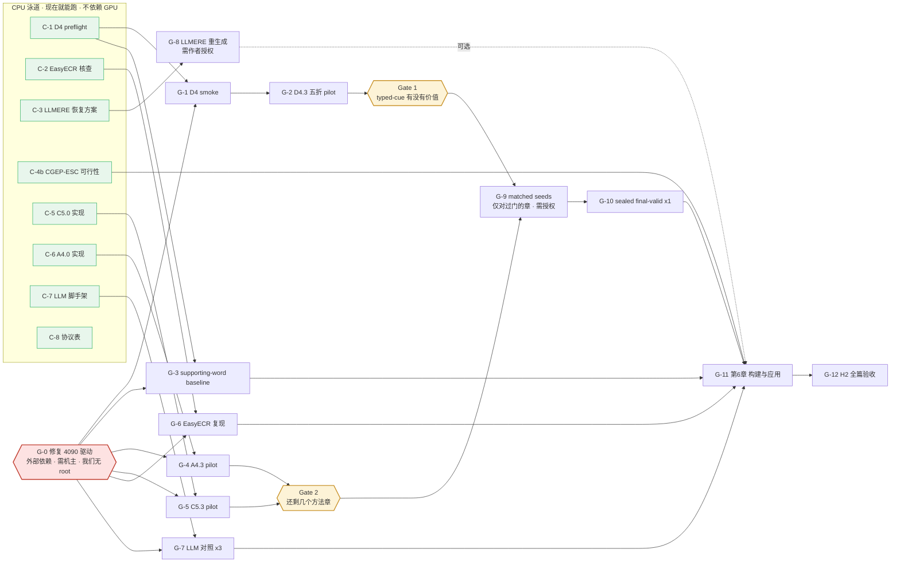
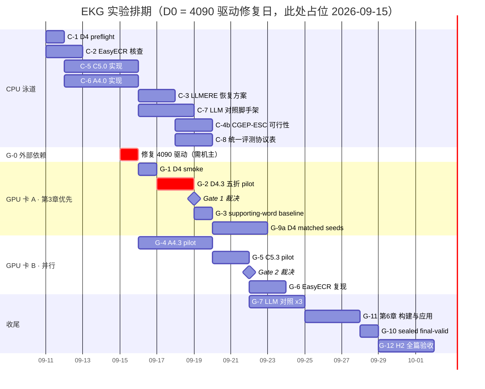

# 完整实验规划（防漂移主表）

> 冻结于 **2026-09-11**。服务 `SPEC.md` v1.1.0。
> **这份文件取代「每周想一遍下周做什么」。** 每周不再重新排任务，只从 §3 的主表里取下一个
> 未完成项；时间线见 §3，预期结果表见 §7。要偏离顺序，**先改本文件再执行**；口头改计划一律无效。
> 数字仍只写进 `results/PHASE_*.md`，本文件不复制任何实验数字。

## 0. 防漂移的四条规则

1. **单一主表**：可执行实验只认 §4。`HANDOFF.md` 的 E 队列只是主表的**当周切片**，不得包含
   主表以外的新任务。
2. **两条泳道并行**：§4 分 **CPU 泳道**与 **GPU 泳道**。GPU 不可用时，CPU 泳道照常推进，
   **不得**把「等 GPU」写成停工理由，也**不得**为了填时间发明主表外的任务。
3. **决策点是排期的一部分**：§5 的三个 Gate 是预先安排的重规划时刻。**只在 Gate 上改计划**；
   Gate 之间出现的新想法记进 §8 候补区，不插队。
4. **完成判据写在表里**：每一项的「完成 =」列就是验收标准。没达到就标 `wip` 并写清卡在哪条证据，
   不得口头声称完成。

## 1. 论文目标结构（作者 2026-09-11 选定「乙」形态）

```
第1章 绪论
第2章 相关工作与统一评测协议
第3章 事件事实性检测            ← D4    方法 + 3.4 实验（对比/消融/负控/案例）
第4章 事件关系抽取              ← A4    方法 + 4.4 实验
第5章 事件身份消解              ← C5    方法 + 5.4 实验
第6章 事件图谱构建与下游事件预测应用 ← E3  带公开对手的应用章
第7章 总结与展望
```

章序按**把握度**排，不按依赖：D4 赛道无竞争、power 六倍余量、实现已完成，放第 3 章先做；
C5 最没把握，放第 5 章。Ch6 不要求胜过任何方法章。

**每个方法章的实验节固定四件**（照钱子杰/宁婉廷/李璐的一致体例）：

```
X.4.1 数据集、评价指标与实验设置
X.4.2 对比模型          ← 逐个介绍每个 baseline
X.4.3 总体实验结果及分析  ← 主表：公开方法[ref] ×≥3 + LLM 对照 + 本文前期方法 + 本文最终方案（末行）
X.4.4 消融实验 + 负控
(X.4.5 参数/案例/错误分析)
```

主表形态与 FR-016 保真度规则见 [`BASELINE_ROSTER.md`](BASELINE_ROSTER.md)。

## 2. 当前状态基线

| | 状态 |
|---|---|
| v6.1 三份方法设计 | **一个都没跑过**。C5/A4 未实现，D4 只完成 D4.0 实现与本地 gate |
| 各章主锚 | Ch1 MUC `.809847`；Ch2 causal F1 `33.17`；Ch3 pooled 5 类 macro-F1 `.553995` |
| Ch6 已有资产 | 图依赖正控**已通过**（gold .1802 / rewired .1185 / no_graph .0811）；构建损失 −.0218＝整图价值 22.0%；受控扰动曲线已测 |
| gpu-4090 | **CUDA 完全不可用**（驱动内核模块与用户态库版本不符，需 root 修复，机器共用） |
| gpu-5090 | 可连，但 host key 待确认、剩约 15GB、须逐次授权 |

## 3. 时间线

### 3.1 依赖图



### 3.2 排期

> CPU 泳道用真实日期。**GPU 泳道以 `D0` = 4090 驱动修复当日为锚**，下图把 `D0` 占位在 2026-09-15；
> 驱动晚修好几天，整条 GPU 泳道就整体平移几天，**相对顺序与时长不变**。



**日历读数**：CPU 泳道约 **8 个工作日**（现在起，不等任何人）。GPU 泳道从 `D0` 起约 **19 天**
到 H2 验收完成。若 `D0` 落在 2026-09-15，全部实验约在 **D0+19 ≈ 2026-10-04** 收口；
`D0` 每推迟一天，收口日同步推迟一天。**这是顺利情形**——任一 Gate 判「不过」都会改变后半段。

## 4. 实验主表

### 4.1 CPU 泳道（GPU 不可用时照常推进）

| ID | 实验 | 依赖 | 完成 = | 产物 |
|---|---|---|---|---|
| **C-1** | D4.1 immutable preflight | 无 | protocol `status=pass`；独立重算两条 accepted OOF baseline；全部 hash/覆盖/折隔离一致 | `runs/stages/D4/d4-v61-typed-cues-r1/preflight/` |
| **C-2** | EasyECR 可运行性实跑核查（不训练） | 无 | 裁决 `runnable`/`conditionally_runnable`/`not_runnable` 落 `results/PHASE_R1.md`；KBP 2017 可得性判定写进名册 §1.1，定下 FR-016 状态 (a) 还是 (b) | 名册 §1.1 + 结果页 |
| **C-3** | E8.1 LLMERE 恢复方案冻结 | 无 | 方案覆盖全部 11,149 条、同一规则、原始输出保留、fail-fast 与成本明确。**通过≠获准重生成** | 结果页 §9.x |
| **C-4** | ~~Ch6 对手名册调研~~ → **已完成 2026-09-11**：SeDGPL 及其四个 CGEP 对手（BART contrastive / CSProm-KG / MCPredictor / SimKGC）全部有公开训练代码，**Gate 3 过**。剩余子项 **C-4b**：验证 CGEP-ESC 能否重建以取得 FR-016 状态 (a) | 无 | C-4 done；C-4b 给出 ESC 重建可行性裁决与切分口径确认 | 名册 §6 |
| **C-5** | C5.0 实现 + 本地 gate | 无（QR-001 修订后已解锁） | targeted tests + 三件套全绿 | 代码 + 测试 |
| **C-6** | A4.0 实现 + 本地 gate | 无 | 同上 | 代码 + 测试 |
| **C-7** | LLM 对照脚手架（提示模板、LoRA 配置、评分接线） | 无 | 三章各有一个 CPU fixture：给定 10 条固定输入产出**格式合法**的预测文件，且能被该章冻结的 evaluator 打分（分数高低不论）；提示模板与 LoRA 配置落 hash | 代码 + 测试 |
| **C-8** | 第 2 章「统一评测协议」素材整理 | 无 | 产出一份 `docs/PROTOCOL_TABLE.md`：三章各自的 manifest SHA-256、文档/mention 计数、划分来源、evaluator SHA-256、指标定义、final-valid 封存状态，**每一格都能从 `results/` 或 `runs/` 反查到**；无空格、无「待补」 | `docs/PROTOCOL_TABLE.md` |

CPU 泳道**全部 8 项都不依赖 GPU，现在就能做**，且彼此无强依赖，可任意顺序并行。

### 4.2 GPU 泳道（全部阻断在 G-0）

| ID | 实验 | 依赖 | 粗估 | 完成 = |
|---|---|---|---|---|
| **G-0** | **修复 gpu-4090 驱动**（重启或重载 nvidia 模块） | **作者联系机主，我们无 root** | — | `nvidia-smi` 正常且 `torch.cuda.is_available()` 为真 |
| **G-1** | D4.2 CPU/CUDA smoke（1 fold / 10 docs / 三臂） | C-1 + G-0 | 分钟级 | 三臂 loss/logits/spans 有限；evaluation ID 未入 train/selection |
| **G-2** | **D4.3 seed-13 五折 pilot（三臂）** ← **GPU 恢复后的队首** | G-1 + 作者授权长任务 | ~1.5 GPU·day | 2,913 篇 / 73,939 mention 各恰好一次 OOF 预测；逐实例概率/cue/evidence/三级 logits/confusion 落盘 |
| **G-3** | D4 supporting-word baseline 五折重建 | C-1 + G-0 | ~1 GPU·day | 先在官方划分复现官方数字（容差事前定 ±1.0 macro-F1）→ FR-016 状态 (a)；再转五折 OOF |
| **G-4** | A4.2 smoke → **A4.3 seed-13 pilot（四臂）** | C-6 + G-0 + 授权 | ~2–3 GPU·day | 完整候选逐位不变；逐实例 evidence 与三种 counterfactual logits 落盘 |
| **G-5** | C5.2 smoke → **C5.3 seed-13 pilot（三臂）** | C-5 + G-0 + 授权 | ~1 GPU·day | 291 篇 / 7,195 mention 全覆盖；false-merge 中介与 calibration 落盘 |
| **G-6** | EasyECR Global-Local Topic 复现 | C-2 判定可跑 + G-0 | ~1–2 GPU·day + 调试 | 若 KBP 2017 可得则先复现其发表数字（(a)）；否则直接跑 MAVEN-ERE 并标 (b) + 列差异 |
| **G-7** | LLM 对照 ×3 章（Qwen3-8B LoRA） | C-7 + G-0 | ~1 GPU·day/章 | 三章主表各加 1–2 行；披露 backbone/revision/微调方式/提示模板 |
| **G-8** | E8.2 LLMERE 全量重生成 + 官方评分 | C-3 + **作者明确授权** | 42 GPU·h（批量化后 3–5 h） | 11,149 条同一规则重生成；官方 evaluator 打分；或如实记为不可评分失败 |
| **G-9** | matched seeds 13/17/42（**仅对已过 seed-13 门的章**） | G-2/G-4/G-5 过门 + **逐次授权** | 各 ~2× pilot | mean delta、2/3 为正、10,000 次配对 bootstrap CI 下界 > 0 |
| **G-10** | sealed final-valid ×1（**仅对已过 confirmation 的章**） | G-9 + 配置完全冻结 | 小时级 | 一次性评测，写入 final-valid ledger |
| **G-11** | Ch6：E3.0 → E3.1 → E3.2 → E3.3 → E3.4 → E3.5 | C-4 + 至少一章的 bundle/fallback + G-0 | ~1–2 GPU·day | 见 `phases/PHASE_E3_graph_application.md` 的 Done when |
| **G-12** | H2 全篇复现验收（默认 CPU/cache） | G-11 | ~CPU | 见 `phases/PHASE_H2_thesis_acceptance.md` 七项审计 |

**GPU 预算粗估**：不含 matched seeds 约 **10–14 GPU·day**；三章都过门并跑 matched seeds + final-valid
则合计约 **25–30 GPU·day**。两卡并行且 namespace 不重叠时可对半。

**两卡并行的合法组合**（G-0 修复后）：卡 A 跑 G-2（D4，写 `runs/stages/D4/`），
卡 B 跑 G-4（A4，写 `runs/stages/A4/`）或 G-6（EasyECR，独立 venv 与 namespace）。
**不得**用并行跑同一方案的多个 seed——多种子始终另行授权。

## 5. 三个决策点（预先安排的重规划时刻）

| Gate | 触发时点 | 要判什么 | 分支 |
|---|---|---|---|
| **Gate 1** | G-2（D4.3）出结果 | typed-cue 机制有没有价值：full 是否高于 CLS 与 DMRoBERTa；full vs remove-core 是否降低注册 confusion；permutation 是否消除该改善 | **过** → 继续 G-4/G-5，三章结构保留。**不过** → **不启动第二个周期**，直接进 Gate 2 讨论结构 |
| **Gate 2** | G-4 与 G-5 都出结果 | 还剩几个方法章 | **3 章过** → 博士量级，按原结构写。**2 章过** → 正好是领域硕士标准形态（2 方法章 + 1 应用章），按此写。**≤1 章过** → 与导师共同决定改纲，**不得**自行降级或再开新机制家族 |
| ~~**Gate 3**~~ | ~~C-4 冻结~~ | ~~Ch6 能否凑够 ≥3 个公开对手~~ | **2026-09-11 已判定：能。** 五个对手全部有公开训练代码，Ch6 按 E3.3 做带对手的应用章。遗留问题移入 C-4b：原论文 CGEP-MAVEN 派生数据未发布，故对手默认落 FR-016 状态 (b)，能否经 CGEP-ESC 升到 (a) 待验 |

Gate 之外不重排计划。Gate 上的裁决必须写回本文件与 `HANDOFF.md`。

## 6. 与 phase 契约的映射

| 主表 ID | 契约 | 契约内任务号 |
|---|---|---|
| C-1, G-1, G-2, G-3 | `phases/PHASE_D4_typed_cue_factuality.md` | D4.1 / D4.2 / D4.3 / D4.1b |
| C-6, G-4 | `phases/PHASE_A4_pair_evidence.md` | A4.0–A4.4 |
| C-5, G-5 | `phases/PHASE_C5_argument_uncertainty.md` | C5.0–C5.4 |
| C-2, C-4, G-6, G-7 | `BASELINE_ROSTER.md` §1/§2/§3/§6 | FR-016 判定 |
| C-3, G-8 | `results/PHASE_R1.md` §9.6 / §21.6 | E8 恢复 |
| G-11 | `phases/PHASE_E3_graph_application.md` | E3.0–E3.5 |
| G-12 | `phases/PHASE_H2_thesis_acceptance.md` | 七项审计 |

## 7. 论文实验预期结果

> **「预期」指的是表的形态与判定线，不是预测的数字。** 已实测的格子填真实值并标来源；
> 未跑的格子一律写 `待测`，不许填猜测值。每张表的最后一行是本文方法。
> 所有数字的唯一权威仍是 `results/PHASE_*.md`，本节只给骨架。

### 7.1 第3章 事件事实性检测 · 表 3-3 主结果

数据：MAVEN-FACT public train 2,913 篇 / 73,939 mention，预冻结五折 OOF，每篇恰好一次 out-of-fold 预测。

| 方法 | CT+ | PS+ | CT− | PS− | Uu | **5类 macro-F1** | accuracy |
|---|---:|---:|---:|---:|---:|---:|---:|
| RoBERTa+CLS[Li+ 2024]（主锚） | .9753 | .5526 | .6628 | .3825 | .1969 | **.5540** | .9492 |
| DMRoBERTa dynamic-multi[Li+ 2024] | .9761 | .5393 | .6712 | .3742 | .1673 | .5456 | .9502 |
| MAVEN-FACT supporting-word pipeline[Li+ 2024] | 待测 | 待测 | 待测 | 待测 | 待测 | 待测 | 待测 |
| LLM 对照（Qwen3-8B LoRA） | 待测 | 待测 | 待测 | 待测 | 待测 | 待测 | 待测 |
| **本文 D4（typed cue + 分解式决策）** | 待测 | 待测 | 待测 | 待测 | 待测 | **待测** | 待测 |

**判定线**：seed-13 门＝严格高于 CLS（.5540）与 DMRoBERTa（.5456），即 **> .5540**；
确认门＝matched seeds 13/17/42 的 mean delta **≥ +.030**（→ 约 **≥ .584**），2/3 为正，
10,000 次文档聚类配对 bootstrap 95% CI 下界 > 0。
**护栏**：任一 anchor 非零 F1 类不得塌为 0；PS−/Uu 相对 CLS 的 non-inferiority margin `-0.030`。

⚠️ **参照系**：同任务已发表硕士论文（钱子杰，苏大，EB-DLEF）打赢 9 个 baseline 的幅度是
**宏 F1 +0.97 点（=+.0097）**。我们的确认门 `+.030` 是其 3 倍。这条差距记录在案，本轮不动
（作者 2026-09-11：统计门槛是锦上添花，不是主要矛盾）。

**表 3-4 消融与负控**

| 臂 | 5类 macro-F1 | unknown 混淆率 | modality-only | polarity-only |
|---|---:|---:|---:|---:|
| full | 待测 | 待测 | 待测 | 待测 |
| remove-core（flat 五类头） | 待测 | 待测 | 待测 | 待测 |
| cue-permutation（文档内置换，**负控**） | 待测 | 待测 | 待测 | 待测 |

机制成立的形态：`full` 相对 `remove-core` 降低三类注册 confusion 总率，而 `permutation` **消除**该改善。
若 permutation 也保留同样改善 → 机制证伪。

### 7.2 第4章 事件关系抽取 · 表 4-3 主结果

数据：MAVEN-ERE 2,622 train / 291 internal-dev，完整候选全集，官方 `evaluate.py`。

| 方法 | causal P | causal R | **causal F1** | subevent F1 | temporal F1 |
|---|---:|---:|---:|---:|---:|
| MAVEN-ERE official joint[Wang+ 2022]（主锚） | 34.37 | 32.05 | **33.17** | 29.75 | 51.63 |
| TacoERE[Chen+ 2024]（透明适配 (b)） | — | — | 32.01 | 28.80 | 51.48 |
| LLMERE-causal[Hu+ 2025]（透明适配 (b)） | 待测 | 待测 | 待测 | n/a | n/a |
| LLM 对照（Qwen3-8B LoRA） | 待测 | 待测 | 待测 | 待测 | 待测 |
| A3.6 fallback（本文前期工作，`failed` 身份） | — | — | 32.10 | — | — |
| **本文 A4（pair evidence sufficiency）** | 待测 | 待测 | **待测** | 待测 | 待测 |

**判定线**：seed-13 门＝causal F1 严格高于主锚 33.17、TacoERE 32.01 与 A3 fallback 32.10；
确认门＝mean causal delta **≥ +.010**，2/3 为正，配对 bootstrap CI 下界 > 0。
**护栏**：subevent F1 ≥ **.2875**，temporal F1 ≥ **.5063**，causal recall 不低于 A3 fallback 1.0 个绝对点，
候选 population/digest 逐位相同。

**表 4-4 消融与负控**：full / remove-core（去 evidence objectives）/ length-matched 非证据句（**负控**）/
no structural constraint。机制成立的形态：full 相对 remove-core **降低跨句 causal 误报率**
（主锚的 9,490 个 causal FP 中 7,115 个是跨句，这是靶子），而 length-matched 负控不保留同样的中介改善。

### 7.3 第5章 事件身份消解 · 表 5-3 主结果

数据：同上 291 篇 internal-dev / 7,195 mention，官方 scorer。

| 方法 | **MUC F1** | B³ F1 | CEAFe F1 | BLANC | CoNLL F1 |
|---|---:|---:|---:|---:|---:|
| MAVEN-ERE official joint[Wang+ 2022]（主锚） | **.8098** | 待重报 | 待重报 | 待重报 | 待重报 |
| Global-Local Topic[Xu+ 2022] via EasyECR | 待测 | 待测 | 待测 | 待测 | 待测 |
| Qwen3 论元池化（本文注册**负面对照**） | .8037 | .9795 | .9762 | .8980 | .9198 |
| LLM 对照（Qwen3-8B LoRA） | 待测 | 待测 | 待测 | 待测 | 待测 |
| **本文 C5（论元不确定性门控）** | **待测** | 待测 | 待测 | 待测 | 待测 |

**判定线**：MUC 严格高于主锚 .8098、注册负面对照 .8037 与 Global-Local Topic；
确认门＝mean MUC delta **≥ +.010**。
**护栏**：B³/CEAFe/BLANC 分别不低于主锚 0.5 个绝对点；覆盖必须是 291 篇 / 7,195 mention 全量显式
`ok`/`empty`/`partial`/`rejected`，任何静默丢弃直接失败。

⚠️ Global-Local Topic 的 FR-016 状态很可能是 **(b)**：其原始基准是 KBP 2017（LDC2015E29/E68/E73/E94、
LDC2016E64，817 篇），需 LDC 许可，我们大概率取不到，因而无法复现其发表数字。
届时该行标「透明适配」并逐条列出差异（语料、mention 来源、评测器、超参）。

**表 5-4 消融与负控**：full / remove-core（去 role residual）/ document×event-type 内 role posterior
permutation（**负控**）。机制成立的形态：full 降低注册的 incompatible-role false-merge 率，permutation 消除之。
MAVEN-ARG event-level gold 论元仅列 **non-deployable oracle**，不参与胜出门。

### 7.4 第6章 事件图谱构建与下游事件预测应用 · 表 6-2 主结果

数据：**本地重建 CGEP-MAVEN 协议**（1,908 实例）。表头必须写明「本地重建」。

| 方法 | MRR | Hit@1 | Hit@3 | Hit@10 | Hit@20 | Hit@50 |
|---|---:|---:|---:|---:|---:|---:|
| random | 待测 | 待测 | 待测 | 待测 | 待测 | 待测 |
| frequency | 待测 | 待测 | 待测 | 待测 | 待测 | 待测 |
| SimKGC[Wang+ 2022]（(b) 适配） | 待测 | 待测 | 待测 | 待测 | 待测 | 待测 |
| MCPredictor[Bai+ 2021]（(b) 适配） | 待测 | 待测 | 待测 | 待测 | 待测 | 待测 |
| CSProm-KG[Chen+ 2023]（(b) 适配） | 待测 | 待测 | 待测 | 待测 | 待测 | 待测 |
| BART contrastive[Zhu+ 2023]（(b) 适配） | 待测 | 待测 | 待测 | 待测 | 待测 | 待测 |
| SeDGPL[Zhan+ 2024]（基座，本项目自跑） | 待重报 | 待测 | 待测 | 待测 | 待测 | 待测 |
| **本文构建图（predicted 上游）** | **.1583** | 待测 | 待测 | 待测 | 待测 | 待测 |
| 本文构建图（gold 上游，**上界**） | .1802 | .1143 | 待测 | .3124 | 待测 | 待测 |

⚠️ **原论文的 CGEP-MAVEN 数字（SeDGPL 27.9 / BART 24.7 / CSProm-KG 22.3 / MCPredictor 18.1 /
SimKGC 9.3）不得填进本表**——它们用的是 512 候选的派生数据，**从未发布**；我们是 1,908 实例的本地
重建，候选规模与构造都不同。原文数字只能在正文里作背景引用，并明写不可比。

**表 6-3 图依赖正控（已完成）**

| 臂 | MRR | Δ vs gold | 占整图价值 |
|---|---:|---:|---:|
| gold | .1802 | — | — |
| rewired（边数/类型/子类型全同，端点随机重挂） | .1185 | −.0617 | 62% |
| no_graph（删光所有边） | .0811 | −.0991 | 100% |

三者严格有序且差距是噪声地板（±.003–.004）的一到两个数量级 ⇒ **消费者确实在读边的正确性，
不只是边的存在**。这张表已经跑完，本轮直接引用。

**表 6-4 构建误差的下游代价（已完成）**

| 对照 | ΔMRR | 95% CI | 占整图价值 |
|---|---:|---|---:|
| gold − predicted（**构建损失**） | **+.0218** | [+.0109, +.0327] | **22.0%** |
| 拆节点 @0.25（身份错误） | −.0184 | CI 不含 0 | 18.6% |
| 删边 @0.25（召回损失） | −.0081 | CI 不含 0 | 8.2% |
| 增边 @0.25（精度损失） | −.0047 | CI 不含 0 | 4.7% |
| 打乱 temporal @1.0 | +.0000 | [0, 0] | 0%（结构零） |

**表 6-5 一致性指标与可重建性不对齐（已完成）**：causal_scc–R1 的 Spearman ρ = **−0.064**，
temporal_closure_gap–R1 ρ = −0.163，拓扑边数–R1 ρ = −0.008；而 R1–R2 ρ = **+0.783**。

### 7.5 三种可能的最终形态

| 情形 | 触发 | 论文长什么样 |
|---|---|---|
| **上行** | 三个方法章都过门 | 3 方法章 + 1 应用章 = 博士量级；对标陈泽/陈勇 |
| **中行（最可能）** | 两个方法章过门 | 2 方法章 + 1 应用章 = **正好是本领域硕士标准形态**（钱子杰/宁婉廷/李璐/陈玉婷均为此形态） |
| **下行** | ≤1 个方法章过门 | 与导师共同决定改纲。Ch6 的构建损失、图依赖正控与不对齐发现**不依赖任何方法章成功**，仍然成立 |

**下行情形不是论文垮掉，是论文降到领域常见水平。** 这是这份规划里最值得记住的一条。

## 8. 候补区（Gate 之间产生的想法放这里，不插队）

- LLMERE 保真度路径与 `HANDOFF.md` §E.1a 第 6 条冲突，待作者裁决（见 `results/PHASE_R1.md` §21.6）；
- CorefPrompt 若以我方 Qwen3 论元替代失效的 OmniEvent 论元文件，可作 Ch1 第二个 (b) 状态对手；
- Ch3 是否在主表增报 3 类 macro-F1 与 micro-F1 两列（领域惯例，需在 D4 任何结果出现前登记）。

## 9. 不做的事

- 不恢复 24 条件 factorial、Holm 校正家族、frozen-vs-fine-tuned 同 backbone 对照；
- 不为「看起来在跑」启动无准入的训练；
- 不在未授权时启动额外 seeds；
- 不用更大 backbone、换 split、扫参或改选模规则来救已止损的机制；
- 不用 LLM 为主评测生成标注（只作 baseline 行与训练侧增强）。
