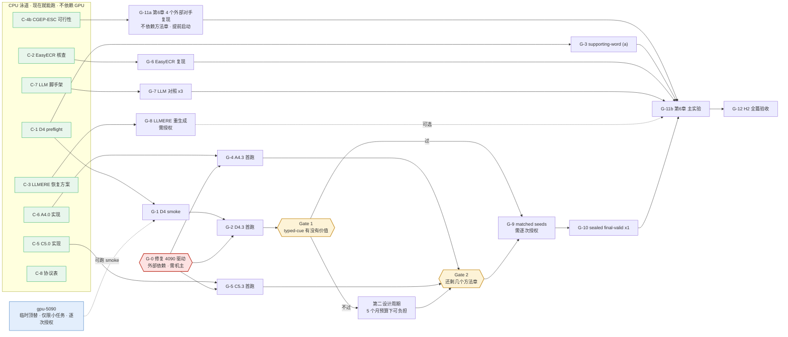
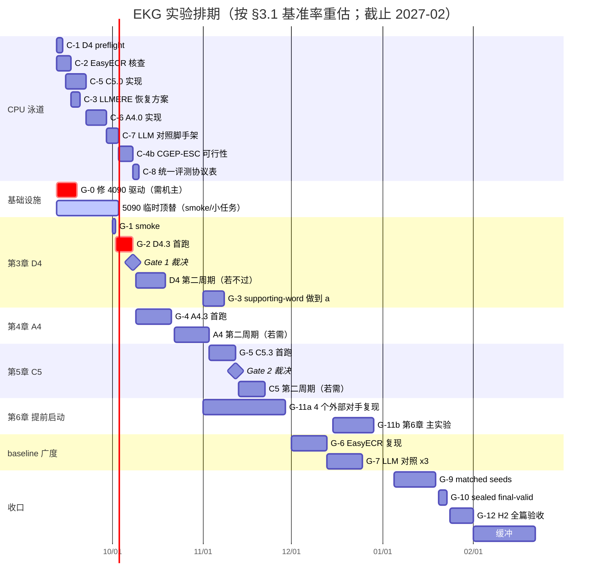

# 完整实验规划（防漂移主表）

> 冻结于 **2026-09-11**。服务 `SPEC.md` v1.1.0。
> **这份文件取代「每周想一遍下周做什么」。** 每周不再重新排任务，只从 §3 的主表里取下一个
> 未完成项；**时间线与估算基准率见 §3**，预期结果表见 §7。要偏离顺序，**先改本文件再执行**；口头改计划一律无效。
> 数字仍只写进 `results/PHASE_*.md`，本文件不复制任何实验数字。

## 0. 防漂移的四条规则

1. **单一主表**：可执行实验只认 §4。`HANDOFF.md` 的 E 队列只是主表的**当周切片**，不得包含
   主表以外的新任务。
2. **两条泳道并行**：§4 分 **CPU 泳道**与 **GPU 泳道**。GPU 不可用时，CPU 泳道照常推进，
   **不得**把「等 GPU」写成停工理由，也**不得**为了填时间发明主表外的任务。
3. **决策点是排期的一部分**：§5 的三个 Gate 是预先安排的重规划时刻。**只在 Gate 上改计划**；
   Gate 之间出现的新想法记进 §8 候补区，不插队。
4. **完成判据写在表里**：每一项的「完成 =」列就是验收标准。没达到就标 `wip` 并写清卡在哪条证据，
   不得口头声称完成。

## 1. 论文目标结构（作者 2026-09-11 选定「乙」形态）

```
第1章 绪论
第2章 相关工作与统一评测协议
第3章 事件事实性检测            ← D4    方法 + 3.4 实验（对比/消融/负控/案例）
第4章 事件关系抽取              ← A4    方法 + 4.4 实验
第5章 事件身份消解              ← C5    方法 + 5.4 实验
第6章 事件图谱构建与下游事件预测应用 ← E3  带公开对手的应用章
第7章 总结与展望
```

章序按**把握度**排，不按依赖：D4 赛道无竞争、power 六倍余量、实现已完成，放第 3 章先做；
C5 最没把握，放第 5 章。Ch6 不要求胜过任何方法章。

**每个方法章的实验节固定四件**（照钱子杰/宁婉廷/李璐的一致体例）：

```
X.4.1 数据集、评价指标与实验设置
X.4.2 对比模型          ← 逐个介绍每个 baseline
X.4.3 总体实验结果及分析  ← 主表：公开方法[ref] ×≥3 + LLM 对照 + 本文前期方法 + 本文最终方案（末行）
X.4.4 消融实验 + 负控
(X.4.5 参数/案例/错误分析)
```

主表形态与 FR-016 保真度规则见 [`BASELINE_ROSTER.md`](BASELINE_ROSTER.md)。

## 2. 当前状态基线

| | 状态 |
|---|---|
| v6.1 三份方法设计 | **一个都没跑过**。C5/A4 未实现，D4 只完成 D4.0 实现与本地 gate |
| 各章主锚 | Ch1 MUC `.809847`；Ch2 causal F1 `33.17`；Ch3 pooled 5 类 macro-F1 `.553995` |
| Ch6 已有资产 | 图依赖正控**已通过**（gold .1802 / rewired .1185 / no_graph .0811）；构建损失 −.0218＝整图价值 22.0%；受控扰动曲线已测 |
| gpu-4090 | **CUDA 完全不可用**（驱动内核模块与用户态库版本不符，需 root 修复，机器共用） |
| gpu-5090 | **已授权作 4090 不可达期间的临时顶替**（作者 2026-09-11）：只跑 smoke 与小任务，主体实验回 4090。host key 待确认、余量约 15GB、须逐次授权。边界见 §3.5 |

## 3. 时间线

> **2026-09-11 重估。** 初版排期（全部实验 3 周收口）是错的：当时把 **GPU 计算耗时**当成了
> **项目日历时间**，既没算调试与抢修，也没留失败重试预算。本节改用**项目自身的历史基准率**估算。

### 3.1 估算基准率（来自本仓库 git 历史，不是拍脑袋）

| 参照事件 | 起止 | 日历天 | 结果 | 说明 |
|---|---|---:|---|---|
| **E8 LLMERE**：跑别人的 converter + LoRA SFT + 全量生成 | 09-07 → 09-10 | **4** | **失败** | 约 10 个抢修 commit：TLS、磁盘、未设门镜像、依赖 extras、断点续跑。计算本身约 2 天，其余全是环境 |
| **A3 关系方法族**：四臂，我们自己的机制 | 08-28 → 09-05 | **9** | **失败** | 20 个 commit |
| Ch3 五折 OOF baseline：2 baseline × 5 折 = 10 个训练任务 | 09-04 → 09-05 | **2** | 成功 | 最顺的一次：无新机制、GPU 正常 |
| D4.0 实现 + 本地 gate | 09-09 | **~2** | 成功 | 建立在既有 factuality 代码上 |

由此得到四条**换算规则**，本节所有估算都按它推：

1. **复现一个外部方法 ≈ 4–9 个日历天，且首次失败概率高**（LLMERE 4 天失败、taco 反复多轮）；
2. **跑一个我们自己的多臂方法 pilot ≈ 6–12 个日历天**（A3 九天）；
3. **纯 baseline 扫（无新机制 + 基础设施正常）≈ 2 天**；
4. **实现 + 本地 gate ≈ 2–7 天**，取决于要不要新建机制组件。

另加三项初版完全没算的开销：**失败重试预算**（我们方法机制首次成功率 0/6）、
**第二设计周期**（`RESEARCH_PLAN` 明确允许每个家族两轮）、**基础设施再故障**
（4090 于 2026-09-11 自发损坏；ssh 隧道约 40% 掉线）。

### 3.2 依赖图



### 3.3 排期 2026-09 → 2027-02



### 3.4 三条关键推论

1. **顺利情形下 2027-01 底收口，2026-02 整月是缓冲。** 但若**两个以上**方法章各需第二设计周期，
   缓冲清零。5 个月不宽裕，是**刚好够**。
2. **第 6 章必须提前启动，不能排在最后。** 那 4 个外部对手（CSProm-KG / SimKGC / BART contrastive /
   MCPredictor）与方法章**没有依赖关系**——它们只需要冻结的 evaluation unit。初版把 G-11 估成 1–2 天
   是本次最大的低估：按基准率 1，4 个外部复现单独就要 **3–4 周**。故从 2026-11 起就在卡 B 上滚。
3. **G-0 每拖一周，缓冲就少一周。** 这是当前唯一该催的外部事项。

### 3.5 GPU 使用：5090 的临时授权与边界

作者 2026-09-11 **第二次裁决（取代下面的旧边界）**：**4090 不管了，工作机改为 gpu-5090**；
在 5090 上验证我们的假设与方法可行性，**可重新拉取模型**，**单次不超过一天的任务都可以直接执行**。
拉模型前须先与作者确认服务器位置（已确认：`/mnt/aidata/tongjiakai/models/local/roberta-base/`）。
下面这张表是旧边界，保留作记录：

~~作者 2026-09-11 授权：**4090 不可达期间，gpu-5090 可用于临时性 GPU 任务；主体实验仍回 4090。**~~

| 能在 5090 上跑 | 不能 |
|---|---|
| D4 / C5 / A4 的 **CPU/CUDA smoke**（RoBERTa-base 量级，显存需求小） | **EasyECR**：其栈是 `torch==2.0.1`，5090 是 Blackwell sm_120，**torch 2.0 不支持该架构**，只能等 4090 |
| 小规模 preflight 里需要 CUDA 的片段 | ~~**Qwen3-8B LoRA 的 LLM 对照**：卡上已有约 17 GB 的既有服务，余量约 15 GB，8B bf16 需约 16 GB，**装不下**~~ —— **2026-09-13 实测作废**，见下面的 ⚠️ |
| 短时诊断、显存探测 | **任何长任务 pilot**（D4.3 / A4.3 / C5.3）：主体实验按作者要求留在 4090 |

⚠️ **上表「装不下」那格已被实测推翻（2026-09-13）**：5090 显存 **209 MiB / 32,607 MiB，无任何计算进程**
（那个约 17 GB 的 Qwen 服务早已不在，§3.5 的 ③ 在 09-11 就记了同样的读数，只是表没跟着改）。
24 核 load 0.05，磁盘余 1,015 GB。**G-7 的「余量不够」这条阻塞理由不再成立**；真正的前置改成
**5090 上只有 Qwen3-1.7B / 4B，没有 8B——拉模型仍须先问作者**。
**结论：过期的能力记录会把可行的任务判成不可行。写进本表的资源读数必须带日期，用前重测。**

**使用前置（按 2026-09-11 第二次裁决更新）**：① host key 已在 `known_hosts` 且**作者确认是本人所加**，
指纹 ED25519 `SHA256:Jkfb9Tb14Z/SqsG6g9GedDjKZOcBl1DLW6zT0V1dkJY`；② **≤1 天的任务不再逐次请示**，
超过一天的仍须问；③ 先 `nvidia-smi` 查实时显存，他人正在跑的卡不得挤占（2026-09-11 实测：
32,607 MiB 只用 209 MiB，原先那个约 17 GB 的 Qwen 服务已不在）；④ checkpoint 训在哪留在哪，
**跨机搬运与拉取模型前先问作者**。

⚠️ **backbone 现状**：5090 已从 ModelScope 拉齐 `roberta-base` 六件里的**五件**且逐字节等于 4090 的 pin
（含 476 MB 的 `pytorch_model.bin`），只差 `tokenizer_config.json`（`dfef6647…cfa5c5`，公网三个源都不提供）。
**闭合 pin 只需从 4090 取这一个几 KB 的文件**，隧道恢复即可；在那之前 5090 上的 D4 结果不能与
冻结的 CLS/DMRoBERTa 直接相减。详见 `results/PHASE_P1.md`。

## 3.6 D4 改为在 5090 自足重建，不从 4090 搬任何东西（作者 2026-09-11 裁决）

作者问「为什么要搬？不能在 5090 从新开始？」——核对后答案是**能，而且更干净**。原先列的两件
「必须从 4090 取」的东西，唯一用途都是复用 4090 已经花掉的算力：

| 原以为要搬 | 实际情况 |
|---|---|
| `tokenizer_config.json`（闭合旧 pin） | 只为复现**4090 那个** pin。旧 pin 里恰好含一个公网不提供的本地文件；5090 重新登记的 pin **六件全部来自公开源**，可重建性反而更强 |
| `r1-v61-factuality-oof-r2/` 四个 JSON | 只为复用 4090 训好的两条 baseline。用同一份冻结五折 CV 在 5090 重训即可 |
| （以为也要搬）`factuality_cv/` | **本地就有，640 KB / 16 文件**，与 4090 无关，已 rsync 到 5090 并双端核对一致 |
| `train.jsonl` | 5090 早已有，SHA-256 与 4090 逐字节相同 |

**新登记的 5090 backbone 内容地址**：
`2c7ff1f10496f2df54ed5590693c38c6bc2385bebf29e37b26e4833407349736`，位于
`gpu-5090:/mnt/aidata/tongjiakai/models/local/roberta-base/2c7ff1f1…49736`。
六个文件中五个直接来自 ModelScope `AI-ModelScope/roberta-base`（含 476 MB 权重，与 4090 pin 逐字节相同），
`tokenizer_config.json` 是 ModelScope 与 hf-mirror 都提供的同一份 25 字节规范文件。

**这条线更符合 A 类口径要求**：baseline 与三臂在同一台机、同一 backbone、同一份五折 manifest 下训出来，
三轴天然一致；反倒是「4090 的 baseline + 5090 的臂」才是该被质疑的混搭。

⚠️ **必须守的顺序（这等于重新求一次主锚）**：现在做合法，因为 D4 三臂**一个都还没训**，锚仍在看到
方法结果之前冻结。执行顺序不得颠倒：

1. 登记 backbone 内容摘要（**已完成**，见上）；
2. 同一份冻结五折 CV 上重训两条 baseline（CLS / dynamic-multi × 5 折 = 10 次 `run_r1_factuality_oof.py`）；
3. 汇总并**把新数字冻进 `results/PHASE_D.md`**，同时把 `prepare_d4_typed_cue_preflight.py` 里三个硬编码
   常量换成新登记值——**必须在跑臂之前写死，不得事后调绿**；
4. 才允许跑 D4 三臂。

4090 上那套数字（CLS .553995 / DMRoBERTa .545603，backbone pin `71be7419…`）作为**历史身份保留**，
与新线**不相减、不混表**。

## 3.7 4090 恢复后走哪条线（2026-09-12）

两条 anchor 线现在都成立，**方法实验走 4090 线**，理由是它已经过完整闸门而 5090 线没有：

| | 4090 线 | 5090 线 |
|---|---|---|
| preflight | ✅ PASS，两条 baseline 逐字段重算一致（`9429c5a8…5025e`） | ❌ 未建 |
| `acceptance.json` | ✅ 有，且 hash 被 preflight 绑定 | ❌ 无（4090 那份由运行目录里的 `acceptance_audit.py` 产出，**该脚本不在仓库**） |
| smoke | ✅ CPU + CUDA 双半边，产物逐字节相同 | — |
| 卡 | 4 张全空 | 1 张 |
| backbone 可重建性 | 含一个公网不提供的文件 | ✅ 六件全部公开源 |

**5090 线不作废，改作两件事**：① anchor 的独立复现证据——同一排序、绝对值低约 .010，
给出这组数字 **±.01 的可复现地板**（见 `results/PHASE_D.md`）；② 4090 再出事时的备份线。
两条线的数字**不相减、不混表**，各自标明机器与 backbone 地址。

## 4. 实验主表

### 4.1 CPU 泳道（GPU 不可用时照常推进）

| ID | 实验 | 依赖 | 完成 = | 产物 |
|---|---|---|---|---|
| **C-1** | ~~D4.1 immutable preflight~~ → **已完成 2026-09-11**（`93f59f1`）：`status=pass`，两条 accepted OOF baseline 逐字段重算一致（CLS .553995 / DMRoBERTa .545603），preflight protocol SHA-256 `9429c5a8…5025e`。执行中修掉三个让它在服务器上跑不起来的缺陷，见 `results/PHASE_D.md` | 无 | 已达成 | `gpu-4090:.../runs/stages/D4/d4-v61-typed-cues-r1/preflight/` |
| **C-2** | EasyECR 可运行性实跑核查（不训练） | 无 | **静态裁决 2026-09-11 已出：`conditionally_runnable`**，6 条阻断全部点名（`PHASE_R1.md` §22），KBP 2017 不可得 → **FR-016 (b)**。**剩余 C-2b**：4090 隧道恢复后建独立 venv 做活体 import 冒烟 | 名册 §1.1 + `PHASE_R1.md` §22 |
| **C-3** | E8.1 LLMERE 恢复方案冻结 | 无 | 方案覆盖全部 11,149 条、同一规则、原始输出保留、fail-fast 与成本明确。**通过≠获准重生成** | 结果页 §9.x |
| **C-4** | ~~Ch6 对手名册调研~~ → **已完成 2026-09-11**：SeDGPL 及其四个 CGEP 对手（BART contrastive / CSProm-KG / MCPredictor / SimKGC）全部有公开训练代码，**Gate 3 过**。剩余子项 **C-4b**：验证 CGEP-ESC 能否重建以取得 FR-016 状态 (a) | 无 | C-4 done；C-4b 给出 ESC 重建可行性裁决与切分口径确认 | 名册 §6 |
| **C-5** | C5.0 实现 + 本地 gate | 无（QR-001 修订后已解锁） | **2026-09-11 完成核心件**：`src/ekg/nodes/role_uncertainty.py`（sidecar / role 兼容性特征 / 分层 permutation / mediator 计数）+ `discriminative.py` 新增 `role_compatibility` 组件；15 条 targeted tests，**550 passed / 26 skipped、ruff 0、smoke OK**。bundle exporter 复用既有 `create_stage_bundle`（`protocol_extra` 足够挂 sidecar/mediator/fallback id），不另写。**剩余 C-5b**：train/evaluate/preflight/smoke 四个入口脚本 | 代码 + 测试 |
| **C-6** | A4.0 实现 + 本地 gate | 无 | ✅ **2026-09-12/13 完成（含 C-6b 入口脚本）**：`src/ekg/relations/pair_evidence.py` + `pair_heads.py` 注册 `pair_evidence` 头（零初始化证据残差，四臂同参数、init 基础 logits 相同）＋ 五个入口 `train_` / `evaluate_` / `prepare_*_preflight` / `smoke_` / `run_a4_pair_evidence.py`（pilot 入口已进 preflight 的 `CODE_FILES`，7 个文件）；**44 条 targeted tests**，本地 **592 passed / 28 skipped、ruff 0、smoke OK**，5090 四臂开发冒烟 pass（**非结果**）。**证据＝两触发句之间的 interior（定义，不是选择）**：不排序、不打分、无预算、无阈值；necessity 去掉 interior、sufficiency 只留 span；注册中介仍是 `cross_sentence_false_positives`，细分改为行为量（logit 掉幅 < 冻结 margin）并自带被测分母。⚠️ **初版的连接词词表选择器已被本项目自己的测量否掉**（`f90c8cd`：分层 recall 只差 .008/.064，补测 109,234 对中 79.3% 被判「有线索」）；**DREEAM 替代方案静态核查 `not_runnable`**（`b52d506`：两条证据监督路径都要人工标注、无 distant 语料、增益靠 dev 选阈值；其证据机制在「无 distant 数据」格只值 +0.33 F1）。冒烟另抓修三个真缺陷。bundle exporter 复用 `create_stage_bundle`。详见 `results/PHASE_A.md` | 代码 + 测试 |
| **C-7** | LLM 对照脚手架（提示模板、LoRA 配置、评分接线） | 无 | 三章各有一个 CPU fixture：给定 10 条固定输入产出**格式合法**的预测文件，且能被该章冻结的 evaluator 打分（分数高低不论）；提示模板与 LoRA 配置落 hash | 代码 + 测试 |
| **C-9** | ✅ **已完成 2026-09-12**（`a90df4e`，10 条 targeted tests，560 passed / ruff 0 / smoke OK；preflight 重建为 `preflight-r2` `dae0e0b4…e15c4`，`code_files=7`）。原文：**写 D4.3 的 pilot 入口 `scripts/run_d4_typed_cue_oof.py`**（2026-09-12 新增：契约点名了它，仓库里没有；同类缺口 A4/C5 各自也有） | C-1 ✅ + G-1 ✅ | 按冻结契约驱动 5 折 × 3 臂，逐实例概率/cue/evidence/三级 logits/confusion 落盘，coverage 断言 2,913 篇 / 73,939 mentions 各恰好一次；targeted tests + 三件套全绿 | 代码 + 测试 |
| **C-8** | 第 2 章「统一评测协议」素材整理 | 无 | 产出一份 `docs/PROTOCOL_TABLE.md`：三章各自的 manifest SHA-256、文档/mention 计数、划分来源、evaluator SHA-256、指标定义、final-valid 封存状态，**每一格都能从 `results/` 或 `runs/` 反查到**；无空格、无「待补」 | `docs/PROTOCOL_TABLE.md` |

| **C-10** | **E3.0 冻结 Ch6 的不可变 evaluation unit**（2026-09-13 新增，理由见下） | 无 | 按 `phases/PHASE_E3_graph_application.md` E3.0 冻结完整 query/candidate manifest、seed、source/generator hashes、candidate-ID digest 与 population counts，明标「本地重建协议」；每个 query 固定 `instance_id/doc_id/anchor/gold/candidates/label` | `runs/stages/E3/` + 结果页 |

CPU 泳道**全部 9 项都不依赖 GPU，现在就能做**，且彼此无强依赖，可任意顺序并行。

**新增 C-10 的理由（2026-09-13）**：§3.4 推论 2 已经判定「第 6 章必须提前启动」，§3.2 依赖图里
G-11a（4 个外部对手复现）也标了「提前启动」，但**它们全都要跑在同一个冻结的 evaluation unit 上**
——unit 没冻结就开对手，是 A 类口径问题（三轴一致性），跑了也得重跑。E3.0 是纯 CPU、零方法章依赖，
**是 G-11a 真正的前置**，却在主表里没有自己的行、被埋在 G-11 那一整行里。单列出来，
G-11a 才能在 5090 上按 §3.4 推论 2 的意图提前滚起来。

**泳道归属的判据（吃了一次亏后补上）**：一项任务属于 GPU 泳道，当且仅当**它自己的代码路径需要 GPU**。
「它读的文件在某台有 GPU 的机器上」不是 GPU 依赖——那是 scp 或 ssh 的事。A4.1 就是这样被误归了两天
（详见 `results/PHASE_A.md` 的 A4.1 节）。**新任务进表时逐条问一句：它 import torch 吗？**

### 4.2 GPU 泳道（长任务阻断在 G-0；smoke 可走 5090，见 §3.5）

| ID | 实验 | 依赖 | 粗估 | 完成 = |
|---|---|---|---|---|
| **G-0** | ~~修复 gpu-4090 驱动~~ → ✅ **已完成 2026-09-12**：驱动 580.178.04，`torch.cuda.is_available()=True`，4 张卡全空，CUDA 张量运算实测通过；中断期间的产物全部完好 | — | 已达成 | — |
| **G-1** | ~~D4.2 CPU/CUDA smoke~~ → ✅ **完整通过**：CPU 半边 2026-09-11，CUDA 半边 2026-09-12（4090 GPU2，`smoke.json` `c4c90b1a…`），**三臂产物与 CPU 逐字节相同**。旧记录：**CPU 半边 2026-09-11 已过**（4090 无 CUDA 时自动落 CPU，契约绑定不变，`smoke.json` `d0003af5…97c75`）；**CUDA 半边仍欠**——5090 虽空闲但缺 `factuality_cv/` 且 backbone 闭合不了 pin（差 `pytorch_model.bin` vs `model.safetensors` 与 `tokenizer_config.json`），要么等 G-0，要么经作者同意搬 476 MB 目录 |
| **G-2** | **D4.3 seed-13 五折 pilot（三臂）** —— ❌ **2026-09-12 跑完，机制失败**：full .476515 < remove-core .536788 < 两个锚；中介反向、PS−/Uu 护栏双破；负控也赢过 full。**typed-cue 家族第 1 个有效周期失败**，详见 `results/PHASE_D.md`。原注：**已启动**（4090，5 折铺 4 卡，预计 4–4.5 小时，收尾脚本自动汇总）。原注：队首，曾**被缺失的入口脚本挡住**：契约冻结的 `scripts/run_d4_typed_cue_oof.py` **从未被写过**（2026-09-12 发现）。先做 **C-9**，再谈授权 | **C-9** + G-1 ✅ + 作者授权长任务 | ~1.5 GPU·day（4 卡可按折并行） | 2,913 篇 / 73,939 mention 各恰好一次 OOF 预测；逐实例概率/cue/evidence/三级 logits/confusion 落盘 |
| **G-3** | D4 supporting-word baseline 五折重建 | C-1 + G-0 | ~1 GPU·day | 先在官方划分复现官方数字（容差事前定 ±1.0 macro-F1）→ FR-016 状态 (a)；再转五折 OOF |
| **G-4** | **~~A4.1 preflight~~ → A4.2 smoke → A4.3 seed-13 pilot（四臂）**。⚠️ **A4.1 从来不属于本泳道**：`prepare_a4_pair_evidence_preflight.py` 零 torch/cuda 引用，`--model` 只算目录内容摘要、不加载模型；它已于 **2026-09-13 在 4090 上纯 CPU 跑完并 PASS**（protocol `321309ac…d65451`，`code_files=7`，两条 baseline 独立重算与 §7.2 逐项吻合，见 `results/PHASE_A.md`）。原先写的「等 4090 空出卡」「卡在 4090 上的两个文件」**都不成立**——被占的是 GPU 不是文件系统，ssh 与 CPU 全程可用。**本行现在只剩 A4.2/A4.3，等空闲卡 + 授权长任务**；A4.2 可走 5090（§3.5）。2026-09-13 核卡：4090 四张仍被他人 vllm 占满（19.4–20.5 GB / 24.5 GB，89–99% util） | C-6 ✅ + **A4.1 ✅** + G-0 ✅ + 空闲卡 + 授权 | ~2–3 GPU·day | 完整候选逐位不变；逐实例 evidence 与三种 counterfactual logits 落盘 |
| **G-5** | C5.2 smoke → **C5.3 seed-13 pilot（三臂）** | C-5 + G-0 + 授权 | ~1 GPU·day | 291 篇 / 7,195 mention 全覆盖；false-merge 中介与 calibration 落盘 |
| **G-6** | EasyECR Global-Local Topic 复现 | C-2 判定可跑 + G-0 | ~1–2 GPU·day + 调试 | 若 KBP 2017 可得则先复现其发表数字（(a)）；否则直接跑 MAVEN-ERE 并标 (b) + 列差异 |
| **G-7** | LLM 对照 ×3 章（Qwen3-8B LoRA） | C-7 + G-0 | ~1 GPU·day/章 | 三章主表各加 1–2 行；披露 backbone/revision/微调方式/提示模板 |
| **G-8** | E8.2 LLMERE 全量重生成 + 官方评分 | C-3 + **作者明确授权** | 42 GPU·h（批量化后 3–5 h） | 11,149 条同一规则重生成；官方 evaluator 打分；或如实记为不可评分失败 |
| **G-9** | matched seeds 13/17/42（**仅对已过 seed-13 门的章**） | G-2/G-4/G-5 过门 + **逐次授权** | 各 ~2× pilot | mean delta、2/3 为正、10,000 次配对 bootstrap CI 下界 > 0 |
| **G-10** | sealed final-valid ×1（**仅对已过 confirmation 的章**） | G-9 + 配置完全冻结 | 小时级 | 一次性评测，写入 final-valid ledger |
| **G-11** | Ch6：E3.0 → E3.1 → E3.2 → E3.3 → E3.4 → E3.5 | C-4 + 至少一章的 bundle/fallback + G-0 | ~1–2 GPU·day | 见 `phases/PHASE_E3_graph_application.md` 的 Done when |
| **G-12** | H2 全篇复现验收（默认 CPU/cache） | G-11 | ~CPU | 见 `phases/PHASE_H2_thesis_acceptance.md` 七项审计 |

**GPU 预算粗估**：不含 matched seeds 约 **10–14 GPU·day**；三章都过门并跑 matched seeds + final-valid
则合计约 **25–30 GPU·day**。两卡并行且 namespace 不重叠时可对半。

**两卡并行的合法组合**（G-0 修复后，均在 4090 上）：卡 A 跑 G-2（D4，写 `runs/stages/D4/`），
卡 B 跑 G-4（A4，写 `runs/stages/A4/`）、G-6（EasyECR，独立 venv 与 namespace）或 G-11a（第6章外部对手）。
**不得**用并行跑同一方案的多个 seed——多种子始终另行授权。

**4090 不可达期间**：只有 smoke 与小任务可按 §3.5 放到 5090，且每次单独取得作者授权；
长任务 pilot 一律等 G-0。

## 5. 三个决策点（预先安排的重规划时刻）

| Gate | 触发时点 | 要判什么 | 分支 |
|---|---|---|---|
| ~~**Gate 1**~~ | ~~G-2（D4.3）出结果~~ | **2026-09-12 已判定：不过。** full `.476515` 低于两个锚；full 相对 remove-core `.536788` **抬高**了注册 confusion；permutation `.495260` 也赢过 full。三项全败，无一含糊 | **已走「不过」分支**：typed-cue 家族关闭，**不启动第二个周期**，转 G-4/G-5，到 Gate 2 判结构。详见 `results/PHASE_D.md` |
| **Gate 2** | G-4 与 G-5 都出结果 | 还剩几个方法章 | **3 章过** → 博士量级，按原结构写。**2 章过** → 正好是领域硕士标准形态（2 方法章 + 1 应用章），按此写。**≤1 章过** → 与导师共同决定改纲，**不得**自行降级或再开新机制家族 |
| ~~**Gate 3**~~ | ~~C-4 冻结~~ | ~~Ch6 能否凑够 ≥3 个公开对手~~ | **2026-09-11 已判定：能。** 五个对手全部有公开训练代码，Ch6 按 E3.3 做带对手的应用章。遗留问题移入 C-4b：原论文 CGEP-MAVEN 派生数据未发布，故对手默认落 FR-016 状态 (b)，能否经 CGEP-ESC 升到 (a) 待验 |

Gate 之外不重排计划。Gate 上的裁决必须写回本文件与 `HANDOFF.md`。

⚠️ **Gate 1 走完后留下的纪律**：`phases/PHASE_D4_typed_cue_factuality.md` 的 stop conditions 写的是
「两个有效周期后封存」，与 Gate 1 的「不过就不开第二轮」不一致。**以本表的 Gate 为准**——它更具体，
且在看到任何 D4 数字之前就已冻结。执行代理不得引用较宽松的那条给自己加一次机会。

## 6. 与 phase 契约的映射

| 主表 ID | 契约 | 契约内任务号 |
|---|---|---|
| C-1, G-1, G-2, G-3 | `phases/PHASE_D4_typed_cue_factuality.md` | D4.1 / D4.2 / D4.3 / D4.1b |
| C-6, G-4 | `phases/PHASE_A4_pair_evidence.md` | A4.0–A4.4 |
| C-5, G-5 | `phases/PHASE_C5_argument_uncertainty.md` | C5.0–C5.4 |
| C-2, C-4, G-6, G-7 | `BASELINE_ROSTER.md` §1/§2/§3/§6 | FR-016 判定 |
| C-3, G-8 | `results/PHASE_R1.md` §9.6 / §21.6 | E8 恢复 |
| G-11 | `phases/PHASE_E3_graph_application.md` | E3.0–E3.5 |
| G-12 | `phases/PHASE_H2_thesis_acceptance.md` | 七项审计 |

## 7. 论文实验预期结果

> **「预期」指的是表的形态与判定线，不是预测的数字。** 已实测的格子填真实值并标来源；
> 未跑的格子一律写 `待测`，不许填猜测值。每张表的最后一行是本文方法。
> 所有数字的唯一权威仍是 `results/PHASE_*.md`，本节只给骨架。

### 7.1 第3章 事件事实性检测 · 表 3-3 主结果

数据：MAVEN-FACT public train 2,913 篇 / 73,939 mention，预冻结五折 OOF，每篇恰好一次 out-of-fold 预测。

| 方法 | CT+ | PS+ | CT− | PS− | Uu | **5类 macro-F1** | accuracy |
|---|---:|---:|---:|---:|---:|---:|---:|
| RoBERTa+CLS[Li+ 2024]（主锚） | .9753 | .5526 | .6628 | .3825 | .1969 | **.5540** | .9492 |
| DMRoBERTa dynamic-multi[Li+ 2024] | .9761 | .5393 | .6712 | .3742 | .1673 | .5456 | .9502 |
| MAVEN-FACT supporting-word pipeline[Li+ 2024] | 待测 | 待测 | 待测 | 待测 | 待测 | 待测 | 待测 |
| LLM 对照（Qwen3-8B LoRA） | 待测 | 待测 | 待测 | 待测 | 待测 | 待测 | 待测 |
| **本文 D4（typed cue + 分解式决策）** | 待测 | 待测 | 待测 | 待测 | 待测 | **待测** | 待测 |

**判定线**：seed-13 门＝严格高于 CLS（.5540）与 DMRoBERTa（.5456），即 **> .5540**；
确认门＝matched seeds 13/17/42 的 mean delta **≥ +.030**（→ 约 **≥ .584**），2/3 为正，
10,000 次文档聚类配对 bootstrap 95% CI 下界 > 0。
**护栏**：任一 anchor 非零 F1 类不得塌为 0；PS−/Uu 相对 CLS 的 non-inferiority margin `-0.030`。

⚠️ **参照系**：同任务已发表硕士论文（钱子杰，苏大，EB-DLEF）打赢 9 个 baseline 的幅度是
**宏 F1 +0.97 点（=+.0097）**。我们的确认门 `+.030` 是其 3 倍。这条差距记录在案，本轮不动
（作者 2026-09-11：统计门槛是锦上添花，不是主要矛盾）。

**表 3-4 消融与负控**

| 臂 | 5类 macro-F1 | unknown 混淆率 | modality-only | polarity-only |
|---|---:|---:|---:|---:|
| full | 待测 | 待测 | 待测 | 待测 |
| remove-core（flat 五类头） | 待测 | 待测 | 待测 | 待测 |
| cue-permutation（文档内置换，**负控**） | 待测 | 待测 | 待测 | 待测 |

机制成立的形态：`full` 相对 `remove-core` 降低三类注册 confusion 总率，而 `permutation` **消除**该改善。
若 permutation 也保留同样改善 → 机制证伪。

### 7.2 第4章 事件关系抽取 · 表 4-3 主结果

数据：MAVEN-ERE 2,622 train / 291 internal-dev，完整候选全集，官方 `evaluate.py`。

| 方法 | causal P | causal R | **causal F1** | subevent F1 | temporal F1 |
|---|---:|---:|---:|---:|---:|
| MAVEN-ERE official joint[Wang+ 2022]（主锚） | 34.37 | 32.05 | **33.17** | 29.75 | 51.63 |
| TacoERE[Chen+ 2024]（透明适配 (b)） | — | — | 32.01 | 28.80 | 51.48 |
| LLMERE-causal[Hu+ 2025]（透明适配 (b)） | 待测 | 待测 | 待测 | n/a | n/a |
| LLM 对照（Qwen3-8B LoRA） | 待测 | 待测 | 待测 | 待测 | 待测 |
| A3.6 fallback（本文前期工作，`failed` 身份） | — | — | 32.10 | — | — |
| **本文 A4（pair evidence sufficiency）** | 待测 | 待测 | **待测** | 待测 | 待测 |

**判定线**：seed-13 门＝causal F1 严格高于主锚 33.17、TacoERE 32.01 与 A3 fallback 32.10；
确认门＝mean causal delta **≥ +.010**，2/3 为正，配对 bootstrap CI 下界 > 0。
**护栏**：subevent F1 ≥ **.2875**，temporal F1 ≥ **.5063**，causal recall 不低于 A3 fallback 1.0 个绝对点，
候选 population/digest 逐位相同。

**表 4-4 消融与负控**：full / remove-core（去 evidence objectives）/ length-matched 非证据句（**负控**）/
no structural constraint。机制成立的形态：full 相对 remove-core **降低跨句 causal 误报率**
（主锚的 9,490 个 causal FP 中 7,115 个是跨句，这是靶子），而 length-matched 负控不保留同样的中介改善。

### 7.3 第5章 事件身份消解 · 表 5-3 主结果

数据：同上 291 篇 internal-dev / 7,195 mention，官方 scorer。

| 方法 | **MUC F1** | B³ F1 | CEAFe F1 | BLANC | CoNLL F1 |
|---|---:|---:|---:|---:|---:|
| MAVEN-ERE official joint[Wang+ 2022]（主锚） | **.8098** | 待重报 | 待重报 | 待重报 | 待重报 |
| Global-Local Topic[Xu+ 2022] via EasyECR | 待测 | 待测 | 待测 | 待测 | 待测 |
| Qwen3 论元池化（本文注册**负面对照**） | .8037 | .9795 | .9762 | .8980 | .9198 |
| LLM 对照（Qwen3-8B LoRA） | 待测 | 待测 | 待测 | 待测 | 待测 |
| **本文 C5（论元不确定性门控）** | **待测** | 待测 | 待测 | 待测 | 待测 |

**判定线**：MUC 严格高于主锚 .8098、注册负面对照 .8037 与 Global-Local Topic；
确认门＝mean MUC delta **≥ +.010**。
**护栏**：B³/CEAFe/BLANC 分别不低于主锚 0.5 个绝对点；覆盖必须是 291 篇 / 7,195 mention 全量显式
`ok`/`empty`/`partial`/`rejected`，任何静默丢弃直接失败。

⚠️ Global-Local Topic 的 FR-016 状态很可能是 **(b)**：其原始基准是 KBP 2017（LDC2015E29/E68/E73/E94、
LDC2016E64，817 篇），需 LDC 许可，我们大概率取不到，因而无法复现其发表数字。
届时该行标「透明适配」并逐条列出差异（语料、mention 来源、评测器、超参）。

**表 5-4 消融与负控**：full / remove-core（去 role residual）/ document×event-type 内 role posterior
permutation（**负控**）。机制成立的形态：full 降低注册的 incompatible-role false-merge 率，permutation 消除之。
MAVEN-ARG event-level gold 论元仅列 **non-deployable oracle**，不参与胜出门。

### 7.4 第6章 事件图谱构建与下游事件预测应用 · 表 6-2 主结果

数据：**本地重建 CGEP-MAVEN 协议**（1,908 实例）。表头必须写明「本地重建」。

| 方法 | MRR | Hit@1 | Hit@3 | Hit@10 | Hit@20 | Hit@50 |
|---|---:|---:|---:|---:|---:|---:|
| random | 待测 | 待测 | 待测 | 待测 | 待测 | 待测 |
| frequency | 待测 | 待测 | 待测 | 待测 | 待测 | 待测 |
| SimKGC[Wang+ 2022]（(b) 适配） | 待测 | 待测 | 待测 | 待测 | 待测 | 待测 |
| MCPredictor[Bai+ 2021]（(b) 适配） | 待测 | 待测 | 待测 | 待测 | 待测 | 待测 |
| CSProm-KG[Chen+ 2023]（(b) 适配） | 待测 | 待测 | 待测 | 待测 | 待测 | 待测 |
| BART contrastive[Zhu+ 2023]（(b) 适配） | 待测 | 待测 | 待测 | 待测 | 待测 | 待测 |
| SeDGPL[Zhan+ 2024]（基座，本项目自跑） | 待重报 | 待测 | 待测 | 待测 | 待测 | 待测 |
| **本文构建图（predicted 上游）** | **.1583** | 待测 | 待测 | 待测 | 待测 | 待测 |
| 本文构建图（gold 上游，**上界**） | .1802 | .1143 | 待测 | .3124 | 待测 | 待测 |

⚠️ **原论文的 CGEP-MAVEN 数字（SeDGPL 27.9 / BART 24.7 / CSProm-KG 22.3 / MCPredictor 18.1 /
SimKGC 9.3）不得填进本表**——它们用的是 512 候选的派生数据，**从未发布**；我们是 1,908 实例的本地
重建，候选规模与构造都不同。原文数字只能在正文里作背景引用，并明写不可比。

**表 6-3 图依赖正控（已完成）**

| 臂 | MRR | Δ vs gold | 占整图价值 |
|---|---:|---:|---:|
| gold | .1802 | — | — |
| rewired（边数/类型/子类型全同，端点随机重挂） | .1185 | −.0617 | 62% |
| no_graph（删光所有边） | .0811 | −.0991 | 100% |

三者严格有序且差距是噪声地板（±.003–.004）的一到两个数量级 ⇒ **消费者确实在读边的正确性，
不只是边的存在**。这张表已经跑完，本轮直接引用。

**表 6-4 构建误差的下游代价（已完成）**

| 对照 | ΔMRR | 95% CI | 占整图价值 |
|---|---:|---|---:|
| gold − predicted（**构建损失**） | **+.0218** | [+.0109, +.0327] | **22.0%** |
| 拆节点 @0.25（身份错误） | −.0184 | CI 不含 0 | 18.6% |
| 删边 @0.25（召回损失） | −.0081 | CI 不含 0 | 8.2% |
| 增边 @0.25（精度损失） | −.0047 | CI 不含 0 | 4.7% |
| 打乱 temporal @1.0 | +.0000 | [0, 0] | 0%（结构零） |

**表 6-5 一致性指标与可重建性不对齐（已完成）**：causal_scc–R1 的 Spearman ρ = **−0.064**，
temporal_closure_gap–R1 ρ = −0.163，拓扑边数–R1 ρ = −0.008；而 R1–R2 ρ = **+0.783**。

### 7.5 三种可能的最终形态

| 情形 | 触发 | 论文长什么样 |
|---|---|---|
| **上行** | 三个方法章都过门 | 3 方法章 + 1 应用章 = 博士量级；对标陈泽/陈勇 |
| **中行（最可能）** | 两个方法章过门 | 2 方法章 + 1 应用章 = **正好是本领域硕士标准形态**（钱子杰/宁婉廷/李璐/陈玉婷均为此形态） |
| **下行** | ≤1 个方法章过门 | 与导师共同决定改纲。Ch6 的构建损失、图依赖正控与不对齐发现**不依赖任何方法章成功**，仍然成立 |

**下行情形不是论文垮掉，是论文降到领域常见水平。** 这是这份规划里最值得记住的一条。

## 8. 候补区（Gate 之间产生的想法放这里，不插队）

- LLMERE 保真度路径与 `HANDOFF.md` §E.1a 第 6 条冲突，待作者裁决（见 `results/PHASE_R1.md` §21.6）；
- CorefPrompt 若以我方 Qwen3 论元替代失效的 OmniEvent 论元文件，可作 Ch1 第二个 (b) 状态对手；
- Ch3 是否在主表增报 3 类 macro-F1 与 micro-F1 两列（领域惯例，需在 D4 任何结果出现前登记）。

## 9. 不做的事

- 不恢复 24 条件 factorial、Holm 校正家族、frozen-vs-fine-tuned 同 backbone 对照；
- 不为「看起来在跑」启动无准入的训练；
- 不在未授权时启动额外 seeds；
- 不用更大 backbone、换 split、扫参或改选模规则来救已止损的机制；
- 不用 LLM 为主评测生成标注（只作 baseline 行与训练侧增强）。
