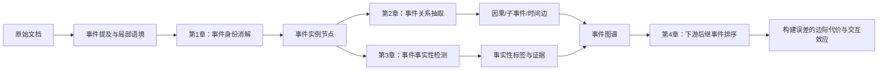

# 童佳锴-事件图谱构建-组会-0902

## 1 项目动机与研究方案

### 1. 项目动机

本文研究事件实例级（occurrence-level）事件图谱的构建与使用。与只识别“发生了什么类型的事件”不同，事件实例级图谱还要回答三个连续问题：文中多次提到的事件是否为同一次发生；不同事件之间存在什么关系；这些事件在当前语境下是否真实、确定。任何一环出错，都会改变图中的节点、边或节点属性，并进一步影响图上的检索、预测和推理结果。

现有工作通常分别评价事件共指、事件关系和事件事实性，较少在同一批事件上继续追问：上游分数的变化是否真的会影响下游，以及不同错误的代价是否相同。本项目因此采用“三个方法章 + 一个系统评估章”的结构：

1. 第 1 章解决事件身份消解，即“哪些提及属于同一次事件”；
2. 第 2 章解决事件关系抽取，即“事件之间有哪些因果、子事件和时间关系”；
3. 第 3 章解决事件事实性检测，即“事件是否确定、可能、否定或未知”；
4. 第 4 章固定下游任务，研究节点、边和事实性错误分别造成多大损失，以及不同图消费者对图质量是否同样敏感。

四章是一条连续的数据链：

### 2. 统一数据与评价口径

第 1、2 章使用 MAVEN-ERE（MAVEN Event Relation Extraction，MAVEN 事件关系抽取数据集）；第 3 章使用 MAVEN-FACT（MAVEN Event Factuality，MAVEN 事件事实性数据集）；第 4 章在相同文档上重建图条件后继事件预测（Causal Graph Event Prediction，CGEP）任务。第 1-3 章当前统一使用 2,622 篇文档训练、291 篇文档作为内部验证集；第 4 章使用 710 篇文档、1,908 个固定查询实例进行系统评价。

#### 2.1 通用分类指标

设 $TP$、$FP$、$FN$ 分别为真正例、假正例和假负例。精确率衡量“模型预测为正的样本中有多少正确”，召回率衡量“全部真实正例中有多少被找回”，F1 是二者的调和平均：

$$
P=\frac{TP}{TP+FP},\qquad
R=\frac{TP}{TP+FN},\qquad
F_1=\frac{2PR}{P+R}.
$$

对于 $C$ 个类别，微平均 F1（micro-F1）先跨类别汇总计数，适合衡量整体样本上的识别能力；宏平均 F1（macro-F1）先计算每个类别的 F1 再等权平均，避免大类完全掩盖小类：

$$
P_{\mathrm{micro}}
=\frac{\sum_{c=1}^{C}TP_c}{\sum_{c=1}^{C}(TP_c+FP_c)},\qquad
R_{\mathrm{micro}}
=\frac{\sum_{c=1}^{C}TP_c}{\sum_{c=1}^{C}(TP_c+FN_c)},
$$

$$
F_{1,\mathrm{micro}}
=\frac{2P_{\mathrm{micro}}R_{\mathrm{micro}}}
{P_{\mathrm{micro}}+R_{\mathrm{micro}}},\qquad
F_{1,\mathrm{macro}}
=\frac{1}{C}\sum_{c=1}^{C}F_{1,c}.
$$

#### 2.2 事件身份消解指标

设金标事件簇集合为 $G$，预测簇集合为 $S$；$\pi_S(g)$ 表示金标簇 $g$ 被预测簇切成的分块集合，$\pi_G(s)$ 表示预测簇 $s$ 被金标簇切成的分块集合。MUC 把大小为 $n$ 的簇视为需要 $n-1$ 条链接，分别计算恢复的金标链接和预测链接中正确的部分：

$$
R_{\mathrm{MUC}}
=\frac{\sum_{g\in G}(|g|-|\pi_S(g)|)}
{\sum_{g\in G}(|g|-1)},\qquad
P_{\mathrm{MUC}}
=\frac{\sum_{s\in S}(|s|-|\pi_G(s)|)}
{\sum_{s\in S}(|s|-1)}.
$$

MUC F1 由 $P_{\mathrm{MUC}}$ 和 $R_{\mathrm{MUC}}$ 代入通用 F1 公式得到。该指标直接反映簇被拆散或错误连接的程度，但单例簇不贡献链接分母，因此本项目同时报告下列三个辅助指标。

对任一事件提及 $m$，令 $G(m)$ 和 $S(m)$ 分别为其金标簇和预测簇。B³ 在提及级计算簇交集比例并对全部 $M$ 个提及取平均：

$$
P_{\mathrm{B^3}}
=\frac{1}{M}\sum_m\frac{|G(m)\cap S(m)|}{|S(m)|},\qquad
R_{\mathrm{B^3}}
=\frac{1}{M}\sum_m\frac{|G(m)\cap S(m)|}{|G(m)|}.
$$

CEAFe 先以 $\phi(g,s)=2|g\cap s|/(|g|+|s|)$ 衡量两个簇的相似度，再寻找金标簇与预测簇的一一最优匹配 $a^*$：

$$
\Phi^*=\max_a\sum_{(g,s)\in a}\phi(g,s),\qquad
P_{\mathrm{CEAFe}}=\frac{\Phi^*}{|S|},\qquad
R_{\mathrm{CEAFe}}=\frac{\Phi^*}{|G|}.
$$

CEAFe 衡量整体簇对齐质量。BLANC 则同时评价“应当共指”和“应当不共指”的提及对。设 $r_c$、$w_c$、$r_n$、$w_n$ 依次为正确共指、错误共指、正确非共指和错误非共指的提及对数，则：

$$
F_{\mathrm{coref}}
=F_1\!\left(\frac{r_c}{r_c+w_c},\frac{r_c}{r_c+w_n}\right),\qquad
F_{\mathrm{non}}
=F_1\!\left(\frac{r_n}{r_n+w_n},\frac{r_n}{r_n+w_c}\right),
$$

$$
F_{\mathrm{BLANC}}=\frac{F_{\mathrm{coref}}+F_{\mathrm{non}}}{2}.
$$

#### 2.3 事件关系与证据指标

因果、子事件和时间关系分别把该关系族的全部正类候选合并计数，再按通用公式计算正类 micro-F1；数值越高，表示该关系族对完整候选事件对的总体识别越准确。句内/跨句精确率与召回率使用相同公式，只是先按两个事件是否位于同一句进行分桶。

设正关系事件对集合为 $Q^+$，事件对 $q$ 的金标或经审计证据句集合为 $A_q$，模型排序前 $k$ 的证据句集合为 $E_q^{(k)}$。证据召回率@$k$ 衡量至少一条充分证据被召回的正关系事件对比例：

$$
\mathrm{EvidenceRecall@}k
=\frac{1}{|Q^+|}\sum_{q\in Q^+}
\mathbf{1}\!\left[A_q\cap E_q^{(k)}\neq\varnothing\right].
$$

若文档为事件对 $q$ 提供的全部候选句集合为 $D_q$，上下文压缩率定义为：

$$
\mathrm{Compression}
=1-\frac{\sum_q|E_q^{(k)}|}{\sum_q|D_q|}.
$$

压缩率越高，进入判别器的文本越少；它必须和证据召回率一起看。本项目只压缩事件对的输入证据，不删除官方评测中的候选事件对。

#### 2.4 事件事实性与证据跨度指标

五类事实性主指标是 CT+、PS+、CT−、PS−、Uu 五个类别的 macro-F1，即 $C=5$ 时的 $F_{1,\mathrm{macro}}$。它对每类等权，因此能暴露 PS− 和 Uu 等稀有类是否完全失效；逐类 F1 用于说明总分变化来自哪些类别。

支持证据三类宏平均 F1 只对具有显式支持词标注的 CT−、PS+、PS− 三类分别计算证据 F1 后取平均：

$$
F_{1,\mathrm{evidence\ macro}}
=\frac{F_{1,\mathrm{CT-}}+F_{1,\mathrm{PS+}}+F_{1,\mathrm{PS-}}}{3}.
$$

汇总跨度 F1（pooled span F1）把全部样本的预测证据跨度与金标证据跨度汇总，并按“事件提及、起点、终点”完全一致判为匹配。设精确匹配的跨度数为 $O$、预测跨度总数为 $T_p$、金标跨度总数为 $T_g$，则：

$$
P_{\mathrm{span}}=\frac{O}{T_p},\qquad
R_{\mathrm{span}}=\frac{O}{T_g},\qquad
F_{1,\mathrm{span}}=\frac{2P_{\mathrm{span}}R_{\mathrm{span}}}
{P_{\mathrm{span}}+R_{\mathrm{span}}}.
$$

前者强调三类证据的均衡识别，后者衡量全部证据跨度的总体重合程度，二者不能互相替代。

#### 2.5 下游排序与统计指标

设固定查询数为 $N$，正确后继事件在第 $i$ 个查询中的名次为 $\mathrm{rank}_i$。MRR 越高，表示正确事件整体排序越靠前；Hit@$k$ 表示正确事件进入前 $k$ 名的查询比例：

$$
\mathrm{MRR}=\frac{1}{N}\sum_{i=1}^{N}\frac{1}{\mathrm{rank}_i},\qquad
\mathrm{Hit@}k=\frac{1}{N}\sum_{i=1}^{N}
\mathbf{1}[\mathrm{rank}_i\leq k].
$$

两个图条件 $a$、$b$ 的效应以同一批查询上的差值表示：

$$
\Delta\mathrm{MRR}_{a,b}=\mathrm{MRR}(a)-\mathrm{MRR}(b).
$$

关键对比以文档为聚类单位做配对 bootstrap：每次有放回抽取文档，同时保留该文档在两个条件下的全部查询，得到 $B$ 个 $\Delta_b$；95% 置信区间为：

$$
\mathrm{CI}_{95\%}=
\left[Q_{0.025}(\{\Delta_b\}_{b=1}^{B}),
Q_{0.975}(\{\Delta_b\}_{b=1}^{B})\right].
$$

区间不跨 0 表示在当前配对样本和重采样口径下可检测到方向稳定的差异。公开论文数字与本地同协议结果分表呈现，避免把不同数据划分、候选全集或评分器的分数直接相减。

### 3. 第 1 章：事件身份消解

#### 3.1 动机与拟解决的问题

事件身份消解也称事件共指消解（event coreference resolution）。它需要把同一事件的多次提及聚成一个实例节点，同时避免把词面相同但实际发生时间、地点或参与者不同的事件合并。身份错误会改变后续图的节点数和连边端点，并通过聚类的传递性被放大：一个错误链接可能污染整个簇。

本章拟解决两个问题：

- 如何利用提及局部的参与者、时间、地点等论元，区分“相同触发词、不同事件实例”；
- 如何让训练目标反映错误链接对整个簇的风险，而不是只优化彼此独立的提及对分类。

#### 3.2 难点

- MAVEN-ERE 中单例事件簇占比很高，模型容易通过“不合并”获得较高的部分指标；
- 同一词面既可能指向同一事件，也可能指向不同事件，单一阈值无法同时解决误合并与漏合并；
- 跨句提及缺少共同上下文，两个触发词的独立表示难以承载论元差异；
- 成对分类错误进入聚类后具有非线性代价，事件对 F1（pair-F1）的改善不一定转化为 MUC F1 的改善。

#### 3.3 当前方法论

当前路线由“局部论元对齐 + 联合语境 + 簇级风险”组成。首先复用公开的事件论元抽取（Event Argument Extraction，EAE）或语义角色标注（Semantic Role Labeling，SRL）方法，从每个提及的局部句子或窗口提取论元；随后对两个提及进行角色感知对齐，显式编码论元缺失、冲突和抽取置信度；最后把成对得分送入风险感知聚类目标，重点惩罚会扩大簇污染的错误正边。

$$
\mathcal{L}_{\mathrm{Ch1}}
=\mathcal{L}_{\mathrm{pair}}
+\lambda\mathcal{L}_{\mathrm{cluster\ risk}}.
$$

其中 $\mathcal{L}_{\mathrm{pair}}$ 判断两个提及是否属于同一事件，$\mathcal{L}_{\mathrm{cluster\ risk}}$ 约束错误链接在聚类中的传播风险。局部论元和跨句语境分别消融，以确认增益来自哪一类信息。

#### 3.4 数据集、指标与预期目标

- 数据集：MAVEN-ERE，使用标注事件提及，训练 2,622 篇、内部验证 291 篇；
- 主指标：MUC（Message Understanding Conference，共指链接恢复指标）F1；
- 辅助指标：B³（Bagga–Baldwin，共指提及级指标）、CEAFe（entity-based Constrained Entity Alignment F-measure，实体对齐指标）和 BLANC（BiLateral Assessment of Noun-Phrase Coreference，双向共指评价）F1；
- 当前同协议主锚：官方联合模型（official joint）的 MUC F1 为 80.98；
- 阶段目标：MUC F1 达到 82.0 左右，并在 B³、CEAFe、BLANC 和跨句召回率上不显著退化；相对主锚的配对 95% CI 下界大于 0。

### 4. 第 2 章：事件关系抽取

#### 4.1 动机与拟解决的问题

关系抽取决定事件图谱中的边。本章同时处理因果关系、子事件关系和时间关系。其中因果关系是主任务；子事件和时间关系用于约束方法不能通过牺牲其他关系族来换取单项分数。

本章拟解决的问题是：在保留完整候选事件对的前提下，如何为每个事件对选择真正相关的跨句证据，并针对关系族和句内/跨句位置的差异学习难负例，使模型降低因果关系误报，而不是只移动全局分类阈值。

#### 4.2 难点

- 事件对数量随文档长度近似按 $O(n^2)$ 增长，无关系候选远多于正例；
- 三个关系族的样本规模与最优训练节奏不同，共享目标容易被大关系族主导；
- 跨句 causal 候选的语义歧义明显更高，现有模型表现为低精确率、高召回率；
- 事后阈值能够改变精确率-召回率工作点，却不能提升事件对表示的可分性。

#### 4.3 当前方法论

第一步完成官方训练配方分账，分别核对关系族损失权重、共指辅助目标和逐族选择模型的贡献，避免把训练协议差异误认为新方法增益。第二步在统一训练协议上引入事件对条件化证据选择：

$$
E_{ij}=\operatorname{TopK}_{s\in D}q(s\mid e_i,e_j,D),
$$

其中 $q(s\mid e_i,e_j,D)$ 衡量句子 $s$ 对事件对 $(e_i,e_j)$ 的证据充分性。分类器仍对完整候选全集输出结果，但表示只聚合与该事件对相关的证据；训练时再按“关系族 $\times$ 句内/跨句位置”组织难负例，重点压低跨句 causal 假阳性。

除官方三族 F1 外，还报告证据召回率（evidence recall）@$k$、候选压缩率，以及句内/跨句精确率和召回率，从而区分“证据没有召回”与“证据召回后仍判断错误”。

#### 4.4 数据集、指标与预期目标

- 数据集：MAVEN-ERE，使用标注事件提及和完整候选事件对；
- 主指标：causal 正类 micro-F1；
- 辅助指标：subevent 和 temporal 的精确率、召回率与 F1；
- 当前同协议主锚：causal 33.17、subevent 29.75、temporal 51.63；
- 最低验收线：causal $>33.17$、subevent $\geq 28.75$、temporal $\geq 50.63$；
- 阶段目标：causal 达到 34.0 以上，subevent 达到 30.0 以上，temporal 保持在 51.0 左右，并使跨句 causal 精确率获得可复现提升。

### 5. 第 3 章：事件事实性检测

#### 5.1 动机与拟解决的问题

同一个事件可以被陈述为确定发生、可能发生、确定未发生、可能未发生，或者在当前文本中无法判断。MAVEN-FACT 将其划分为五类：确定肯定（Certain Positive，CT+）、可能肯定（Possible Positive，PS+）、确定否定（Certain Negative，CT−）、可能否定（Possible Negative，PS−）和未知（Unknown，Uu）。事实性如果被错误处理，图消费者可能把假设、否定或未确定事件当作已发生事实。

本章拟解决两个问题：一是保留否定、可能性、条件、来源承诺及其作用域，而不是把所有证据压缩成一个平均向量；二是把“证据是否足以判断”与“在证据充分时属于哪一类”分开建模，专门处理 Uu。

#### 5.2 难点

- 类别极不均衡：当前内部验证集中 CT+ 有 6,835 个实例，而 PS− 和 Uu 分别只有 19 和 14 个；
- 五类 macro-F1 对少量稀有类样本极其敏感，单个样本就可能明显改变总分；
- CT+ 和 Uu 通常都没有明确支持词，不能仅凭“是否检测到证据”区分；
- 现有软池化把不同类型、不同作用域的证据压成一个向量，容易丢失否定与模态结构。

#### 5.3 当前方法论

当前方法使用类型化线索与证据充分性门控。模型分别编码否定、可能性、条件、来源承诺和作用域等线索，先估计证据是否足以支持确定判断，再在证据充分时预测极性与模态组合：

$$
p(y\mid e,D)
=p(z=\mathrm{adequate}\mid e,D)\,p(y\mid z=\mathrm{adequate},e,D),
$$

其中 $z$ 表示证据充分性；当 $z$ 不充分时，提高 Uu 的概率。事件论元和事件关系只作为补充内容输入，需要与同容量对照比较，不能把参数增加误认为方法增益。

#### 5.4 数据集、指标与预期目标

- 数据集：MAVEN-FACT，使用标注事件提及、五类事实性标签和支持词；
- 主指标：五类 macro-F1；
- 辅助指标：逐类 F1、证据三类宏平均 F1 和汇总跨度 F1（pooled span F1）；
- 当前强基线：RoBERTa（Robustly Optimized BERT Pretraining Approach，鲁棒优化的 BERT 预训练模型）+ CLS（classification token，分类标记）为 0.5458，DMRoBERTa（Dynamic Multi-pooling RoBERTa，动态多池化 RoBERTa）为 0.5423；
- 阶段目标：五类 macro-F1 达到 0.60 左右，并使相对强基线的配对 95% CI 下界大于 0；证据三类宏平均 F1 不低于 0.55、汇总跨度 F1 不低于 0.45，同时要求 PS− 与 Uu 不再同时接近零。

### 6. 第 4 章：构建错误的下游代价与消费者依赖性

#### 6.1 动机与拟解决的问题

前三章的 F1 只能说明局部构建质量，不能直接回答错误是否影响实际使用。本章不再提出第四个抽取模型，而是在固定查询、候选集、事件文本和评分器的条件下，分别替换事件身份、关系边和事实性属性，测量下游后继事件排序的变化。

本章拟解决三个问题：

- 身份、关系和事实性错误各自损失多少，是否存在交互；
- 图消费者是否真的利用了图中边的内容，而不只是利用“有图”这一形式；
- 冻结式消费者与微调式消费者对图质量变化是否表现出不同敏感性。

#### 6.2 难点

- 所有实验条件必须使用同一批查询和候选事件，否则绝对分数不可比较；
- 图的序列化顺序、边数量和可达率都可能成为混淆因素；
- 某些真实构建误差的效应小于模型重训噪声，需要配对统计和正控才能解释；
- factuality 必须作为节点属性被消费者读取，单纯删节点不能代表事实性输入。

#### 6.3 当前方法论

本章采用同实例析因设计：身份质量为金标/预测两档，关系质量为金标/预测两档，事实性为金标/预测/屏蔽三档，消费者为参数冻结/参数微调两档，共形成 $2\times2\times3\times2=24$ 个基础条件。每个消费者在各质量条件下复用同一模型，逐查询保存排名，再计算主效应、交互效应和“消费者 $\times$ 图质量”效应。

$$
\Delta\mathrm{MRR}_{a,b}
=\mathrm{MRR}(a)-\mathrm{MRR}(b).
$$

同时设置金标图、端点重连图和无图输入正控：端点重连图保持边数与关系类型不变，只打乱端点；如果结果满足 $\mathrm{MRR}_{gold}>\mathrm{MRR}_{rewired}>\mathrm{MRR}_{no\text{-}graph}$，说明消费者使用的是边的正确内容，而不是简单统计边数。

#### 6.4 数据集、指标与预期目标

- 数据集：本地重建 CGEP-MAVEN，710 篇文档、1,908 个固定查询；
- 主指标：MRR、 Hit@1 /3/10/20/50；
- 统计指标：逐文档配对效应、95% CI、主效应与交互效应；
- 当前金标图 MRR 为 0.1802，作为同协议性能锚；
- 阶段目标：完整闭合 24 个条件；至少一个消费者通过图依赖正控；有效效应绝对值超过约 0.003-0.004 的 MRR 噪声区间并且配对 95% CI 不跨 0。该章不预设 identity、relation 或 factuality 的效应必须为正，零效应和负效应同样是有效结论。

## 2 各章方法分数对比

表中方法名后的“(ours)”表示本项目提出的方法、消融或受控干预；没有该标记的方法均来自公开论文。公开论文报告值与本地同协议重跑值分别列出，不能跨表直接比较高低。

### 1. 第 1 章：事件身份消解

下表均为相同 MAVEN-ERE 内部验证集上的 MUC F1。事件级金标论元直接使用按事件组织的标注，会泄露簇身份，只用于估计信息上限，不属于可部署方法。

| 方法 | MUC F1 | 数字与方法来源 | 实验性质 |
|---|---:|---|---|
| official joint | **80.98** | [《MAVEN-ERE: A Unified Large-scale Dataset for Event Coreference, Temporal, Causal, and Subevent Relation Extraction》](https://aclanthology.org/2022.emnlp-main.60/)；本地同协议重跑 | 冻结主锚 |
| 稳定训练底座 (ours) | 79.14 | 本项目实测 | 4 个种子均值 |
| 底座 + 混淆度特征 (ours) | 79.47 | 本项目实测 | 3 个种子均值 |
| 历史采样、无论元 (ours) | 80.87 | 本项目实测 | 单种子根因分析 |
| 历史采样 + 事件级金标论元 (ours) | **87.74** | 本项目实测 | 不可部署上限 |
| 补全全负文档、无论元 (ours) | 78.78 | 本项目实测 | 单种子根因分析 |
| 补全全负文档 + 事件级金标论元 (ours) | 85.82 | 本项目实测 | 不可部署上限 |

注：稳定训练底座低于主锚 1.84；混淆度特征相对配对底座平均提高 0.52，但种子间符号翻转。80.87 和 78.78 只用于根因分析，不进入正式主表；两个金标论元条件存在簇身份泄露，仅说明论元信息上限。

公开论文还报告了以下结果，其数据划分或指标口径与上表不同，只用于说明公开方法量级：

| 方法 | 论文报告指标 | 论文报告值 | 数字出处 |
|---|---|---:|---|
| RoBERTa single | MUC F1 | 81.4 | [《MAVEN-ERE: A Unified Large-scale Dataset for Event Coreference, Temporal, Causal, and Subevent Relation Extraction》表 7](https://aclanthology.org/2022.emnlp-main.60/) |
| Joint | MUC F1 | 82.1 | [《MAVEN-ERE: A Unified Large-scale Dataset for Event Coreference, Temporal, Causal, and Subevent Relation Extraction》表 7](https://aclanthology.org/2022.emnlp-main.60/) |
| LLMERE（Llama3-8B-base） | MUC/B³/CEAFe/BLANC 平均 F1 | 90.9 | [《Large Language Model-Based Event Relation Extraction with Rationales》表 2](https://aclanthology.org/2025.coling-main.500/) |

注：MAVEN-ERE 表 7 的 81.4/82.1 是论文测试集结果；LLMERE 使用另一套划分，并把四个共指指标的 F1 取平均，不能把 90.9 当作与本项目 MUC F1 同口径的直接对手。

### 2. 第 2 章：事件关系抽取

下表使用相同候选全集和官方评分器，三族分数均为正类 F1。

| 方法 | causal F1 | subevent F1 | temporal F1 | 数字与方法来源 |
|---|---:|---:|---:|---|
| 本地事件对分类器，3 个训练轮次 (ours) | 26.31 | 27.68 | 49.29 | 本项目实测 |
| 官方单任务模型（official single） | 32.29 | — | — | [《MAVEN-ERE: A Unified Large-scale Dataset for Event Coreference, Temporal, Causal, and Subevent Relation Extraction》](https://aclanthology.org/2022.emnlp-main.60/)；本地同协议重跑 |
| **官方联合模型（official joint）** | **33.17** | 29.75 | **51.63** | [《MAVEN-ERE: A Unified Large-scale Dataset for Event Coreference, Temporal, Causal, and Subevent Relation Extraction》](https://aclanthology.org/2022.emnlp-main.60/)；本地同协议重跑 |
| 本地复现底座，50 个训练轮次 (ours) | 31.42 | **30.62** | 50.78 | 本项目实测 |
| 自适应工作点，种子 13 (ours) | 33.19 | **33.02** | 50.38 | 本项目实测 |
| 工作点 + 风险平衡，3 个种子均值 (ours) | **33.27** | **31.39** | 50.61 | 本项目实测 |
| 分位置事后诊断上限 (ours) | **33.80** | 30.62 | 51.03 | 本项目实测；不可部署诊断 |
| 原型依赖表示，种子 13 (ours) | 29.80 | **32.64** | **51.81** | 本项目实测 |

注：3 个训练轮次的模型明显欠训；50 个训练轮次使 causal 提高 5.11。自适应工作点和风险平衡没有同时通过 temporal 护栏；分位置结果只说明句内/跨句边界有诊断价值；原型依赖表示改善 subevent/temporal，但 causal 因误报下降。

公开论文中的对比方案全部列于下表。为避免把“方法原论文”和“后续论文转引的数字”混为一谈，数字出处单独注明：

| 方法 | causal F1 | subevent F1 | temporal F1 | 数字出处 |
|---|---:|---:|---:|---|
| ERGO | 28.0 | 21.8 | 51.2 | [《Large Language Model-Based Event Relation Extraction with Rationales》表 2](https://aclanthology.org/2025.coling-main.500/)转引；原方法见[《ERGO: Event Relational Graph Transformer for Document-level Event Causality Identification》](https://aclanthology.org/2022.coling-1.185/) |
| ProtoEM（LLMERE 表中写作 ProtoERE） | 31.8 | 27.9 | 53.8 | [《Large Language Model-Based Event Relation Extraction with Rationales》表 2](https://aclanthology.org/2025.coling-main.500/)转引；原方法见[《ProtoEM: A Prototype-Enhanced Matching Framework for Event Relation Extraction》](https://arxiv.org/abs/2309.12892) |
| [TacoERE](https://aclanthology.org/2024.lrec-main.1348/) | 34.1 | 30.6 | — | [《TacoERE: Cluster-aware Compression for Event Relation Extraction》表 1、表 2](https://aclanthology.org/2024.lrec-main.1348/) |
| [LLMERE（Llama3-8B-base）](https://aclanthology.org/2025.coling-main.500/) | **36.0** | 28.2 | **54.7** | [《Large Language Model-Based Event Relation Extraction with Rationales》表 2](https://aclanthology.org/2025.coling-main.500/) |

注：ERGO 和 ProtoEM 三族数字来自 LLMERE 的统一重报表，并非全部直接取自各自原论文；TacoERE 原文没有在同一张表中报告 temporal。公开结果使用的数据划分、训练方式或评测说明与本项目内部验证协议不同，只作背景，不与上表直接排名。

### 3. 第 3 章：事件事实性检测

下表为相同 MAVEN-FACT 内部验证集上的五类 macro-F1。金标证据上限直接回放标注证据，仅用于判断“证据定位是否为主要瓶颈”。

| 方法 | 五类 macro-F1 | PS− F1 | Uu F1 | 数字与方法来源 |
|---|---:|---:|---:|---|
| 无证据耦合底座（none）(ours) | 0.5283 | 0.350 | 0.061 | 本项目实测 |
| 同容量均匀池化（uniform）(ours) | 0.5292 | 0.400 | 0.000 | 本项目实测 |
| DMRoBERTa | 0.5423 | 0.476 | 0.000 | [《MAVEN-FACT: A Large-scale Event Factuality Detection Dataset》](https://aclanthology.org/2024.findings-emnlp.651/)；本地同协议重跑 |
| RoBERTa+CLS | 0.5458 | 0.483 | 0.000 | [《MAVEN-FACT: A Large-scale Event Factuality Detection Dataset》](https://aclanthology.org/2024.findings-emnlp.651/)；本地同协议重跑 |
| **证据条件化（evidence-conditioned）(ours)** | **0.5554** | **0.500** | 0.000 | 本项目当前方法实测 |
| 金标证据上限 (ours) | **0.5717** | 0.353 | 0.063 | 本项目不可部署上限实测 |

注：同容量均匀池化说明增加容量本身没有明显收益。证据条件化方法的点值最高，但相对两个强基线的配对 CI 均含 0；金标证据主要提升 PS+，仍未解决 PS−/Uu，且不能作为可部署方法。

当前方法相对 RoBERTa+CLS 的 $\Delta=+0.0096$，95% CI 为 $[-0.0398,+0.0630]$；相对 DMRoBERTa 的 $\Delta=+0.0131$，95% CI 为 $[-0.0250,+0.0522]$。因此目前只能说点估计较高，不能说已经显著超过对手。

MAVEN-FACT 原论文报告的公开对比方案如下：

| 方法 | 五类 macro-F1（%） | 数字出处 |
|---|---:|---|
| BERT+CLS | 46.1 | [《MAVEN-FACT: A Large-scale Event Factuality Detection Dataset》表 3](https://aclanthology.org/2024.findings-emnlp.651/) |
| RoBERTa+CLS | 45.4 | [《MAVEN-FACT: A Large-scale Event Factuality Detection Dataset》表 3](https://aclanthology.org/2024.findings-emnlp.651/) |
| DMBERT | **47.6** | [《MAVEN-FACT: A Large-scale Event Factuality Detection Dataset》表 3](https://aclanthology.org/2024.findings-emnlp.651/) |
| DMRoBERTa | 47.1 | [《MAVEN-FACT: A Large-scale Event Factuality Detection Dataset》表 3](https://aclanthology.org/2024.findings-emnlp.651/) |
| GenEFD | 45.1 | [《MAVEN-FACT: A Large-scale Event Factuality Detection Dataset》表 3](https://aclanthology.org/2024.findings-emnlp.651/) |
| GPT-4 + CoT | 42.8 | [《MAVEN-FACT: A Large-scale Event Factuality Detection Dataset》表 3](https://aclanthology.org/2024.findings-emnlp.651/) |

注：以上是论文测试口径，其中 GPT-4 + CoT 在从测试集抽取的 2,000 个实例上评价；本项目当前表使用 291 篇内部验证集，因此不直接计算差值。

### 4. 第 4 章：构建误差的下游代价

下表固定同一个图消费者、同一批 1,908 个查询和同一候选集，只改变输入图。图消费者采用 [《What Would Happen Next? Predicting Consequences from An Event Causality Graph》](https://aclanthology.org/2024.findings-emnlp.45/) 提出的 SeDGPL，本项目在其上重建同实例干预协议。

| 图条件或干预 | MRR | 相对金标图的变化 | 结论 |
|---|---:|---:|---|
| 无图输入（no-graph）(ours) | 0.0811 | −0.0991 | 整张图的下游价值约为 0.0991 MRR |
| 端点重连图（rewired）(ours) | 0.1185 | −0.0617 | 边的正确端点具有实质作用 |
| 当前预测图（predicted）(ours) | 0.1583 | −0.0218 | 构建阶段损失约占整张图价值的 22.0% |
| 结构规则修复图（repaired）(ours) | 0.1595 | −0.0207 | 相对当前预测图仅 +0.0011，落在噪声区间内 |
| 事实性净化图（purified）(ours) | 0.1583 | −0.0219 | 无可检测收益 |
| 金标图（gold）(ours) | **0.1802** | — | 性能锚 |

注：表中数值均为本项目在本地重建 CGEP 协议上的实测结果，不是 SeDGPL 原论文表格的转录。SeDGPL 是消费者来源；no-graph、rewired、predicted、repaired、purified 和 gold 是本项目设置的同实例图条件。

受控扰动中，25% 拆节点造成 $\Delta\mathrm{MRR}=-0.0184$，约为同幅度删边（$-0.0081$）的 2.3 倍、同幅度增边（$-0.0047$）的 3.9 倍。现有证据说明身份错误可能比等幅关系错误更伤下游，但完整的“身份 $\times$ 关系 $\times$ 事实性 $\times$ 消费者”析因实验仍需闭合。

## 3 现状分析与下一周计划

### 1. 第 1 章现状分析

#### 1.1 为什么指标仍低

历史方法主要使用触发词、局部语境池化和混淆度特征，没有真正使用提及局部论元，因此对“相同词面、不同参与者或时间”的事件缺少直接证据。训练目标是普通提及对分类，而主指标在聚类后计算；一个错误正边经传递闭包放大后，损失远高于一个普通负例。无正共指对的文档曾在采样中被弱化，模型少见了大量全单例和同类型难负例。此外，本任务存在明显的训练轮次与种子波动，单个最优模型 checkpoint 容易高估方法收益。

#### 1.2 已进行的探索与效果

- 加入学习率预热和线性学习率衰减后，10 个训练轮次的平均 MUC 提高 1.78，训练后期退化明显减轻；
- 语境池化和混淆度特征在多种子下没有稳定收益，混淆度相对底座平均 +0.52，但 3 个种子中有 1 个为负；
- 补全全负文档改变了精确率-召回率工作点，但没有稳定提高 MUC；
- 事件级金标论元将单种子 MUC 从 80.87 提到 87.74，说明论元信号有较大上限；但该标注按事件复制给簇内提及，存在身份泄露，不能作为最终方法；
- 去除这种复制后，提及局部论元签名在正、负同触发词事件对上仍保留约 20.41 个百分点的区分差，支持继续研究可部署的局部论元对齐。

#### 1.3 下一周计划

1. 接入公开 EAE/SRL 模型，生成提及局部预测论元；
2. 完成角色感知对齐，显式处理论元缺失、冲突和置信度；
3. 在相同编码器和采样条件下比较“无论元 / 仅论元 / 仅联合语境 / 完整方法”；
4. 以 MUC 和簇级配对 CI 为主判据，同时报告同触发词误合并率和跨句召回率；
5. 若局部论元不能稳定超过 80.98 的主锚，则停止扩充特征，重新评估本章方法定位。

### 2. 第 2 章现状分析

#### 2.1 为什么指标仍低

最初的主要问题是欠训：从 3 个训练轮次延长到 50 个训练轮次，causal 已提高 5.11。剩余差距不再是全面的模型容量问题，而集中在 causal 跨句误报。当前模型对事件对主要使用两个触发词表示及其组合，没有为每个跨句事件对建立共同证据表示；逆频加权虽然避免模型全部预测“无关系”，又把模型推向高召回、低精确率。此外，官方联合模型使用关系族损失率、共指辅助目标和逐族最优模型，本地等权共享训练与单一模型之间仍有协议差额，需要先分账。

#### 2.2 已进行的探索与效果

- 训练预算修正使 causal 从 26.31 提升到 31.42，并使 subevent 达到 30.62；
- 关系族工作点和风险平衡将 3 种子 causal 均值提高到 33.27，但 temporal 为 50.61，未通过 50.63 护栏；
- 按句内/跨句分别重切的诊断上限达到 causal 33.80，说明位置条件确实存在，但事后阈值不是方法贡献；
- 原型依赖表示把 subevent/temporal 提到 32.64/51.81，却把 causal 降到 29.80，错误仍是低精确率、高召回率；
- 通用 Adaptive Thresholding Loss（自适应阈值损失，ATLoss）在短周期中使 causal/subevent 塌为零，说明直接取消类别权重会被大量 NONE 候选淹没；
- 三个轻量检索近似没有达到预设的跨句正例召回率，不能靠缩小候选集掩盖表示问题。

#### 2.3 下一周计划

1. 先完成官方配方分账：依次比较关系族损失率、共指辅助目标和逐族最优模型，确定剩余 1-2 个点中有多少来自训练协议；
2. 在协议差额闭合后，实现事件对条件化的证据句选择；
3. 训练中加入“关系族 $\times$ 句内/跨句”难负例平衡，但保持官方候选全集不变；
4. 同时报告证据召回率@$k$、压缩率、句内/跨句 P/R 和三族官方 F1；
5. 单种子若不能同时达到 causal $>33.17$、subevent $\geq28.75$、temporal $\geq50.63$，不进入额外种子。

### 3. 第 3 章现状分析

#### 3.1 为什么指标仍低

当前内部验证集由 7,195 个事件提及构成，但决定 macro-F1 的 PS− 和 Uu 只有 33 个实例，导致一个预测变化就可能明显改变总分。现有证据条件化方法把多个支持证据跨度加权平均为单一向量，无法保留否定、模态、条件和来源承诺的类型与作用域。更关键的是，CT+ 和 Uu 都可能没有显式支持词，因此单纯提升证据定位无法解决未知类。

#### 3.2 已进行的探索与效果

- 证据条件化方法得到 0.5554，高于 RoBERTa+CLS 的 0.5458 和 DMRoBERTa 的 0.5423，但两个配对 CI 均跨 0；
- 同容量均匀池化对照只有 0.5292，说明当前点值提升不是简单增加参数得到的；
- 证据轴的三类宏平均为 0.5511、汇总跨度 F1 为 0.4521，证据学习本身存在有效信号；
- 金标证据上限仅把 macro-F1 提到 0.5717，名义提升 0.0163，仍低于当前数据划分约 0.051 的可检测变化量；PS− 反而从 0.500 降到 0.353，Uu 只命中 1/14；
- 该上限实验说明瓶颈不是“证据头还不够准”，而是证据表示与五类决策结构不足。

#### 3.3 下一周计划

1. 将支持证据拆成否定、可能性、条件、来源承诺和作用域等类型槽位；
2. 增加证据充分性/未知门控，先判断信息是否足以分类，再预测极性 $\times$ 模态；
3. 以当前证据条件化模型、RoBERTa+CLS 和 DMRoBERTa 为固定对照；
4. 同时报五类 macro-F1、逐类混淆、证据 span 指标和文档聚类配对 CI；
5. 若第二个机制周期仍不能取得大于可检测变化量的改善，则把本章结论收缩为“事实性与证据联合检测的判别力分析”，不继续堆叠证据抽取器。

### 4. 第 4 章现状分析

#### 4.1 当前认识

图依赖正控已经成立：MRR 严格满足 $0.1802>0.1185>0.0811$，即金标图 $>$ 端点重连图 $>$ 无图输入。这说明消费者不仅利用“图是否存在”，还利用边端点是否正确。当前预测图相对金标图损失 0.0218 MRR，约占整张图下游价值的 22%。身份拆分错误在同幅度下比删边、增边更伤，但结构修复和事实性净化的效果均落在噪声区间内。

现有结果仍不足以回答消费者依赖性：目前主要结果来自一个微调图消费者，尚未在同一骨干模型下完成参数冻结与参数微调对照，也没有闭合 24 个“身份 $\times$ 关系 $\times$ 事实性 $\times$ 消费者”条件。

#### 4.2 下一周计划

1. 固定 1,908 个查询、候选集和序列化顺序，完成 24 条件的数据准备与逐实例一致性检查；
2. 在同一模型结构下建立参数冻结和参数微调两类消费者，避免把不同骨干模型的差异解释成微调效应；
3. 分别估计身份、关系、事实性主效应及其交互，并报告“消费者 $\times$ 图质量”效应；
4. 所有效应使用文档级配对自助重采样和 95% CI，与 0.003-0.004 MRR 噪声区间比较；
5. 若两类消费者都不能通过图依赖正控，则撤回消费者差异解释，只保留构建误差代价结论。

### 5. 下一周工作顺序与预期产出

|  顺序 | 研究任务               | 预期产出                            | 判定标准                        |
| --: | ------------------ | ------------------------------- | --------------------------- |
|   1 | 第 2 章官方训练配方分账      | causal/subevent/temporal 同协议对照表 | 明确协议差额，确定表示方法的真实剩余差距        |
|   2 | 第 2 章事件对条件化证据单种子验证 | 证据召回、跨句 P/R、三族 F1               | 三族同时通过 33.17/28.75/50.63 门槛 |
|   3 | 第 3 章类型化线索 + 充分性原型 | 五类与证据联合结果、逐类混淆                  | macro-F1 提升且配对 CI、稀有类护栏不退化  |
|   4 | 第 1 章提及局部论元适配      | 论元覆盖率、角色对齐消融、MUC                | 超过 80.98 主锚，并确认增益不来自金标泄露    |
|   5 | 第 4 章析因数据准备        | 24 条件的同实例评价矩阵                   | 查询、候选和标签逐项一致，无静默缺失          |

下周工作的重点不是继续增加模型数量，而是把已经定位的三个核心问题分别做成可证伪实验：第 1 章验证提及局部论元是否真正改善事件身份；第 2 章验证事件对特定证据是否降低跨句 causal 误报；第 3 章验证类型化线索与证据充分性是否能够处理 PS− 和 Uu。任何方向若只带来低于噪声区间的点值变化，将按负结果收口，不再用阈值或超参数扫描延长结论。
