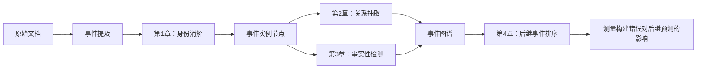

# 童佳锴—事件图谱构建阶段性报告（精简版）
## 当前结果

| 章节               |                                                                      当前最好结果 |                                        与主要对照的关系 | 当前判断                 |
| ---------------- | --------------------------------------------------------------------------: | ----------------------------------------------: | -------------------- |
| 第 1 章：事件身份消解     |                             Message Understanding Conference（MUC）F1 为 79.47 |     比本地同协议 official joint 低 1.51；非同协议公开参照为 86.1 | 尚未形成有效的方法增益          |
| 第 2 章：事件关系抽取     |                                    因果 / 子事件 / 时间 F1 = 33.27 / 31.39 / 50.61 |     时间比本地主基线低 1.02；非同协议公开参照为 37.4 / 32.9 / 60.7 | 尚未超过本地主基线            |
| 第 3 章：事件事实性检测    |                                                  五类宏平均 F1（macro-F1）为 0.5554 | 比本地分类器基线高 0.0096，但 95% 置信区间为 $[-0.0398,0.0630]$ | 增益未获统计支持，未知类 F1 仍为 0 |
| 第 4 章：对后继事件预测的影响 | 金标图 / 端点重连图 / 无图的平均倒数排名（Mean Reciprocal Rank，MRR）为 0.1802 / 0.1185 / 0.0811 |                     预测图为 0.1583；非同协议公开参照为 0.362 | 图依赖性成立，但当前下游预测模型较弱   |

## 一、项目动机与分章方案

### 1. 研究问题

本项目研究事件实例级图谱。一个节点应当对应一次具体事件，而不是一个抽象事件类型。图谱构建需要连续回答三个问题：哪些提及指向同一次事件，事件之间有什么关系，事件在文本中是否真实或确定。随后再用固定的下游预测模型，即读取事件图谱并完成后继事件排序的模型，检验这些错误究竟会造成多大损失。

### 2. 第 1 章：事件身份消解

事件身份消解，也称事件共指消解（Event Coreference Resolution，ECR），负责把同一次事件的多次提及合并成一个节点。难点不是识别相同触发词，而是区分“词面相同但时间、地点或参与者不同”的事件；一次错误合并还会通过聚类传递到整个事件簇。

目前的方法是为每个提及提取局部参与者、时间和地点论元，再对两个提及做角色对齐，并在聚类阶段提高错误正边的代价。现有实验已经说明论元信息有用，但事件级金标论元会泄露事件簇身份，因此只能视为上限，下一步必须换成提及局部、可部署的论元输入。

数据使用 MAVEN Event Relation Extraction（MAVEN-ERE，MAVEN 事件关系抽取数据集）。主指标为 MUC F1，辅助报告 B³（Bagga–Baldwin 提及级指标）、entity-based Constrained Entity Alignment F-measure（CEAFe，实体对齐指标）和 BiLateral Assessment of Noun-Phrase Coreference（BLANC，双向共指指标）。MUC F1 达到 82.0 只是近期门槛；最终结果须在统一重跑下超过 official joint 和至少一种较新的强方法。

### 3. 第 2 章：事件关系抽取

事件关系抽取（Event Relation Extraction，ERE）决定图中的因果、子事件和时间边。主要困难是无关系事件对远多于正例，跨句因果候选尤其容易误报；三个关系族的样本规模和最优训练节奏也不同，单一损失容易顾此失彼。

当前方案先核对官方训练配方，再为每个事件对选择相关证据句：

$$
E_{ij}=\operatorname{TopK}_{s\in D}q(s\mid e_i,e_j,D).
$$

分类器仍评价完整候选事件对，只压缩进入编码器的文本。训练负例按“关系族 $\times$ 句内/跨句”分组，重点减少跨句 causal 假阳性。

数据仍为 MAVEN-ERE。主指标是因果关系（causal）的正类微平均 F1（micro-F1），子事件关系（subevent）和时间关系（temporal）F1 作为护栏。最低验收线为 causal $>33.17$、subevent $\geq28.75$、temporal $\geq50.63$。34.0 / 30.0 / 51.0 只够通过本阶段闸门，低于公开强方法，不是最终目标。

### 4. 第 3 章：事件事实性检测

事件事实性检测（Event Factuality Detection，EFD）区分确定肯定（CT+）、可能肯定（PS+）、确定否定（CT−）、可能否定（PS−）和未知（Uu）五类。它的难点是类别极不均衡：内部验证集有 6,835 个 CT+ 实例，但 PS− 和 Uu 分别只有 19 和 14 个。模型即使总体准确，也可能完全放弃稀有类。

目前将否定、可能性、条件和来源承诺等线索分开编码，并增加“证据是否足够”的门控；证据不足时优先考虑未知，而不是直接预测极性和模态。事件论元和关系只作为补充输入，并与同容量对照比较。

数据使用 MAVEN Event Factuality（MAVEN-FACT，MAVEN 事件事实性数据集）。主指标为五类宏平均 F1（macro-F1），辅助指标为逐类 F1、三类证据宏平均 F1 和汇总跨度 F1。目标是五类 macro-F1 达到 0.60 左右，证据宏平均 F1 不低于 0.55，汇总跨度 F1 不低于 0.45，且可能否定与未知不能同时接近零。

### 5. 第 4 章：构建错误对后继事件预测的影响

前三章的 F1 不能直接说明错误是否影响使用。本章固定查询、候选事件、事件文本和评分器，只替换节点、关系边和事实性属性，然后观察后继事件排序的变化。

数据为本地重建的因果图事件预测（Causal Graph Event Prediction，CGEP）任务，共 710 篇文档、1,908 个固定查询。主指标为 MRR 和前 $k$ 名命中率（Hit@ $k$）。正式设计包含身份质量两档、关系质量两档、事实性三档和下游模型两档，共 $2\times2\times3\times2=24$ 个条件。目标是完成同实例比较，并要求关键效应超过约 0.003--0.004 的 MRR 噪声区间，配对 95% 置信区间（Confidence Interval，CI）不跨 0。下游模型还需加入至少一种较强的图结构预测方法，确认误差效应不是当前简单模型特有的现象。

## 二、各章方法对比

以下各表先列数据集官方论文，再列其他论文，最后列本项目。数据划分不占表格列，统一放在表注中按论文说明。

### 1. 事件身份消解

| 论文（来源） | 年份 | 方法 | MUC F1 |
|---|---:|---|---:|
| MAVEN-ERE | 2022 | Robustly Optimized BERT Pretraining Approach（RoBERTa，稳健优化 BERT 预训练模型）single | 81.4 |
| MAVEN-ERE | 2022 | Joint | **82.1** |
| GraphERE | 2024 | GraphERE joint | 80.13 |
| RESIJ | 2024 | Rich-Event-Structure Informed Joint（RESIJ，富事件结构联合模型） | **86.1** |
| MAQInstruct | 2025 | Multiple-Answer-Question Instruction（MAQInstruct，多答案问题指令模型，Llama2） | 80.2 |
| 本项目 | 2026 | 官方联合模型的本地重跑（主对照） | **80.98** |
| 本项目 | 2026 | 稳定训练底座（本地基线） | 79.14 |
| 本项目 | 2026 | 底座 + 混淆度特征（当前方法） | **79.47** |
| 本项目 | 2026 | 历史采样、无论元（诊断） | 80.87 |
| 本项目 | 2026 | 历史采样 + 事件级金标论元（信息上限） | 87.74 |

备注：本表只比较 MUC F1，不混入 B³、CEAFe、BLANC 或共指综合 F1。MAVEN-ERE 使用官方划分，即 2,913 篇训练、710 篇验证和 857 篇隐藏测试；MAQInstruct 用原验证集 710 篇作测试；GraphERE、RESIJ 的具体划分在可核实材料中没有写明，均记为“未知”，且不能据此视为同一划分；本项目把官方训练集切为 2,622 篇训练和 291 篇验证。阅读时只比较划分相同的结果。本地金标论元直接暴露事件簇信息，87.74 只是信息上限。公开数字见 [MAVEN-ERE 表 7](https://aclanthology.org/2022.emnlp-main.60/)、[GraphERE 表 1](https://arxiv.org/abs/2403.12523)、[RESIJ](https://www.sciencedirect.com/science/article/pii/S0306457324001705) 和 [MAQInstruct 表 1](https://arxiv.org/abs/2502.03954)。

### 2. 事件关系抽取

| 论文（来源） | 年份 | 方法 | 因果 F1 | 子事件 F1 | 时间 F1 |
|---|---:|---|---:|---:|---:|
| MAVEN-ERE | 2022 | Joint | 31.50 | 27.50 | 56.00 |
| ProtoEM | 2023 | Prototype-Enhanced Matching（ProtoEM，原型增强匹配） | 34.55 | 32.11 | 56.80 |
| GraphERE | 2024 | GraphERE joint | 31.05 | 27.26 | 54.74 |
| TacoERE | 2024 | Cluster-aware Compression for Event Relation Extraction（TacoERE，簇感知压缩） | 34.1 | 30.6 | — |
| RESIJ | 2024 | RESIJ | **37.4** | **32.9** | **60.7** |
| LogicERE | 2025 | Logic Induced High-Order Reasoning Network（LogicERE，逻辑诱导高阶推理网络） | — | 30.3 | 55.0 |
| MAQInstruct | 2025 | MAQInstruct（Llama2） | 32.5 | 25.2 | 53.8 |
| LLMERE | 2025 | Joint（该论文复现） | 29.9 | 22.7 | 52.5 |
| LLMERE | 2025 | Large Language Model-Based Event Relation Extraction with Rationales（LLMERE，基于大模型与理由的事件关系抽取，Llama3-8B-base） | **36.0** | **28.2** | **54.7** |
| 本项目 | 2026 | 官方联合模型的本地重跑（主对照） | 33.17 | 29.75 | **51.63** |
| 本项目 | 2026 | 50 轮训练底座（本地基线） | 31.42 | 30.62 | 50.78 |
| 本项目 | 2026 | 工作点 + 风险平衡（当前方法，3 个种子均值） | **33.27** | 31.39 | 50.61 |
| 本项目 | 2026 | 分位置阈值（诊断上限） | 33.80 | 30.62 | 51.03 |
| 本项目 | 2026 | 原型依赖表示（探索方法，种子 13） | 29.80 | **32.64** | **51.81** |

备注：表内三类关系都采用正类 micro-F1；“—”表示未报告。MAVEN-ERE、ProtoEM、TacoERE 和 LogicERE 使用官方的 2,913/710/857 篇划分，其中 LogicERE 只报告时间与子事件关系，并重新构造了反向标签；LLMERE 及其复现的 Joint 将原训练集按 8:2 切分，并以原验证集作测试；MAQInstruct 只明确说明以原验证集作测试；GraphERE、RESIJ 的具体划分均记为“未知”，不能据此互相排位；本项目统一使用 2,622 篇训练、291 篇验证。分位置阈值使用事后标签扫描，只是诊断上限。本地工作点相对本地官方联合模型仅提高因果 F1 0.10，同时时间 F1 降低 1.02。公开数字见 [MAVEN-ERE 表 8](https://aclanthology.org/2022.emnlp-main.60/)、[ProtoEM](https://arxiv.org/abs/2309.12892)、[GraphERE](https://arxiv.org/abs/2403.12523)、[TacoERE](https://aclanthology.org/2024.lrec-main.1348/)、[RESIJ](https://www.sciencedirect.com/science/article/pii/S0306457324001705)、[LogicERE](https://ojs.aaai.org/index.php/AAAI/article/view/34589)、[MAQInstruct](https://arxiv.org/abs/2502.03954) 和 [LLMERE](https://aclanthology.org/2025.coling-main.500/)。

### 3. 事件事实性检测

| 论文（来源） | 方法 | 模型形式 | 适配方式 | 五类 macro-F1（%） |
|---|---|---|---|---:|
| MAVEN-FACT | Bidirectional Encoder Representations from Transformers（BERT）+CLS | 编码器分类器 | 监督微调 | 46.1 |
| MAVEN-FACT | RoBERTa+CLS | 编码器分类器 | 监督微调 | 45.4 |
| MAVEN-FACT | BERT + 动态多池化（DMBERT） | 编码器分类器 | 监督微调 | **47.6** |
| MAVEN-FACT | DMRoBERTa | 编码器分类器 | 监督微调 | 47.1 |
| MAVEN-FACT | Generative Event Factuality Detection（GenEFD，生成式事件事实性检测） | 编码器—解码器生成模型 | 监督微调 | 45.1 |
| MAVEN-FACT | Mistral 7B + Chain-of-Thought（CoT，思维链） | 解码器式生成大模型 | 五样本上下文学习 | 24.4 |
| MAVEN-FACT | Llama 3 + CoT | 解码器式生成大模型 | 五样本上下文学习 | 27.0 |
| MAVEN-FACT | GPT-3.5 | 解码器式生成大模型 | 五样本上下文学习 | 17.9 |
| MAVEN-FACT | GPT-4 + CoT | 解码器式生成大模型 | 五样本上下文学习 | **42.8** |
| 本项目 | 无证据耦合底座（本地基线） | RoBERTa 编码器分类器 | 监督微调 | 52.83 |
| 本项目 | 同容量均匀池化（容量对照） | RoBERTa 编码器分类器 | 监督微调 | 52.92 |
| 本项目 | RoBERTa + 动态多池化（DMRoBERTa，本地对照） | RoBERTa 编码器分类器 | 监督微调 | 54.23 |
| 本项目 | RoBERTa+CLS（本地主对照） | RoBERTa 编码器分类器 | 监督微调 | 54.58 |
| 本项目 | 证据条件化（当前方法） | RoBERTa 编码器分类器 | 监督微调 | **55.54** |
| 本项目 | 金标证据（信息上限） | RoBERTa 编码器分类器 | 监督微调，上限输入 | 57.17 |

备注：MAVEN-FACT 论文中的监督微调模型使用完整官方测试集；GPT-3.5、GPT-4、Llama 3 和 Mistral 7B 只在官方测试集中抽取 2,000 条测试，并用严格字符串匹配处理生成结果；本项目使用 2,622 篇训练、291 篇验证。前两组虽然出自同一论文，但测试范围不同，不能直接按分数排位。生成式大模型采用“五样本上下文学习”，这是提示方式，不是模型类别。当前证据条件化在本地组内达到 55.54，但相对本地基线的 95% CI 跨 0，Uu F1 仍为 0；金标证据 57.17 只是上限。数字见 [MAVEN-FACT 表 3](https://aclanthology.org/2024.findings-emnlp.651/)；长尾复核见 [From Factuality to Meta-Factivity 表 1、表 2](https://aclanthology.org/2026.acl-short.7/)。

### 4. 构建错误对后继事件预测的影响

| 论文（来源） | 年份 | 图条件或方法 | MRR |
|---|---:|---|---:|
| SeDGPL | 2021 | MCPredictor | 0.181 |
| SeDGPL | 2024 | BART-base | 0.247 |
| SeDGPL | 2024 | Semantic Enhanced Distance-sensitive Graph Prompt Learning（SeDGPL，语义增强距离敏感图提示学习） | 0.279 |
| SeDGPL | 2024 | Llama3-7B，零样本提示 | 0.096 |
| SeDGPL | 2024 | GPT-3.5-turbo，零样本提示 | 0.146 |
| CBLiP | 2025 | Connection-Biased Link Prediction（CBLiP，连接偏置链路预测） | 0.282 |
| SEDA | 2025 | Scale-restricted Event Dynamic Attention（SEDA，尺度约束事件动态注意） | 0.304 |
| TRACE | 2026 | Triplet-Based Robustness-Augmented Causal Encoder（TRACE，三元组鲁棒增强因果编码器） | **0.362** |
| AR-GCAE | 2026 | Abstract Rule-Guided Causal Attention Encoder（AR-GCAE，抽象规则引导因果注意编码器，预印本） | 0.405 |
| 本项目 | 2026 | 无图输入（no-graph） | 0.0811 |
| 本项目 | 2026 | 端点重连图（rewired） | 0.1185 |
| 本项目 | 2026 | 当前预测图（predicted） | 0.1583 |
| 本项目 | 2026 | 结构规则修复图（repaired） | 0.1595 |
| 本项目 | 2026 | 事实性净化图（purified） | 0.1583 |
| 本项目 | 2026 | 金标图（gold） | **0.1802** |

备注：SeDGPL 及后续 CGEP-MAVEN 论文沿用公开基准划分：从原训练集留出 20% 作验证，以原验证集作测试；整个公开数据集共 12,200 个实例，每例 512 个候选。表中 MCPredictor、BART-base、Llama3-7B 和 GPT-3.5-turbo 的分数均由 SeDGPL 论文报告。本项目使用本地重建的 710 篇文档和 1,908 个固定查询，与公开论文数字不能直接排位。本地同协议结果为金标图 0.1802、预测图 0.1583、无图 0.0811；结构修复只提高 0.0011，仍在约 0.003--0.004 的噪声区间内。公开组中已发表的最高结果为 TRACE 0.362；AR-GCAE 0.405 截至报告日期仍是预印本。2024 年结果及数据划分见 [SeDGPL](https://aclanthology.org/2024.findings-emnlp.45/)，TRACE 的发表信息见 [ICASSP 2026](https://www.cmsworkshops.com/ICASSP2026/view_paper.php?PaperNum=14940&bare=1)，2025—2026 年数字见 [AR-GCAE 表 6](https://arxiv.org/abs/2608.05205)。

## 三、现状分析与下一周计划

| 章节 | 目前为什么没有达到目标 | 已完成的探索及结果 | 下一周工作 |
|---|---|---|---|
| 第 1 章 | 当前特征仍主要来自触发词和全局语境，缺少提及局部论元；金标事件级论元虽然高分，但包含身份泄露 | 混淆度特征把 79.14 提到 79.47；金标论元上限达到 87.74；补全全负文档反而使无论元结果从 80.87 降到 78.78 | 接入提及局部论元，报告覆盖率、角色对齐消融和 MUC；同时核查 RESIJ、GraphERE 的公开实现，准备同协议复现 |
| 第 2 章 | causal 的主要问题是跨句假阳性；统一工作点难以兼顾三个关系族 | 风险平衡后 causal 和 subevent 上升，但 temporal 以 0.02 未过护栏；分位置阈值上限为 33.80，说明工作点有作用但不是完整方法；原型表示牺牲了 causal | 先完成官方训练配方分账，再做事件对条件化证据和分组难负例的单种子实验；公开实现可用时优先复现 RESIJ、LLMERE |
| 第 3 章 | 证据池化没有保留线索类型和作用域；未知类样本少，当前 Uu F1 仍为 0 | 证据条件化达到 0.5554，但相对两条强基线的 CI 都跨 0；金标证据上限只有 0.5717，说明只换证据来源不够 | 实现类型化线索和证据充分性门控，重点检查 PS−、Uu 与逐类混淆，不再扩大底座 |
| 第 4 章 | 图侧小修复的效应低于噪声，事实性净化即使用金标标签也没有收益；现有下游预测模型弱于 TRACE 等公开方法 | $0.1802>0.1185>0.0811$ 的正控证明下游预测模型利用了边的正确内容；gold 到 predicted 损失 0.0218；拆节点在 0.25 幅度下损失 0.0184，高于删边 0.0081 和增边 0.0047 | 保持查询不变，先接入一种较强的图结构预测模型，再完成 24 条件同实例矩阵；主结果报告配对效应和交互 |
